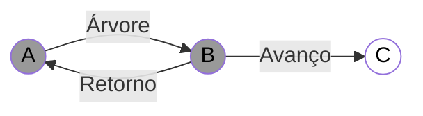
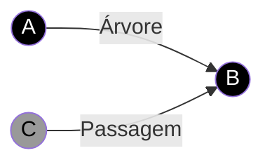
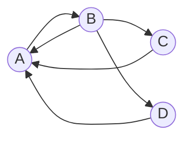

# Algoritmos

| Categoria                      | Nome do algoritmo          | Complexidade em lista de adjacências | Complexidade em matriz de adjacências |
| ------------------------------ | -------------------------- | ------------------------------------ | ------------------------------------- |
| Caminhamento                   | Depth First Search (DFS)   | $$O(V+E)$$                           | $$V^2$$                               |
| Caminhamento                   | Breadth First Search (BFS) | $$O(V+E)$$                           | $$V^2$$                               |
| Minimum Spanning Tree          | Kruskal                    | $$O(E \log E) + EV$$ ou só $$O(EV)$$ | $$O(E \log E) + EV$$                  |
| Minimum Spanning Tree          | Kruskal (Union Find)       | $$O(E \log E)$$                      | $$O(E \log E)$$                       |
| Minimum Spanning Tree          | Prim                       | $$O(V^2 + E)$$                       | $$O(V^2)$$                            |
| Minimum Spanning Tree          | Prim (Min-Heap)            | $$O(E \log V)$$                      |                                       |
| Minimum Spanning Tree          | Prim (Fib. Heap)           | $$O(E + V \log V)$$                  |                                       |
| Componentes Fortemente conexas | Kosaraju                   | $$O(V+E)$$                           | $$V^2$$                               |
| Fluxo                          | Ford-Fulkerson             | $$O(EF)$$                            |                                       |
| Fluxo                          | Edmonds-Karp               | $$O(VE^2)$$                          |                                       |
| Fluxo                          | Dinic                      | $$O(V^2 E)$$                         |                                       |
| Fluxo                          | Dinic Unitario             | $$O(\sqrt{V} E)$$                    |                                       |
| Shortest Path                  | Bellman-Ford               | $$O(VE)$$                            | $$O(V^2 E)$$                          |
| Shortest Path                  | Dijkstra                   | $$O(V^2)$$                           | $$O(V^2)$$                            |
| Shortest Path                  | Dijkstra (Min-Heap)        | $$O((V+E) \log V)$$                  |                                       |
| Shortest Path                  | Dijkstra (Fibonacci-Heap)  | $$O(E+V \log V)$$                    |                                       |

## Categoria de problemas

### Vizinhança

- **Descrição:** encontrar todos os vértices que são vizinhos de um vértice específico.

- Matematicamente: $N(v) = \{u \in V(G) | uv \in E(G)\}$

- Lista de Adjacência: $O(1)$
  - Explicação: basta acessar a lista de adjacências do vértice.
  - Pseudocódigo
    - **Entrada:** Grafo $G(V, E)$, vértice $v \in V(G)$
    - **Saída:** $N(v)$
    - return $adj[v]$;

- Matriz de Adjacência: $O(V)$
  - Explicação: é necessário percorrer a linha correspondente ao vértice.
  - Pseudocódigo
    - **Entrada:** Grafo $G(V, E)$, vértice $v \in V(G)$
    - **Saída:** $N(v)$
    - *lst* $\leftarrow \emptyset$
    - **for** $u$ de $1$ até $n$ **do**
      - **if** $M[v][u]$ **then**
        - Inclui $u$ em *lst*;
      - **end**
    - **end**
    - return *lst*;

### Grau

- **Descrição:** encontrar o número de vértices vizinhos de um vértice específico.

- **Matematicamente:** $d(v) = |N(v)|$

- **Lista de Adjacência:** $O(d(v))$
  - **Explicação:** basta percorrer todos os elementos da lista de adjacências e contar quantos elementos existem.
  - **Pseudocódigo**
    - **Entrada:** Grafo $G(V, E)$, vértice $v \in V(G)$
    - **Saída:** $d(v)$
    - *lst* $\leftarrow adj[v].head;$
    - *deg* $\leftarrow 0;$
    - **while** *lst* $\neq \lambda$ **do**
      - *lst* $\leftarrow lst.next;$
      - *deg* $\leftarrow deg + 1;$
    - **end**
    - **return** *deg;*
  - [JV: Obs.: suponho que esse $\lambda$ seja um ponteiro nulo.]

- **Matriz de Adjacência:** $O(V)$
  - **Explicação:** é necessário percorrer a linha correspondente ao vértice e contar quantos elementos são verdadeiros.
    - **Pseudocódigo**
      - **Entrada:** Grafo $G(V, E)$, vértice $v \in V(G)$
      - **Saída:** $d(v)$
      - *deg* $\leftarrow 0;$
      - **for** $u$ de $1$ até $n$ **do**
        - **if** $M[v][u]$ **then**
          - *deg* $\leftarrow deg + 1;$
        - **end**
      - **end**
      - **return** *deg;*

### Pertinência de Aresta

- **Descrição:** verificar se uma aresta pertence ao grafo.

- **Matematicamente:** $uv \in E(G)$

- **Lista de Adjacência:** $O(d(u))$
  - **Explicação:** basta percorrer a lista de adjacências do vértice $u$ e verificar se $v$ está presente.
  - **Pseudocódigo**
    - **Entrada:** Grafo $G(V, E)$, vértices $u, v \in V(G)$
    - **Saída:** $uv \in E(G)?$ [JV: Booleano]
    - *lst* $\leftarrow adj[u].head;$
    - **while** *lst* $\neq \lambda$ **do**
      - **if** *lst* $= v$ **then**
        - **return** *true;*
      - **end**
      - *lst* $\leftarrow lst.next;$
    - **end**
    - **return** *false;*

- **Matriz de Adjacência:** $O(1)$
  - **Explicação:** basta acessar a posição $M[u][v]$.
  - **Pseudocódigo**
    - **Entrada:** Grafo $G(V, E)$, vértices $u, v \in V(G)$
    - **Saída:** $uv \in E(G)$
    - **return** $M[u][v];$

<!-- ### Caminhamento -->

### Depth First Search (DFS)

- **Descrição:** começa em um vértice inicial e segue para um dos seus vizinhos, continuando a explorar o próximo vértice não visitado até que não haja mais vértices para visitar nesse caminho. Em seguida, ele retrocede e explora outros caminhos a partir dos vértices anteriores.

- **Pseudocódigo**
  - **Variáveis:**
    - $\pi[v]$: pai do vértice $v$.
    - $i[v]$: tempo que encontramos o vértice $v$. [JV: i de início]
    - $f[v]$: tempo que terminamos de explorar o vértice $v$. [JV: f de fim]
    - $cor$:
      - Branco: ainda não visitei
      - Cinza: estou visitando
      - Preto: já terminei de visitar

  - **Algoritmo DFS base:** DFS(G, s):
    - **Entrada:** Grafo $G = (V, s)$, vértice inicial $s$.
    - **para** $v$ até $V(G)$ **faça**
      - $cor[v] \leftarrow$ Branco;
      - $\pi[u] = \lambda;$ [JV: suponho que $\lambda$ seja um valor nulo]
    - **end**
    - $time \leftarrow 0;$
    - **para** $v \in V(G)$ **faça** [JV: ele força a DFS a percorrer todos os vértices do grafo]
      - **se** $cor[v] = $ Branco **então**
        - $DFS-VISIT(G, u);$
      - **end**
    - **end**

  - **Algoritmo DFS-VISIT:** DFS-VISIT(G, u):
    - time $\leftarrow$ time + 1;
    - $cor[u] \leftarrow$ Cinza;
    - $i[u] \leftarrow$ time;
    - **para** $v \in N(u)$ **faça**
      - **se** $cor[v] = $ Branco **então**
        - $\pi[v] \leftarrow u;$
        - $DFS-VISIT(G, v);$
      - **end**
    - **end**
    - $time \leftarrow time + 1;$
    - $cor[u] \leftarrow$ Preto;
    - $f[u] \leftarrow$ time;

- Produtos da DFS:
  - **Grafo de predecessores:** $G_{\pi} = (V, E_{\pi})$ [JV: $E_{\pi}$ é o conjunto de arestas que conectam os vértices aos seus predecessores]
  - Os vetores de tempo de descoberta e de tempo em visita.

- **Complexidade:**
  - **Lista de Adjacência:** $\Theta(|V| + |E|)$
    - [JV: entendendo mais intuitivamente, podemos entender que percorreremos todos os vértices, e para cada vértice, percorreremos $d(v)$ arestas (Complexidade de se calcular $g(v)$ em uma lista de Adjacência). Ao final, teremos percorrido basicamente $2|E|$ arestas, visto que cada aresta está presente em duas listas de adjacências.]
  - **Matriz de Adjacência:** $\Theta(|V|^2)$
    - [JV: entendendo mais intuitivamente, numa matriz de adjacência, a complexidade para percorrermos os vizinhos de um vértice é $O(|V|)$; e como antes disso também iremos executar o algoritmo para todos os vértices, a complexidade total será $O(|V|^2)$.]

- Classificação de arestas
  - **Arestas de Árvore:** $vu \in G_{\pi}$
  - **Arestas de Retorno/Volta:** liga $u$ a um ancestral
  - **Arestas de Avanço:** liga $u$ a um descendente
  - **Arestas de Cruzamento/Passagem:** as demais

### Ordenação topológica

- **Descrição:** dada um grafo acíclico direcionado, a ordenação topológica é uma ordenação linear dos vértices tal que, para cada vértice, todos os vértices que ele aponta estão à sua frente.

- **Algoritmo: Ordenação_topológica(G)**
  - **Entrada:** Grafo $G(V, s)$
  - Use DFS para calcularos tempos de término $f[v]$ para cada vértice $v$.
  - **Ordenação:** ordene os vértices $V(G)$ em ordem decrescente de $f[v]$.

### Componentes Fortemente Conexas

<!-- #### Kosaraju -->

- **Descrição:**
  - Dado um grafo direcionado $G = (V, A)$...
  - **Par de vértices fortemente conexos:** são vértices $u$ e $v$ tais que é possível chegar de $u$ a $v$ e de $v$ a $u$.
  - **Grafo fortemente conexo:** é um grafo em que todos os pares de vértices são fortemente conexos.
  - **Componente fortemente conexa:** é um subgrafo fortemente conexo maximal.

| conjunto       | Descrição                    |
| -------------- | ---------------------------- |
| $[A, A]$       | Fortemente conexo (?)        |
| $[A, B]$       | Fortemente conexo            |
| $[A, B, C]$    | Grafo fortemente conexo      |
| $[A, B, C, D]$ | Componente fortemente conexa |

---

Definindo $G^T = (V, A^T)$, onde $A^T = \{(u, v) | (v, u) \in A\}$ (Conjunto de arcos de G com a direção trocada).

- **Algoritmo:**
  - **Entrada:** Grafos $G = (V, s)$
    - Use DFS para calcular os tempos de término $f[v]$ para cada vértice $v$.
    - Calcule $G^T$.
    - Use DFS em $G^T$ para visitar os vértices em ordem decrescente de $f[v]$.

Com isso, teremos um vetor $\pi$ que indica os pais de cada vértice. A quantidade de componentes fortemente conexas é dada pela quantidade de vértices que são pais deles mesmos.

- **Complexidade:**
  - $O(DFS) + O(G^T) + O(Ordenar(f[v])) + O(DFS)$
  - $2* O(DFS) + O(G^T) + O(Ordenar(f[v]))$
  - $O(DFS) + O(G^T) + O(Ordenar(f[v]))$

### Árvore Geradora Mínima (Minimum Spanning Tree - MST)

- $Peso(G) = \sum_{(u, v) \in E} w(u, v)$
  - Onde $w(u, v)$ é o peso da aresta $(u, v)$.

#### Kruskal

- **Descrição:** tenta sempre adicionar a aresta de menor peso, desde que não crie um ciclo.

- **Algoritmo: Kruskal(G)**
  - **Entrada:** Grafo $G(V, E)$
  - **Saída:** Árvore geradora mínima $T$
  - $A \leftarrow \emptyset;$
  - $E \leftarrow ordena(E(G));$
  - **para todo** $uv \in E$ **faça**
    - **se** $uv + A$ não forma ciclo **então**
      - $A \leftarrow A \cup \{uv\};$
    - **fim**
  - **fim**

- **Complexidade:**
  - $O(Ordenação) + O(|E|)*(O(checa_ciclo) + O(insere_A))$
  - $O(Ordenação) + O(|E|)*O(checa_ciclo) + O(|E|)*O(insere_A)$

Segundo o professor:

<!-- ### PEDIR AJUDA PRA ENTENDER ISSO -->

- Considerando que:
  - $X = O(checa_ciclo)$
  - $Y = O(insere_A)$
  - $m = |E|$

- **Lista de Adjacência:** $O(m \log n + mX + nY)$
- **Matriz de Adjacência:** $O(n^2 \log n + n^2X + nY)$

<!-- GPT: -->

Vamos analisar cuidadosamente o que pode estar faltando para você alcançar a lógica do professor em relação à análise da complexidade do algoritmo de Kruskal. Aqui estão os principais pontos a considerar e onde o entendimento pode ser refinado:

---

### 1. **Decomposição da Complexidade**

A complexidade total do Kruskal pode ser decomposta da seguinte forma:

$$O(Ordenação) + O(E) \cdot (O(checa\_ciclo) + O(insere\_A))$$

Essa fórmula é válida e faz sentido, mas o professor está especificando os tempos de execução de cada operação **dependendo da estrutura de dados utilizada** (lista de adjacência ou matriz de adjacência).

#### Passos detalhados

1. **Ordenação das arestas**:
   - O número de arestas é \( m \) (ou \( |E| \)).
   - Ordenar as arestas pelo peso requer \( O(m \log m) \), mas \( m \leq n^2 \), então \( O(m \log m) = O(m \log n) \) usando \( \log m = \log n^2 = 2\log n \).

2. **Laço principal (iterações sobre as arestas):**
   - A iteração é feita sobre \( m \) arestas.
   - Em cada iteração, duas operações ocorrem:
     - **Checar se adicionar uma aresta forma um ciclo** (\( O(checa\_ciclo) \)).
     - **Inserir a aresta na solução \( A \)** (\( O(insere\_A) \)).

---

### 2. **Checar Ciclos (\( O(checa\_ciclo) \))**

O professor usa o contexto do **Union-Find** para determinar a presença de ciclos. No Union-Find, o custo de checar ciclos depende de:
- **Busca (find):** Para verificar se os dois vértices de uma aresta pertencem ao mesmo conjunto.
- Esse custo é **quase constante** devido à compressão de caminhos e à união por tamanho/classificação:
  \[
  O(checa\_ciclo) = O(\alpha(n)), \text{ onde } \alpha(n) \text{ é a inversa da função de Ackermann}.
  \]
- Como \( \alpha(n) \) é extremamente pequeno, podemos aproximá-lo como **constante** para propósitos práticos.

#### O que isso significa?
- O termo \( O(E) \cdot O(checa\_ciclo) \) reduz para algo **próximo de \( O(E) \)**, mas ele ainda o deixa como \( mX \) para indicar dependência do custo específico do ciclo.

---

### 3. **Inserir na Solução (\( O(insere\_A) \))**

A operação de inserir uma aresta na solução \( A \) pode ter custos diferentes dependendo da estrutura de dados usada para armazenar \( A \):
- Se for uma **lista de adjacência**, a inserção é \( O(1) \) para cada aresta. Logo, \( O(insere\_A) = O(1) \), e o custo total será \( O(m) \).
- Se for uma **matriz de adjacência**, a atualização pode exigir operações mais complexas, como atualizar \( O(n) \) posições (uma linha ou coluna inteira), dependendo da implementação.

O professor provavelmente está generalizando isso como \( nY \), pois \( Y \) pode variar dependendo da estrutura.

---

### 4. **Como a Estrutura de Dados Afeta o Cálculo?**

Agora vamos interpretar as fórmulas que o professor apresenta para as duas representações:

#### **Lista de Adjacência:**

\[
O(m \log n + mX + nY)
\]
- \( m \log n \): Ordenação das \( m \) arestas.
- \( mX \): Custo de checar ciclos para \( m \) arestas.
- \( nY \): Inserção das arestas na solução (aqui \( Y \) é provavelmente \( O(1) \), então o custo total é dominado por outros termos).

#### **Matriz de Adjacência:**
\[
O(n^2 \log n + n^2X + nY)
\]
- \( n^2 \log n \): Ordenação, porque no caso pior \( m = O(n^2) \).
- \( n^2X \): Checar ciclos para \( n^2 \) arestas.
- \( nY \): Inserção das arestas na matriz (provavelmente maior que para lista).

---

### 5. **O que pode estar faltando?**

Talvez o que precise de mais atenção para "fechar" o raciocínio seja entender as seguintes questões:

1. **Impacto da estrutura de dados no custo das operações**:
   - Como a lista de adjacência e a matriz de adjacência afetam \( O(checa\_ciclo) \) e \( O(insere\_A) \).
   - Na lista de adjacência, o custo de inserir arestas ou verificar ciclos é mais eficiente do que na matriz.
2. **Generalização de \( X \) e \( Y \)**:
   - \( X \) pode ser tratado como \( O(\alpha(n)) \) devido ao Union-Find.
   - \( Y \) é normalmente \( O(1) \), mas pode variar se a matriz exigir atualizações mais pesadas.

3. **Separação de termos \( m \) e \( n^2 \)**:
   - Na matriz, \( m \) pode crescer até \( n^2 \), então o custo \( O(n^2 \log n) \) passa a dominar.

Se precisar de mais detalhamento em algum ponto específico, posso te ajudar a reforçar! 😊

#### Prim

### Breadth First Search (BFS)

### Fluxo

#### Ford-Fulkerson

start with 0 flow
while there exists an augmenting path: // iterative algorithm
  find an augmenting path (for now, 'any' graph traversal will do)
  compute bottleneck capacity
  increase flow on the path by the bottleneck capacity

#### Edmonds-Karp

Implementation: We first ignore capacity of the edges first (assume all edges in the residual graph have weight 1), and we run O(E) BFS to find the shortest (in terms of # of edges used) augmenting path. Everything else is the same as the basic Ford-Fulkerson Method outlined earlier.

It can be proven that Edmonds-Karp will use at most O(VE) iterations thus it runs in at most in O(VE * E) = O(VE^2) time.

#### Dinic

Dinic's algorithm also uses similar strategy of finding shortest augmenting paths first.

But Dinic's algorithm runs in a faster time of O(V^2 × E) due to the more efficient usage of BFS shortest path information.

This slide will be expanded.

### Shortest Path

#### Bellman-Ford

#### Dijkstra
