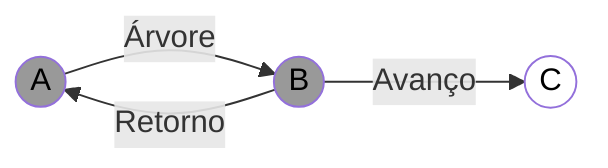
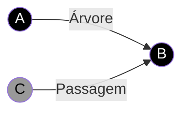
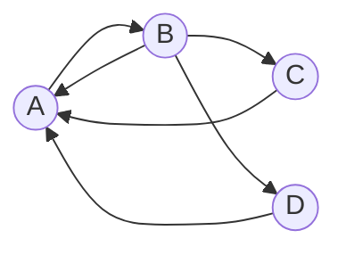

# Algoritmos

| Categoria                      | Nome do algoritmo          | Complexidade em lista de adjacências | Complexidade em matriz de adjacências |
| ------------------------------ | -------------------------- | ------------------------------------ | ------------------------------------- |
| Caminhamento                   | Depth First Search (DFS)   | $$O(V+E)$$                           | $$V^2$$                               |
| Caminhamento                   | Breadth First Search (BFS) | $$O(V+E)$$                           | $$V^2$$                               |
| Minimum Spanning Tree          | Kruskal                    | $$O(E \log E) + EV$$ ou só $$O(EV)$$ | $$O(E \log E) + EV$$                  |
| Minimum Spanning Tree          | Kruskal (Union Find)       | $$O(E \log E)$$                      | $$O(E \log E)$$                       |
| Minimum Spanning Tree          | Prim                       | $$O(V^2 + E)$$                       | $$O(V^2)$$                            |
| Minimum Spanning Tree          | Prim (Min-Heap)            | $$O(E \log V)$$                      |                                       |
| Minimum Spanning Tree          | Prim (Fib. Heap)           | $$O(E + V \log V)$$                  |                                       |
| Componentes Fortemente conexas | Kosaraju                   | $$O(V+E)$$                           | $$V^2$$                               |
| Fluxo                          | Ford-Fulkerson             | $$O(EF)$$                            |                                       |
| Fluxo                          | Edmonds-Karp               | $$O(VE^2)$$                          |                                       |
| Fluxo                          | Dinic                      | $$O(V^2 E)$$                         |                                       |
| Fluxo                          | Dinic Unitario             | $$O(\sqrt{V} E)$$                    |                                       |
| Shortest Path                  | Bellman-Ford               | $$O(VE)$$                            | $$O(V^2 E)$$                          |
| Shortest Path                  | Dijkstra                   | $$O(V^2)$$                           | $$O(V^2)$$                            |
| Shortest Path                  | Dijkstra (Min-Heap)        | $$O((V+E) \log V)$$                  |                                       |
| Shortest Path                  | Dijkstra (Fibonacci-Heap)  | $$O(E+V \log V)$$                    |                                       |

## Categoria de problemas

### Vizinhança

- **Descrição:** encontrar todos os vértices que são vizinhos de um vértice específico.

- Matematicamente: $N(v) = \{u \in V(G) | uv \in E(G)\}$

- Lista de Adjacência: $O(1)$
  - Explicação: basta acessar a lista de adjacências do vértice.
  - Pseudocódigo
    - **Entrada:** Grafo $G(V, E)$, vértice $v \in V(G)$
    - **Saída:** $N(v)$
    - return $adj[v]$;

- Matriz de Adjacência: $O(V)$
  - Explicação: é necessário percorrer a linha correspondente ao vértice.
  - Pseudocódigo
    - **Entrada:** Grafo $G(V, E)$, vértice $v \in V(G)$
    - **Saída:** $N(v)$
    - *lst* $\leftarrow \emptyset$
    - **for** $u$ de $1$ até $n$ **do**
      - **if** $M[v][u]$ **then**
        - Inclui $u$ em *lst*;
      - **end**
    - **end**
    - return *lst*;

### Grau

- **Descrição:** encontrar o número de vértices vizinhos de um vértice específico.

- **Matematicamente:** $d(v) = |N(v)|$

- **Lista de Adjacência:** $O(d(v))$
  - **Explicação:** basta percorrer todos os elementos da lista de adjacências e contar quantos elementos existem.
  - **Pseudocódigo**
    - **Entrada:** Grafo $G(V, E)$, vértice $v \in V(G)$
    - **Saída:** $d(v)$
    - *lst* $\leftarrow adj[v].head;$
    - *deg* $\leftarrow 0;$
    - **while** *lst* $\neq \lambda$ **do**
      - *lst* $\leftarrow lst.next;$
      - *deg* $\leftarrow deg + 1;$
    - **end**
    - **return** *deg;*
  - [JV: Obs.: suponho que esse $\lambda$ seja um ponteiro nulo.]

- **Matriz de Adjacência:** $O(V)$
  - **Explicação:** é necessário percorrer a linha correspondente ao vértice e contar quantos elementos são verdadeiros.
    - **Pseudocódigo**
      - **Entrada:** Grafo $G(V, E)$, vértice $v \in V(G)$
      - **Saída:** $d(v)$
      - *deg* $\leftarrow 0;$
      - **for** $u$ de $1$ até $n$ **do**
        - **if** $M[v][u]$ **then**
          - *deg* $\leftarrow deg + 1;$
        - **end**
      - **end**
      - **return** *deg;*

### Pertinência de Aresta

- **Descrição:** verificar se uma aresta pertence ao grafo.

- **Matematicamente:** $uv \in E(G)$

- **Lista de Adjacência:** $O(d(u))$
  - **Explicação:** basta percorrer a lista de adjacências do vértice $u$ e verificar se $v$ está presente.
  - **Pseudocódigo**
    - **Entrada:** Grafo $G(V, E)$, vértices $u, v \in V(G)$
    - **Saída:** $uv \in E(G)?$ [JV: Booleano]
    - *lst* $\leftarrow adj[u].head;$
    - **while** *lst* $\neq \lambda$ **do**
      - **if** *lst* $= v$ **then**
        - **return** *true;*
      - **end**
      - *lst* $\leftarrow lst.next;$
    - **end**
    - **return** *false;*

- **Matriz de Adjacência:** $O(1)$
  - **Explicação:** basta acessar a posição $M[u][v]$.
  - **Pseudocódigo**
    - **Entrada:** Grafo $G(V, E)$, vértices $u, v \in V(G)$
    - **Saída:** $uv \in E(G)$
    - **return** $M[u][v];$

<!-- ### Caminhamento -->

### Depth First Search (DFS)

- **Descrição:** começa em um vértice inicial e segue para um dos seus vizinhos, continuando a explorar o próximo vértice não visitado até que não haja mais vértices para visitar nesse caminho. Em seguida, ele retrocede e explora outros caminhos a partir dos vértices anteriores.

- **Pseudocódigo**
  - **Variáveis:**
    - $\pi[v]$: pai do vértice $v$.
    - $i[v]$: tempo que encontramos o vértice $v$. [JV: i de início]
    - $f[v]$: tempo que terminamos de explorar o vértice $v$. [JV: f de fim]
    - $cor$:
      - Branco: ainda não visitei
      - Cinza: estou visitando
      - Preto: já terminei de visitar

  - **Algoritmo DFS base:** DFS(G, s):
    - **Entrada:** Grafo $G = (V, s)$, vértice inicial $s$.
    - **para** $v$ até $V(G)$ **faça**
      - $cor[v] \leftarrow$ Branco;
      - $\pi[u] = \lambda;$ [JV: suponho que $\lambda$ seja um valor nulo]
    - **end**
    - $time \leftarrow 0;$
    - **para** $v \in V(G)$ **faça** [JV: ele força a DFS a percorrer todos os vértices do grafo]
      - **se** $cor[v] = $ Branco **então**
        - $DFS-VISIT(G, u);$
      - **end**
    - **end**

  - **Algoritmo DFS-VISIT:** DFS-VISIT(G, u):
    - time $\leftarrow$ time + 1;
    - $cor[u] \leftarrow$ Cinza;
    - $i[u] \leftarrow$ time;
    - **para** $v \in N(u)$ **faça**
      - **se** $cor[v] = $ Branco **então**
        - $\pi[v] \leftarrow u;$
        - $DFS-VISIT(G, v);$
      - **end**
    - **end**
    - $time \leftarrow time + 1;$
    - $cor[u] \leftarrow$ Preto;
    - $f[u] \leftarrow$ time;

- Produtos da DFS:
  - **Grafo de predecessores:** $G_{\pi} = (V, E_{\pi})$ [JV: $E_{\pi}$ é o conjunto de arestas que conectam os vértices aos seus predecessores]
  - Os vetores de tempo de descoberta e de tempo em visita.

- **Complexidade:**
  - **Lista de Adjacência:** $\Theta(|V| + |E|)$
    - [JV: entendendo mais intuitivamente, podemos entender que percorreremos todos os vértices, e para cada vértice, percorreremos $d(v)$ arestas (Complexidade de se calcular $g(v)$ em uma lista de Adjacência). Ao final, teremos percorrido basicamente $2|E|$ arestas, visto que cada aresta está presente em duas listas de adjacências.]
  - **Matriz de Adjacência:** $\Theta(|V|^2)$
    - [JV: entendendo mais intuitivamente, numa matriz de adjacência, a complexidade para percorrermos os vizinhos de um vértice é $O(|V|)$; e como antes disso também iremos executar o algoritmo para todos os vértices, a complexidade total será $O(|V|^2)$.]

- Classificação de arestas
  - **Arestas de Árvore:** $vu \in G_{\pi}$
  - **Arestas de Retorno/Volta:** liga $u$ a um ancestral
  - **Arestas de Avanço:** liga $u$ a um descendente
  - **Arestas de Cruzamento/Passagem:** as demais

### Ordenação topológica

- **Descrição:** dada um grafo acíclico direcionado, a ordenação topológica é uma ordenação linear dos vértices tal que, para cada vértice, todos os vértices que ele aponta estão à sua frente.

- **Algoritmo: Ordenação_topológica(G)**
  - **Entrada:** Grafo $G(V, s)$
  - Use DFS para calcularos tempos de término $f[v]$ para cada vértice $v$.
  - **Ordenação:** ordene os vértices $V(G)$ em ordem decrescente de $f[v]$.

### Componentes Fortemente Conexas

<!-- #### Kosaraju -->

- **Descrição:**
  - Dado um grafo direcionado $G = (V, A)$...
  - **Par de vértices fortemente conexos:** são vértices $u$ e $v$ tais que é possível chegar de $u$ a $v$ e de $v$ a $u$.
  - **Grafo fortemente conexo:** é um grafo em que todos os pares de vértices são fortemente conexos.
  - **Componente fortemente conexa:** é um subgrafo fortemente conexo maximal.

| conjunto       | Descrição                    |
| -------------- | ---------------------------- |
| $[A, A]$       | Fortemente conexo (?)        |
| $[A, B]$       | Fortemente conexo            |
| $[A, B, C]$    | Grafo fortemente conexo      |
| $[A, B, C, D]$ | Componente fortemente conexa |

---

Definindo $G^T = (V, A^T)$, onde $A^T = \{(u, v) | (v, u) \in A\}$ (Conjunto de arcos de G com a direção trocada).

- **Algoritmo:**
  - **Entrada:** Grafos $G = (V, s)$
    - Use DFS para calcular os tempos de término $f[v]$ para cada vértice $v$.
    - Calcule $G^T$.
    - Use DFS em $G^T$ para visitar os vértices em ordem decrescente de $f[v]$.

Com isso, teremos um vetor $\pi$ que indica os pais de cada vértice. A quantidade de componentes fortemente conexas é dada pela quantidade de vértices que são pais deles mesmos.

- **Complexidade:**
  - $O(DFS) + O(G^T) + O(Ordenar(f[v])) + O(DFS)$
  - $2* O(DFS) + O(G^T) + O(Ordenar(f[v]))$
  - $O(DFS) + O(G^T) + O(Ordenar(f[v]))$

### Árvore Geradora Mínima (Minimum Spanning Tree - MST)

- $Peso(G) = \sum_{(u, v) \in E} w(u, v)$
  - Onde $w(u, v)$ é o peso da aresta $(u, v)$.

#### Kruskal

- **Descrição:** tenta sempre adicionar a aresta de menor peso, desde que não crie um ciclo.

- **Algoritmo: Kruskal(G)**
  - **Entrada:** Grafo $G(V, E)$
  - **Saída:** Árvore geradora mínima $T$
  - $A \leftarrow \emptyset;$
  - $E \leftarrow ordena(E(G));$
  - **para todo** $uv \in E$ **faça**
    - **se** $uv + A$ não forma ciclo **então**
      - $A \leftarrow A \cup \{uv\};$
    - **fim**
  - **fim**

- **Complexidade:**
  - $O(Ordenação) + O(|E|)*(O(checa_ciclo) + O(insere_A))$
  - $O(Ordenação) + O(|E|)*O(checa_ciclo) + O(|E|)*O(insere_A)$

Segundo o professor:

<!-- ### PEDIR AJUDA PRA ENTENDER ISSO -->

- Caso geral
  - Considerando que:
    - $X = O(checa_ciclo)$
    - $Y = O(insere_A)$
    - $m = |E|$
    - **Complexidade:**
      - **Matriz de Adjacência:** $O(n^2 \log n + n^2X + nY)$
      - **Lista de Adjacência:** $O(m \log n + mX + nY)$
- BFS:
  - $X = O(n)$ (DFS)
  - $Y = O(1)$
  - **Complexidade:**
    - **Matriz de Adjacência:** $O(n^2 \log n + n^2n + n*1) = O(n^3)$
    - **Lista de Adjacência:** $O(m \log n + mn + n*1) = O(mn)$
- Union-find
  - $X = O(\log n) \cong O(1)$
  - $Y = O(1)$
  - **Complexidade:**
    - **Matriz de Adjacência:** $O(n^2 \log n + n^2 + n) = O(n^2 \log n)$
    - **Lista de Adjacência:** $O(m \log n + m + n) = O(m \log n)$

#### Prim

- **Descrição:** tendo como raiz o vértice árbitrário $r$, o algoritmo tenta sempre adicionar a aresta de menor peso que liga um vértice já visitado a um vértice não visitado. E vai construindo a árvore geradora mínima ao definir os pais de cada vértice.

- **Algoritmo: Prim(G)**
  - **Entrada:** Grafo $G(V, E)$
  - **para todo** $u \in V(G)$ **faça**
    - $c[u] \leftarrow \infty;$
    - $\pi[u] \leftarrow u;$
  - **fim**
  - Selecione a menor aresta $uv;$
  - $c[u] \leftarrow 0;$
  - $Q \leftarrow V(G);$ [JV: Não entendi o que seria $Q$]
  - **enquanto** $Q \neq \emptyset$ **faça**
    - $u \leftarrow$ obter_menor_vértice($Q$);
    - **para todo** $v \in N(u)$ **faça**
      - **se** $v \in Q$ e $w(u, v) < c[v]$ **então**
        - $\pi[v] \leftarrow u;$
        - $c[v] \leftarrow w(u, v);$
      - **fim**
    - **fim**
  - **fim**

---

##### Prim - Complexidade - Lista Ordenada

| Tarefa                         | Comp. Lista Ordenada |
| ------------------------------ | -------------------- |
| Ordenar os vértices por $c[v]$ | $O(V \log V)$        |
| Obter o menor vértice          | $O(1)$               |
| Re-ordenar após mudança        | $O(V)$               |
| Buscar um elemento             | $O(V)$               |

- **Matriz de Adjacências:** $O(V + V \log V + V + V^2*V) = O(V^3)$
- **Lista de Adjacências:** $O(V + V \log V + V + EV) = O(EV)$

---

| Tarefa                         | Comp. Heap  |
| ------------------------------ | ----------- |
| Ordenar os vértices por $c[v]$ | $O(V)$      |
| Obter o menor vértice          | $O(1)$      |
| Re-ordenar após mudança        | $O(\log V)$ |
| Buscar um elemento             | $O(\log V)$ |

- **Matriz de Adjacências:** $O(V + V*1 + V + V^2*\log V) = O(V^2 \log V)$
- **Lista de Adjacências:** $O(V + V  + V*1 + E \log V + V + EV) = O(EV)$

---

| Tarefa                         | Comp. Heap de Fibonacci |
| ------------------------------ | ----------------------- |
| Ordenar os vértices por $c[v]$ | $O(V)$                  |
| Obter o menor vértice          | $O(\log V)$             |
| Re-ordenar após mudança        | $O(1)$                  |
| Buscar um elemento             | $O(1)$                  |

- **Matriz de Adjacências:** $O(V + V + V \log V + V^2*1) = O(V^2)$
- **Lista de Adjacências:** $O(V + V  + V \log V + E*1) = O(E + V \log V)$

### Caminho Mínimo (Shortest Path)

- **Propriedade fundamental:** se $<u, v_1, \dots, v_k, v>$ é um caminho mínimo de $u$ a $v$, então $<u, v_1, \dots, v_k>$ é um caminho mínimo de $u$ a $v_k$.

#### Bellman-Ford - Apenas pesos positivos

- **Descrição:** o algoritmo vai percorrer todas os vértices e todas as arestas, sempre atualizando os vetores de distância e de predecessores. Assim, para cada vértice (menos o último), ele verificará se cada uma das arestas existentes no grafo geram uma solução melhor.

- **Algoritmo: Inicializa(G, s)**
  - **para todo** $v \in V(G)$ **faça**
    - $d[v] \leftarrow \infty;$
    - $\pi[v] \leftarrow v;$
  - **fim**
  - $d[s] \leftarrow 0;$

---

- **Algoritmo: Relaxa(G, u, v)**
  - **se** $d[v] > d[u] + w(u, v)$ **então**
    - $d[v] \leftarrow d[u] + w(u, v);$
    - $\pi[v] \leftarrow u;$
  - **fim**
  - $d[s] \leftarrow 0;$

---

- **Algoritmo: Bellman-Ford(G, s)**
  - Inicializa(G, s);
  - **para** $i$ de $1$ até $|V(G)|$ **faça**
    - **para todo** $uv \in E(G)$ **faça**
      - Relaxa(G, u, v);
    - **fim**

##### Complexidade e Análise

- **Complexidade:**
  - **Matriz de Adjacência:** $O(|V|^3) = O(n^3)$
  - **Lista de Adjacência:** $O(|V||E|) = O(nm)$

<!-- #### Dijkstra -->

<!-- ### Breadth First Search (BFS) -->

### Fluxo

- **Conceitos:**
  - **Rede:** um grafo direcionado $G = (V, A)$ com dois vértices particulares $s$ (fonte) e $t$ (sumidouro), e capacidades $c_{uv} \geq 0$ em seus arcos
  - **Fluxo:** é uma função nos arcos do grafo tal que:
      1. $f(uv) \leq c_{uv}$ para todo $uv \in A(G)$
      2. $\sum_{u \in V(G)} f(vu) = \sum_{u \in V(G)} f(uv)$ para todo $v \in V(G) - \{s, t\}$
  - **Valor do Fluxo ($|f|$):** $|f| = \sum_{u \in V(G)} f(su)$

---

- **Corte (S, T)**: é uma partição de $V$ tal que $s \in S$ e $t \in T$.
  - [JV: $s$ é a fonte e $t$ é o sumidouro. $s$ estará num conjunto e $t$ estará no outro. Essa divisão da rede em dois conjuntos é o corte.]
  - **Fluxo de um corte (S, T):** [JV: seria basicamente a quantide de água que está passando pelas arestas que ligam $S$ a $T$.]
  - **Capacidade de um corte (S, T):** [JV: seria a capacidade total das arestas que ligam $S$ a $T$.]
  - **Relação entre Corte e Fluxo:**
    - $|f| = f(S, T) \leq c(S, T)$
  - Fluxo Máximo - Corte Mínimo
    - O valor do fluxo máximo é igual à capacidade mínima de um corte.
    - [JV: ou seja, estou cortando exatamente os arcos saturados, visto que o fluxo máximo atingiu o limite de capacidade deles.]

#### Ford-Fulkerson

- **Descrição:** busca por um caminho de $s$ a $t$ que ainda tenha capacidade disponível, e aumenta o fluxo nesse caminho.

- **Conceitos:**
  - **Caminho aumentante:** é um caminho de $s$ a $t$ que ainda tem capacidade disponível.
  - **Capacidade Residual:** é a capacidade ainda não utilizada pelo fluxo em um arco.
    - **Matematicamente:**
      - A capacidade residual ($c_{uv}^{f}$) será $c_{uv} - f(uv)$, onde $c_{uv}$ é a capacidade do arco e $f(uv)$ é o fluxo que passa por ele.
      - E gerará também um arco de volta $f(uv)$ que será o fluxo utilizado.
  - **Rede Residual ($G_f)$:** é o grafo que representa a capacidade residual de cada arco. [JV: me parece ser o conjunto de todas as capacidades residuais]
    - **Matematicamente:**
      - $G_f = (V, A_f)$, onde:
        - $V_f = V$
        - $A_f = \{uv \in A(G) | c_{uv}^{f} > 0\}$
  - **Capacidade Residual de um caminho:** é o máximo fluxo que pode ser aumentado nesse caminho.
    - **Matematicamente:**
      - $c^f(p) = \min\{c^{f}_{uv} | uv \in p\}$

- **Pseudocódigo:**
  - Começa com fluxo 0
  - Enquanto existir caminho aumentante:
    - Procure caminho aumentante
    - Calcule capacidade máxima de aumento
    - Aumente o fluxo pela capacidade máxima

- **Algoritmo: Ford-Fulkerson(G, s, t)**
  - $f \leftarrow \emptyset;$
  - Calcular $G_f;$
  - **enquanto** $\exists$ caminho aumentante $p$ **faça**
    - Calcular $c^f(p);$
    - Aumente $f$ de $c^f(p);$
    - Atualize $G_f;$
  - **fim**
  - **retorna** $|f|$

---

##### Ford-Fulkerson - Complexidade

- Inicializar $f$: O($E$)
- Computar $G_f$: O($E$)
- Achar $p$: O($V + E$)
- Calcular $c^f(p)$: O($V$)
- Aumentar $f$ e atualizar $G_f$: O($V$)

Se os valores são inteiros, o laço é realizado no máximo $|f|$ vezes.

- Complexidade Ford-Fulkerson-Ingênuo: $|f|O(V + E)$

#### Edmonds-Karp

- **Descrição:** é uma variação do Ford-Fulkerson que sempre escolhe o caminho aumentante mais curto através da BFS, visando sempre saturar uma aresta.

- Complexidade: $O(VE^2)$

<!-- #### Dinic -->

<!-- Dinic's algorithm also uses similar strategy of finding shortest augmenting paths first. -->

<!-- But Dinic's algorithm runs in a faster time of O(V^2 × E) due to the more efficient usage of BFS shortest path information. -->
