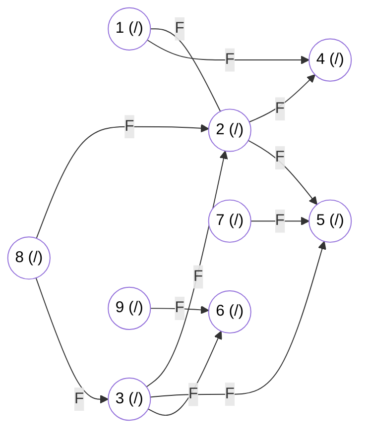

# Lista 4

Universidade Federal de Minas Gerais
Departamento de Computação
Projeto e Análise de Algoritmos - 2024.2
Professor: Marcio Costa Santos

## Exercício 1. Prove ou refute: em uma busca em largura o conjunto formado pelos nós PRETOS sempre induz um grafo conexo

## Exercício 2. Prove ou refute: em uma busca em largura o conjunto formado pelos nós CINZAS sempre induz um grafo conexo

## Exercício 3. Prove ou refute: em uma busca em largura o conjunto formado pelos nós BRANCOS sempre induz um grafo conexo

## Exercício 4. O diâmetro de uma grafo é seu maior menor caminho caminho de uma folha até a raiz. Dado uma árvore $T = (V, E)$ escreva um algoritmo que calcula o diâmetro dessa árvore. Qual a complexidade do seu algoritmo? Ele é eficiente?

## Exercício 5. Dado um grafo $G = (V, E)$ qualquer escreva um algoritmo que calcula o diâmetro do grafo. Qual a complexidade do seu algoritmo?

## Exercício 6. Aplique o algoritmo de busca em largura para o grafo abaixo

## Exercício 7. A aplicação da busca em largura em um grafo ponderado nas arestas não produz os caminhos de custo mínimo (considerando como o tamanho do caminho sendo a soma das arestas). Dê um exemplo para ilustrar esse fato

## Exercício 8. É possível modificar o algoritmo de busca em largura para calcular o menor caminho mesmo em um grafo ponderado? Como? Qual a nova complexidade desse algo ritmo? Sua abordagem funciona se o grafo tiver pesos negativos?

## Exercício 9. Em um DAG, é possível executar o laço interior do algoritmo de Bellman-Ford apenas uma vez, se os vértices forem ordenados de forma conveniente antes. Qual seria essa ordenação? Qual a complexidade do algoritmo obtido dessa forma?

## Exercício 10. Considere o conjunto de inequações abaixo

- $x_1 - x_2 \leq 1$
- $x_1 - x_4 \leq -4$
- $x_2 - x_3 \leq 2$
- $x_2 - x_5 \leq 7$
- $x_2 - x_6 \leq 5$
- $x_3 - x_6 \leq 10$
- $x_4 - x_2 \leq 2$
- $x_5 - x_1 \leq -1$
- $x_5 - x_4 \leq 3$
- $x_6 - x_3 \leq -8$

Determine uma solução viável (que respeite todas as restrições) para esse conjunto de inequações.

## Exercício 11. Considere um conjunto de m inequações sobre n variáveis na forma $x_i - x_j \leq b_k$. Apresente um algoritmo para determinar se esse conjunto de inequações possui uma solução viável ou não. Qual a complexidade do seu algoritmo?

## Exercício 12. Usando as propriedades de caminho mínimo em um grafo não direcionado é possível conceber um algoritmo recursivo para calcular todos os menores caminhos a um vértice fixo $s \in V(G)$. Apresente um algoritmo recursivo (ou uma relação de recorrência) que faça exatamente isso
