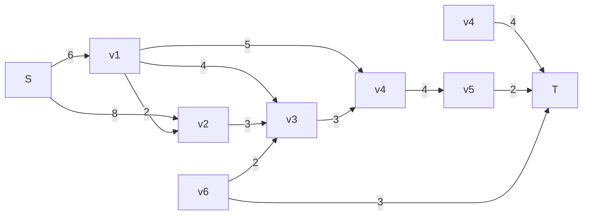

# Lista 6

Universidade Federal de Minas Gerais
Departamento de Computação
Projeto e Análise de Algoritmos - 2024.2
Professor: Marcio Costa Santos

## Exercício 1. Escreva uma função $graph_check_flow()$ que verifique se um suposto fluxo é de fato um fluxo. A função deve receber um grafo $G$, a fonte $s$, o sumidouro $t$, e um suposto fluxo representado por uma matriz f

## Exercício 2. Determine o fluxo máximo na rede abaixo

## Exercício 3. Considere uma rede $G = (V, E)$ com capacidades $c(v, u)$ e dois fluxos $f_1$ e $f_2$. Defina a soma dos fluxos $f = f_1 + f_2$ como sendo $f (u, v) = f_1(u, v) + f_2(u, v)$

- **Prove ou refute:** A soma de dois fluxos é um fluxo. Caso não seja um fluxo, qual propriedade de fluxo é violada?

## Exercício 4. Considere uma rede $G = (V, E)$ com capacidades $c(v, u)$, um fluxo $f$ e um real positivo $\beta$. Defina o produto do fluxo $f$ por $\beta$, $\beta f$, como sendo: $(\beta f )(u, v) = \beta f (u, v)$

- **Prove ou refute:** O produto de um fluxo por um real positivo $\beta$ é um fluxo. Caso não seja, o que ocorre se $\beta \leq 1$?

## Exercício 5. Mostre que dado uma rede $G = (V, E)$ com capacidades $c(u, v)$, o conjunto de todos os fluxos nesta rede é um conjunto convexo. Ou seja, dados dois fluxos válidos $f_1$ e $f_2$ e $0 \leq \alpha \leq 1 temos que \alpha f_1 + (1 - \alpha )f_2$ é um fluxo válido

## Exercício 6. Considere o seguinte problema: Temos um conjunto professores $P$ e um conjunto de disciplinas $D$. Cada professor $p$ pode dar um conjunto de disciplinas $D(p) \subseteq D$. Desejamos atribuir a cada professor uma disciplina de maneira a maximizar o número de disciplinas com professores para ministrá-las. Como podemos modelar esse problema como um problema em grafos?

## Exercício 7. Considere que temos uma rede $G = (V, E)$ com $k$ fontes $s_1, \dots, s_ k$ e $p$ sumidouros $t_1, \dots, t_p$. Apresente um algoritmo para determinar o fluxo máximo nesta rede, assumindo que o fluxo é o mesmo e que o fluxo originado em uma fonte pode ser consumido em qualquer sumidouro

## Exercício 8. Considere o seguinte problema: Dado um grafo $G = (V, E)$ e dois vértices $v$ e $u$, desejamos determinar se existe um ciclo (não necessariamente induzido) contendo $v$ e $u$. É possível adaptar o **Algoritmo de Ford-Fulkerson** para responder essa pergunta?
