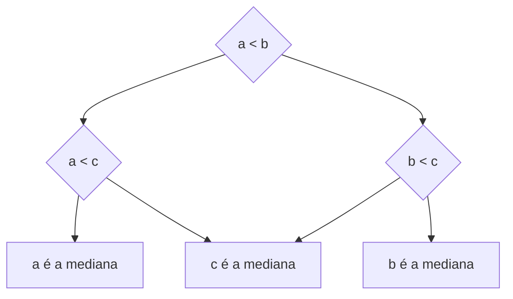
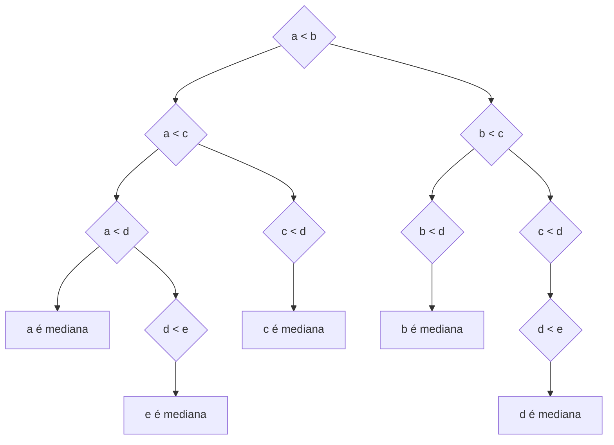
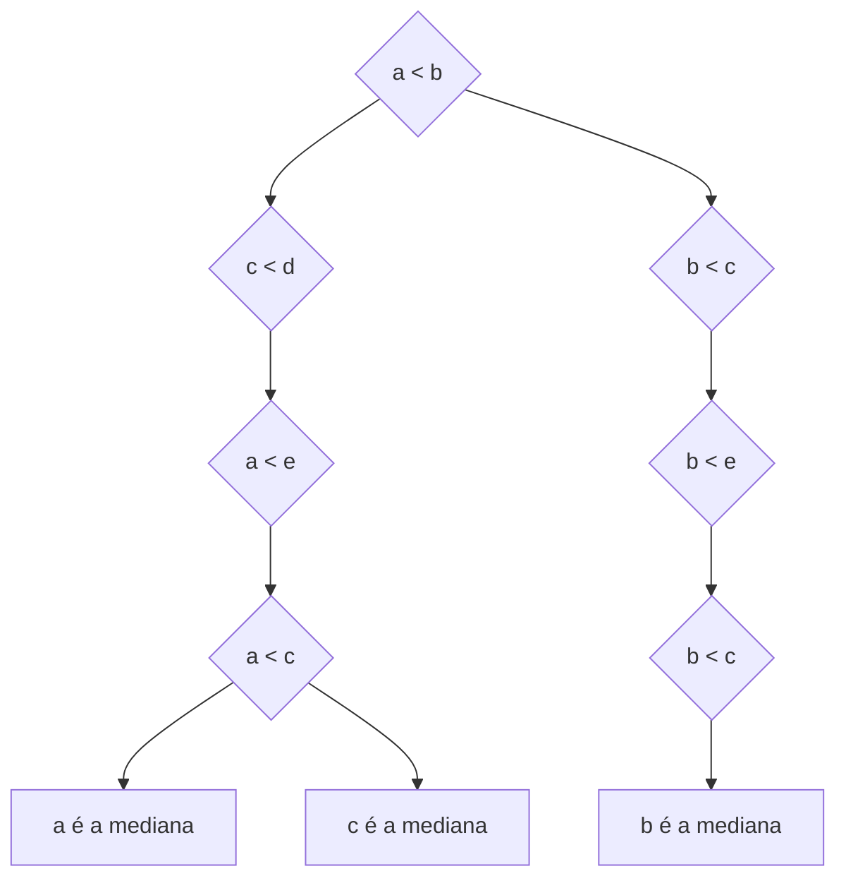

# Exercícios extras

<!--
⌊x⌋: chão \left\lfloor floor
⌈x⌉: teto \left\rroof roof ceil
-->

## Possíveis pontos extras

### SHUFFLING A LINKED LIST [JV: Também não sei se vale ponto extra]

- **Problem.** Given a singly linked list, rearrange its nodes uniformly at random. (All $n!$ permutations equally likely.)
- **Assumption.** Access to a perfect random-number generator.
- **Performance.** $O(n \log n)$ time, $O(\log n)$ extra space.

### 09/12/2024 [JV: Não sei exatamente o que era pra fazer aqui]

Para grupos de 5 elementos

$C(n) = C( ⌊ n/5 ⌋ ) + C(n - 3 ⌊ n/10 ⌋ ) + \frac{11}{5}n$

- $\frac{11}{5}n$
  - computar mediana de 5 elementos ($\leq 6$ comparações por grupo)
  - Particionar

### Ponto extra 1: 11/12/2024 - Tentar reduzir o número de pontos para algo abaixo de 7 [JV: esse é pra fazer mesmo]

Exemplo original do Kleinberg (Slide 005DivideAndConquer1 pág 73)

**Definição:** Seja $s_i$ um ponto na faixa de tamanho $2 \delta$, com a $i$-ésima menor coordenada $y$.

**Afirmação:** Se $|j – i| > 7$, então a distância entre $s_i$ e $s_j$ é pelo menos $\delta$.

**Prova:**

- Considere um retângulo $R$ de $2 \delta$ por $\delta$ na faixa cuja mínima coordenada $y$ é a coordenada $y$ do ponto $s_i$.
- A distância entre $s_i$ e qualquer ponto $s_j$ acima de $R$ é $\geq \delta$.
- Subdivida $R$ em 8 quadrados.
- Haverá no máximo 1 ponto por quadrado. (O diâmetro é $\delta/\sqrt{2} < \delta$)
- No máximo **7** outros pontos podem estar em $R$.
  - A constante pode ser aprimorada com um argumento mais refinado de geometric packing.

---

**Postulado:** Dado que $\delta$ é a menor distância entre dois pontos dentro do problema dividido de menores distâncias por meio de divisão e conquista. Se $|j – i| > 7$, então a distância entre $s_i$ e $s_j$ é pelo menos $\delta$.

**Ponto extra**: fazer uma prova para reduzir a constante de quantos pontos podem ser comparados dentro da faixa cinza e que podem ser menores que delta.

---

### Ponto Extra 2 - Divide-and-conquer: Quiz 5 - Mediana das medianas para uma divisão por 7

Suppose that we divide $n$ elements into $⌊ n/5 ⌋$ groups of $r$ elements each, and use the median-of-medians of these $⌈n/r⌉$ groups as the pivot. For which $r$ is the worst-case running time of select $O(n)$?

a. $r = 3$
b. $r = 7$
c. Both a and b
d. Neither a nor b

---

### Ponto extra 3?: Resolvendo Recorrência [JV: aparentemente esse daqui foi só zoeira]

$$
T(n) =
\begin{cases}
  0                                                       & \text{if } n = 1 \\
  T(\lceil n/2 \rceil) + T(\lfloor n/2 \rfloor) + n - 1   & \text{if } n > 1 \\
\end{cases}
$$

- $n_1 = \lceil n/2 \rceil$;
- $n_2 = \lfloor n/2 \rfloor$;
- $n = n_1 + n_2$;

---

- $T(n) = T(\lceil n/2 \rceil) + T(\lfloor n/2 \rfloor) + n - 1$
- $T(n) = T(n_1) + T(n_2) + n - 1$
- $T(n_1) = T(\lceil n_1/2 \rceil) + T(\lfloor n_1/2 \rfloor) + n_1 - 1$
- $T(n_2) = T(\lceil n_2/2 \rceil) + T(\lfloor n_2/2 \rfloor) + n_2 - 1$

---

## Resoluções JV

### JV: Ponto extra 1: 11/12/2024 - Tentar reduzir o número de pontos para algo abaixo de 7 [JV: esse é pra fazer mesmo]

Exemplo original do Kleinberg (Slide 005DivideAndConquer1 pág 73)

**Definição:** Seja $s_i$ um ponto na faixa de tamanho $2 \delta$, com a $i$-ésima menor coordenada $y$.

**Afirmação:** Se $|j – i| > 7$, então a distância entre $s_i$ e $s_j$ é pelo menos $\delta$.

**Prova:**

- Considere um retângulo $R$ de $2 \delta$ por $\delta$ na faixa cuja mínima coordenada $y$ é a coordenada $y$ do ponto $s_i$.
- A distância entre $s_i$ e qualquer ponto $s_j$ acima de $R$ é $\geq \delta$.
- Subdivida $R$ em 8 quadrados.
- Haverá no máximo 1 ponto por quadrado. (O diâmetro é $\delta/\sqrt{2} < \delta$)
- No máximo **7** outros pontos podem estar em $R$.
  - A constante pode ser aprimorada com um argumento mais refinado de *geometric packing*.

---

**Postulado:** Dado que $\delta$ é a menor distância entre dois pontos dentro do problema dividido de menores distâncias por meio de divisão e conquista. Se $|j – i| > 7$, então a distância entre $s_i$ e $s_j$ é pelo menos $\delta$.

**Ponto extra**: fazer uma prova para reduzir a constante de quantos pontos podem ser comparados dentro da faixa cinza e que podem ser menores que delta.

---

#### Solução: apenas analisar os quadrados do lado oposto

Como estamos buscando o menor valor, teremos que, caso a distância entre dois pontos de um mesmo lado tenha valor menor que $\delta$, isso o tornaria o novo $\delta$, sendo assim, consideramos que o menor valor entre dois pontos de um mesmo lado do $L$, não pode ser menor que $\delta$.

Com isso, entendemos que a menor distância entre qualquer par de pontos pertencente ao intervalo $[L - \delta, L]$ ou ao intervalo $[L, L + \delta]$ é $\delta$. Então, para potencialmente encontrarmos uma solução menor que $\delta$, para um ponto pertencente ao lado esquerdo de $L$, para cada um dos pontos, precisamos apenas analisar os pontos do lado oposto ao qual ele se encontra.

Assim, considerando ainda a partição em quadrantes, reduz-se o número máximo de pontos a serem comparados para 4.

#### Apenas analisar os quadrantes que têm interseção com o círculo de raio $\delta$ [JV: errado]

A redução pode ser ainda maior, se considerarmos que a distância entre dois pontos é menor que $\delta$ se, e somente se, os dois pontos estiverem contidos em um círculo de raio $\delta$. Assim, podemos considerar que um círculo cujo centro é o ponto $S_i$, esse círculo sobreporá no máximo 2 dos quadrantes do outro lado.

### JV: Ponto Extra 2 - Divide-and-conquer: Quiz 5 - Mediana das medianas para uma divisão por 7

Suppose that we divide $n$ elements into $⌊ n/5 ⌋$ groups of $r$ elements each, and use the median-of-medians of these $⌈n/r⌉$ groups as the pivot. For which $r$ is the worst-case running time of select $O(n)$?

a. $r = 3$
b. $r = 7$
c. Both $a$ and $b$
d. Neither $a$ nor $b$

---

Achar a constante que dá certo para $R = 7$

---

$C(n) \leq C( ⌊ n/5 ⌋ ) + C(n - 3 ⌊ n/10 ⌋ ) + \frac{11}{5}n$

Onze comparações:

## Resoluções Gustavo

### Questão que não sei qual

### É possível reduzir o número de comparações para o problema de menor distância planar para algo menor que 7?

- Resposta:
  - Opção 01:
    - Regiões de menor densidade podem resultar em uma comparação com $n < 7$ elementos. Se há uma garantia que a densidade da região é pequena. Em nível de complexidade pode-se reduzir o número máximo de comparações uma vez que nem todos os quadradinhos serão populados
  - Opção 02:
    - Usando diagramas de Voronoi no lugar de quadradinhos. O Diagrama divide o espaço em células poligonais e cada célula possui os pontos mais próximos de um ponto específico. Dois pontos só podem ter distância menor do que $\delta$ se as duas células tiverem arestas simultâneas. Então só será necessário comparar cada ponto com suas arestas vizinhas. Se os polígonos resultantes tiverem menos de 7 lados, garantidamente haverão menos de 7 comparações

### Mediana das medianas para uma divisão por 7

Para o número de elementos iguais a 7

Pelo menos metade dos 7 medianas de elementos tem que ser menores ou iguais a p

Além disso, pelo menos Chão(Chão(n/7)/2) (Ou seja, chão(n/14)) medianas tem que ser menores ou iguais a p

Entretanto, como P pode ser maior ou igual a 4 dos elementos, temos que 4*chão(n/14)) tem que ser menores ou iguais a p

## Dúvidas

> Non-degeneracy assumption. No two points have the same x-coordinate.

Por que eles não podem ter o mesmo valor de x?
