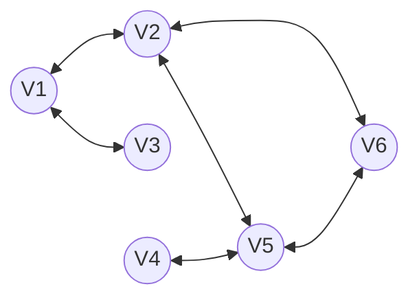

# Resumo do Módulo 3

Esse módulo está dividido em 4 partes (segundo a lista da Olga):

1. Indução e Recursão
2. Divisão e Conquista
3. Programação Dinâmica
4. NP

---

Segundo a apresentação dela, está dividido da seguinte forma:

- Módulo 3
  - Fundamentos Matemáticos
    - Indução matemática e estrutural
    - Recursividade
  - Paradigmas Algortímicos
    - Divisão e Conquista
    - Programação Dinâmica
    - Greedy

---

Temos também os slides que ela apresentou em aula, sendo eles:

1. [~~02AlgorithmAnalysis_commonRunningTimesBeforeNP~~](<../Materiais enviados/Módulo 3 e 4/PAA - Livros e Slides/02AlgorithmAnalysis_commonRunningTimesBeforeNP.pdf>)
2. [04GreedyAlgorithmsI_select06_DP](<../Materiais enviados/Módulo 3 e 4/PAA - Livros e Slides/04GreedyAlgorithmsI_select06_DP.pdf>)
   - coin changing
   - interval scheduling
   - interval partitioning
   - scheduling to minimize lateness
   - optimal caching
3. [05DivideAndConquerI](<../Materiais enviados/Módulo 3 e 4/PAA - Livros e Slides/05DivideAndConquerI.pdf>)
    - mergesort
      - [05DemoMerge](<../Materiais enviados/Módulo 3 e 4/PAA - Livros e Slides/05DemoMerge.pdf>)
         - merge demo
         - merge-and-count demo
    - counting inversions
    - randomized quicksort
       [05DemoQuick](<../Materiais enviados/Módulo 3 e 4/PAA - Livros e Slides/05DemoQuick.pdf>)
        - 3-way partitioning demo
        - randomized quickselect demo
    - median and selection
    - closest pair of points
4. [05DivideAndConquerII-MasterTheorem](<../Materiais enviados/Módulo 3 e 4/PAA - Livros e Slides/05DivideAndConquerII-MasterTheorem.pdf>)
5. [06DynamicProgrammingI_select](<../Materiais enviados/Módulo 3 e 4/PAA - Livros e Slides/06DynamicProgrammingI_select.pdf>)
   - weighted interval scheduling
   - ~~segmented least squares~~
   - knapsack problem
   - ~~RNA secondary structure~~
6. [06DynamicProgrammingII.BellmanFord.editedOlga](<../Materiais enviados/Módulo 3 e 4/PAA - Livros e Slides/06DynamicProgrammingII.BellmanFord.editedOlga.pdf>)
    - ~~sequence alignment~~
    - ~~Hirschberg′s algorithm~~
    - Bellman–Ford–Moore algorithm
    - distance-vector protocols
    - negative cycles

Obs.: Ela aparentemente também tá cobrando indução e recursão que é no arquivo [PAA_Inducao_ILC_Slides_Olga](<../Materiais enviados/Módulo 3 e 4/PAA - Livros e Slides/Logica Revisão/PAA_Inducao_ILC_Slides_Olga.pdf>) que ela não apresentou em aula.

---

Com isso concluo a seguinte organização:

- Fundamentos Matemáticos
  - [Indução e Recursão: Indução Matemática Fraca e Forte, Indução Estrutural, Algoritmos Recursivos](<../Materiais enviados/Módulo 3 e 4/PAA - Livros e Slides/Logica Revisão/PAA_Inducao_ILC_Slides_Olga.pdf>)
  - Indução matemática e estrutural
  - Recursividade
- Paradigmas Algortímicos
  - [Algoritmos Gulosos 1](<../Materiais enviados/Módulo 3 e 4/PAA - Livros e Slides/04GreedyAlgorithmsI_select06_DP.pdf>)
    - coin changing
    - interval scheduling
    - ~~interval partitioning~~
    - ~~scheduling to minimize lateness~~
    - ~~optimal caching~~
  - Divisão e Conquista
    - [Divisão e Conquista 1](<../Materiais enviados/Módulo 3 e 4/PAA - Livros e Slides/05DivideAndConquerI.pdf>)
      - Mergesort
        - [Mergesort Demo](<../Materiais enviados/Módulo 3 e 4/PAA - Livros e Slides/05DemoMerge.pdf>)
          - merge demo
          - merge-and-count demo
      - counting inversions
      - randomized quicksort
        - [Quicksort Demo](<../Materiais enviados/Módulo 3 e 4/PAA - Livros e Slides/05DemoQuick.pdf>)
          - 3-way partitioning demo
          - randomized quickselect demo
      - median and selection
      - closest pair of points
    - [Divisão e Conquista 2 - Teorema Mestre](<../Materiais enviados/Módulo 3 e 4/PAA - Livros e Slides/05DivideAndConquerII-MasterTheorem.pdf>)
  - Programação Dinâmica
    - [Programação Dinâmica 1](<../Materiais enviados/Módulo 3 e 4/PAA - Livros e Slides/06DynamicProgrammingI_select.pdf>)
      - weighted interval scheduling
      - ~~segmented least squares~~
      - knapsack problem
      - ~~RNA secondary structure~~
    - [Programação Dinâmica 2](<../Materiais enviados/Módulo 3 e 4/PAA - Livros e Slides/06DynamicProgrammingII.BellmanFord.editedOlga.pdf>)
      - ~~sequence alignment~~
      - ~~Hirschberg′s algorithm~~
      - Bellman–Ford–Moore algorithm
      - distance-vector protocols
      - negative cycles

## [Fundamentos Matemáticos](<../Materiais enviados/Módulo 3 e 4/PAA - Livros e Slides/Logica Revisão/PAA_Inducao_ILC_Slides_Olga.pdf>)

### Indução matemática e estrutural

#### Indução Matemática Fraca

- **Ideia geral não-matemática:** Para você provar que certa afirmação é verdade, você precisa generalizar de tal forma, que se você utilizar de passos repetidos graduais que te direcionem ao seu objetivo, em algum momento você alcançará o que deseja.
  - Exemplo: para você chegar no final da escada, você precisa subir o primeiro degrau; Estando no primeiro, você consegue chegar no segundo e assim por diante, até alcançar o último.

A indução fraca tem duas partes:

1. Passo base: Demonstra-se a fórmula mostrada para o primeiro valor.
2. Passo indutivo: Demonstra-se que a fórmula é verdadeira para $k+1$.

No geral, o que é preciso fazer é ficar descontruindo e reconstruindo a fórmula gerada a partir do $k+1$ para se alcançar a fórmula do passo base, somado a $k+1$.

Exemplo do processo:

- **Fórmula:** $1 + 2 + 3 + \dots + n = \frac{n(n+1)}{2}$
- **Passo base:** $n = 1$
  - $1 = \frac{1(1+1)}{2} = 1$
- **Passo indutivo:** $n = k+1$
  - $1 + 2 + 3 + \dots + k + (k+1) = \frac{(k+1)((k+1)+1)}{2}$
    - $\frac{(k+1)((k+1)+1)}{2} =$
    - $\frac{(k+1)(k+2)}{2} =$
    - $\frac{k^2 + k + 2k + 2}{2} =$
    - $\frac{k^2 + k}{2} + \frac{2k + 2}{2} =$
    - $\frac{k(k+1)}{2} + (k+1) =$
  - $1 + 2 + 3 + \dots + k + (k+1) = \frac{k(k+1)}{2} + (k+1)$

> O princípio da indução pode ser utilizado para demonstrar propriedades dos números inteiros (se elas forem verdadeiras).

#### Indução Matemática Forte

Aparentemente, ao invés de provar que você consegue alcançar o caso $k+1$ como era na indução fraca, aqui deve-se provar que todo valor de $j \in [1, k]$ é verdadeiro.

Aqui, deve-se provar que $P(1) \land P(2) \land \dots \land P(k) \implies P(k+1)$.

Afinal, se é tudo verdadeiro até $P(k)$, dificilmente $P(k+1)$ será falso. :stuck_out_tongue_winking_eye:

Cara, esse negócio de Indução Matemática Forte é muito esquisito.

Exemplos de uso:

- Todo número inteiro $n \geq 2$ pode ser escrito como um produto de números primos.
- Todo número inteiro maior ou igual a 8 pode ser escrito como a soma de 3s e 5s.
- Todo número inteiro maior ou igual a 12 pode ser escrito como a soma de 4s e 5s.

### Recursividade

O conceito de recursividade é a ideia de que uma função pode chamar a si mesma.

Exemplos:

- Fatorial: $n! = n \cdot (n-1)!$ ou $fat(n) = n \cdot fat(n-1)$
- Fibonacci: $Fib(n) = Fib(n-1) + Fib(n-2)$

Mas para isso, é necessário uma condição de parada. Muitas vezes tem-se apenas uma condição de parada, que seria algo como: $f(0) = 1$.

Então, matematicamente, usa-se o seguinte formato:

```math
fat(n) =
\begin{cases}
  1 & \text{para } n = 0 \\
  n \cdot fat(n-1) & \text{para } n > 0
\end{cases}
```

```math
Fib(n) =
\begin{cases}
  0 & \text{para } n = 0 \\
  1 & \text{para } n = 1 \\
  Fib(n-1) + Fib(n-2) & \text{para } n > 1
\end{cases}
```

ou então

```math
\begin{cases}
  fat(0) = 1\\
  fat(n) = n \cdot fat(n-1) & \text{para } n > 0
\end{cases}
```

Agora fazendo algumas equivalências:

```math
f(n) = a^n

\Leftrightarrow

f(n) =
\begin{cases}
  1 & \text{para } n = 0 \\
  a \cdot f(n-1) & \text{para } n > 0
\end{cases}

\Leftrightarrow

\begin{cases}
  f(0) = 1\\
  f(n) = a \cdot f(n-1) & \text{para } n > 0
\end{cases}
```

Conceitualmente então, precisamos de duas partes para definir uma função recursiva:

- Condições de parada/Caso base
- Relação de recorrência/Passo recursivo

Quando usa-se recursividade para definir conjuntos, o caso base é o conjunto inicial de itens e o passo recursivo é a adição de um novo item ao conjunto.

Existe também uma regra de exclusão (que eu não entendi).

> Elementos que não podem ser gerados a partir da aplicação do passo base e instâncias do passo indutivo não pertencem ao conjunto.

Exemplo de conjuntos gerados por recorrência:

#### Conjunto de múltiplos de 3 positivos $M_3$

```math
\begin{cases}
  3 \in M_3\\
  n \in M_3 \implies n+3 \in M_3
\end{cases}
```

ou então

```math
\begin{cases}
  3 \in M_3\\
  (x \in M_3) \land (y \in M_3) \rightarrow (x+y \in M_3)
\end{cases}
```

#### Cadeias/Strings/Alfabetos

Para isso, definem-se alguns símbolos e notações:

- $\Sigma$ é o alfabeto
- $\Sigma^*$ é o conjunto de todas as cadeias possíveis
- $\epsilon$ é a cadeia vazia
- $w$ é uma cadeia
- $|w|$ é o comprimento da cadeia
- $w[i]$ é o $i$-ésimo símbolo da cadeia
- $a$ é um dos símbolos presentes no alfabeto
- $wa$ é a concatenação da cadeia $w$ com o símbolo $a$

Podemos dizer que $\epsilon \in \Sigma^*$. Pois a cadeia vazia está presente no conjunto de todas as possibilidades de junções de símbolos do alfabeto. Mais especificamente seria o caso do $\Sigma^0$, onde ele não é concatenado com nenhum elemento de seu conjunto de símbolos.

Sua definição de recorrência seria o seguinte:

```math
\begin{cases}
  \epsilon \in \Sigma^*\\
  w \in \Sigma^* \implies \forall a \in \Sigma, wa \in \Sigma^*
\end{cases}
```

##### Exemplo 12 (do slide)

Dado que $\Sigma = \{0, 1\}$, Qual seria $\Sigma^*$?

- $\Sigma^0 = \{\epsilon\}$: O passo base.
- $\Sigma^1 = \{\epsilon, 0, 1\}$: Concatenam-se todos os símbolos presentes no $\Sigma$ com os próprios itens.
- $\Sigma^2 = \{\epsilon, 0, 1, 00, 01, 10, 11\}$: Concatenam-se todos os símbolos presentes no $\Sigma$ com os próprios itens. De novo.
- $\dots$
- $\Sigma^*$ = Conjunto de todos os números binários possíveis.

#### Árvores (de grafos)

Primeiro definamos os elementos de um grafo:

- $G$ é o grafo
  - $G = (V, E)$ onde $V$ e $E$ são definidos abaixo.
- $V$ é o conjunto de vértices
  - $v \in V$ é um vértice
- $E$ é o conjunto de arestas
  - $e \in E$ é uma aresta
  - $e = (v_1, v_2)$ é uma aresta que conecta os vértices $v_1$ e $v_2$

Agora, alguns termos relacionados aos grafos:

- **Ciclo:** caminho de arestas consecutivas que começa e termina no mesmo vértice.
- **Vértice interno:** vértice que está conectado a pelo menos dois outros vértices.
- **Folha:** vértice que está conectado a apenas um outro vértice.

Exemplo:



Nesse exemplo:

- **Ciclo:** $V1 \rightarrow V2 \rightarrow V5 \rightarrow V6 \rightarrow V2 \rightarrow V1$
- **Vértices internos:** $V1$, $V2$, $V5$, $V6$
- **Folhas:** $V3$, $V4$

---

Mais definições:

- **Árvore:** grafo conexo sem ciclos.
- **Árvore binária:** árvore onde cada vértice tem no máximo dois filhos.
- **Árvore binária completa:** árvore binária onde todos os níveis estão completos, exceto possivelmente o último.

Uma árvore binária completa pode ser definida recursivamente como...

Ai, a explicação disso aqui é muito feia. Vou só copiar de lá:

- **Passo Base:** Um vértice isolado é uma árvore binária completa.
- **Passo Recursivo:** Se $T_1$ e $T_2$ são árvores binárias completas disjuntas com raízes $r_1$ e $r_2$, respectivamente, então pode-se formar uma nova árvore binária completa ao se conectar um vértice $r$ (não presente em $T_1$ ou $T_2$, que chamaremos de raiz) através de uma aresta a $r_1$ e outra aresta a $r_2$.

### Indução Estrutural

Isso aqui tá explicadinho legal, então vou tirar do slide talis qualis:

> - Se um conjunto tem uma definição recursiva, é possível demonstrar propriedades dos elementos deste conjunto através de indução.
> - A **indução estrutural** é uma maneira de mostrar que se:
>   1. os elementos iniciais do conjunto (passo base) satisfazem uma certa propriedade, e
>   2. as regras de construção de novos elementos (passo indutivo) preservam esta propriedade,
>   - então todos os elementos do conjunto satisfazem a propriedade.

Ele também tem seu passo base e passo indutivo.

No **passo base**, mostra-se que a propriedade é verdadeira para os elementos iniciais do conjunto.

No **passo indutivo**, mostra-se que a propriedade é preservada pelas regras de construção de novos elementos.

A **hipótese de indução** é que a propriedade é verdadeira para todos os elementos que são construídos a partir de elementos iniciais.

#### Exemplo de Indução Estrutural (Exemplo 14 do Slide)

Considerando aquele mesmo conjunto de múltiplos de 3 positivos $M_3$:

```math
M_3 =
\begin{cases}
  3 \in M_3\\
  x, y \in M_3 \implies x+y \in M_3
\end{cases}
```

- **Passo Base:** $3 \in M_3$
  - É verdadeiro, pois 3 é um múltiplo de 3, visto que $3 = 3 \cdot 1$ e $1 \in \mathbb{Z}$.
- **Passo Indutivo:** $x, y \in M_3 \implies x+y \in M_3$
  - Se $x, y \in M_3$, então $x = 3a$ e $y = 3b$ para $a, b \in \mathbb{Z}$.
  - Então, $x + y = 3a + 3b = 3(a+b)$.
  - Como $a+b \in \mathbb{Z}$, então $x+y \in M_3$.

#### Outros exemplos, agora com árvores

- **Altura:** $h(T)$.

```math
h(T) =
\begin{cases}
  0 & \text{se } T \text{ é uma folha}\\
  1 + \max(h(T_1), h(T_2)) & \text{se } T \text{ tem raízes } T_1 \text{ e } T_2
\end{cases}
```

- **Número de folhas:** $n(T)$.

```math
n(T) =
\begin{cases}
  1 & \text{se } T \text{ é uma folha}\\
  1 + n(T_1) + n(T_2) & \text{se } T \text{ tem raízes } T_1 \text{ e } T_2
\end{cases}
```

### Algoritmos Recursivos

Ora, agora volta a falar sobre recursão/recorrência. Isso seria melhor se estivesse junto com a parte de recursividade...

E aqui não tem nada de muito novo. É só a explicação de recorrência/recursão numa forma mais computacional.

## Paradigmas Algortímicos

### [Algoritmos Gulosos 1](<../Materiais enviados/Módulo 3 e 4/PAA - Livros e Slides/04GreedyAlgorithmsI_select06_DP.pdf>)

#### Coin Changing

#### Interval Scheduling

### Divisão e Conquista

#### Mergesort

#### Counting Inversions

#### Randomized Quicksort

#### Median and Selection

##### Median of Medians (MoM) Selection Algorithm

#### Closest Pair of Points (CP)

### Programação Dinâmica (PD)

#### PD1: Weighted Interval Scheduling

#### PD1: knapsack problem

#### PD2: Bellman–Ford–Moore algorithm

#### PD2: Distance-vector protocols

#### PD2: Negative cycles

## 2. Divisão e Conquista

### Dijkstra 3-way partitioning - $O(n)$

- **Descrição:** defina um pivô `p`; tenha os ponteiros `i`, `lt` (less than) e `gt` (greater than); O `lt` marca o primeiro elemento do conjunto de valores iguais ao pivô; O `i` começa no primeiro elemento após o conjunto de pivôs e o `gt` começa no último elemento do array; Se o elemento na posição `i` for menor que o pivô, troque com o elemento na posição `lt` e incremente `i` e `lt`; Se o elemento na posição `i` for maior que o pivô, troque com o elemento na posição `gt` e decremente o `gt`; Se o elemento na posição `i` for igual ao pivô, apenas incremente o `i`;

---

Anotações do slide Demo

- Seja `p` o pivô
- Troque `p` pelo index `lo` [JV: Não entendi]
- Escaneie com o `i` da esquerda pra direita
  - Se `a[i] < p`, troque `a[lt]` com `a[i]` e incremente `lt` e `i`
  - Se `a[i] > p`, troque `a[gt]` com `a[i]` e decremente `gt`
  - Se `a[i] == p`, apenas incremente `i`

### Randomized quicksort - $O(n \log n)$

- **Descrição:** Defina um pivô aleatório; Coloque os menores à esquerda e os maiores à direita; Recursivamente, aplique o algoritmo nos subarrays à esquerda e à direita do pivô.

#### Anotações do slide Demo

- Escolha um pivô aleatório
- Crie 3 partes do array: Esquerda, Meio e Direita
- Recursivamente, aplique o algoritmo nos subarrays à parte esquerda e à parte direita do pivô

##### Randomized quicksort - Implementação

```python
def partition_3_way_dijkstra(A, pivot):
  lt = 0
  gt = len(A) - 1
  i = 0
  while i <= gt:
    if A[i] < pivot:
      A[lt], A[i] = A[i], A[lt]
      lt += 1
      i += 1
    elif A[i] > pivot:
      A[gt], A[i] = A[i], A[gt]
      gt -= 1
    else:
      i += 1
  
  left = A[:lt]
  middle = A[lt:gt+1]
  right = A[gt+1:]

  return left, middle, right
  # return A

def partition_3_way_py(A, pivot):
  left    = [x for x in A if x <  pivot]
  middle  = [x for x in A if x == pivot]
  right   = [x for x in A if x >  pivot]
  return left, middle, right

def randomized_quicksort(A):
  if len(A) <= 1:
    return A
  pivot = random.choice(A)
  L, M, R = partition_3_way_py(A, pivot)
  return randomized_quicksort(L) + M + randomized_quicksort(R)
```

##### Chance dos elementos $a_i$ e $a_j$ serem comparados

Apenas se um deles for escolhido como pivô. A chance dele ser escolhido como pivô aleatoriamente é $\frac{1}{n}$, onde $n$ é o tamanho do array. Como são dois possíveis pivôs, a chance de um deles ser escolhido é $\frac{1}{n} + \frac{1}{n} = \frac{2}{n}$.

É dito que a Probabilidade de $a_i$ e $a_j$ serem comparados é $\frac{2}{j-i+1}$. Ou seja, $2 =$ a quantidade de elementos que se tá computando a probabilidade de serem comparados. e $j-i+1 =$ a quantidade de elementos que estão entre $a_i$ e $a_j$.

---

Tem toda uma matemática com soma harmônica que eu não entendi.

### Median-of-Medians (MoM) Selection Algorithm

- **Descrição:** Divide o array em grupos de 5 elementos; Encontra a mediana de cada grupo; Encontra a mediana das medianas; Usa a mediana das medianas como pivô.

---

- **Pseudocódigo**

- **MOM-SELECT** $(A, k)$
- $n \leftarrow |A|$
- **SE** $(n < 50)$
  - **RETORNE** o $k$-ésimo menor elemento de $A$ via mergesort.
- Agrupe $A$ em $\left\lceil \frac{n}{5} \right\rceil$ grupos de 5 elementos cada (ignore leftovers).
- $B \leftarrow$ mediana de cada grupo de 5.
- $p \leftarrow$ MOM-SELECT$(B, \left\lceil \frac{n}{10} \right\rceil)$ <!-- <- Mediana das medianas -->
- $(L, M, R) \leftarrow$ PARTITION-3-WAY$(A, p)$.
- **SE** $(k \leq |L|)$ **RETORNE** MOM-SELECT$(L, k)$.
- **SENÃO SE** $(k > |L| + |M|)$ **RETORNE** MOM-SELECT$(R, k - |L| - |M|)$
- **SENÃO** **RETORNE** $p$.

## 3. Programação Dinâmica

## 4. NP

### Algoritmos Gulosos

#### Cashier's Algorithm

- **Descrição:** a cada iteração, adicione uma moeda do maior valor que não nos leva além do valor a ser pago.

- **Observações:** sua otimalidade depende do conjunto de moedas que poderão ser utilizadas. Não só a otimalidade, mas a existência de uma solução.
  - Exemplo de não-otimalidade:
    - Valor a ser pago: 6; Moedas: 1, 3, 4
  - Exemplo de inexistência de solução:
    - Valor a ser pago: 2; Moedas: 3, 4

- **Propriedades de uma solução ótima:** [JV: No slide fala especificamente sobre as moedas dos EUA e não fala de forma não matematicamente genérica, então não garanto a certeza dessa afirmação.]
  - Cada moeda deverá ter uma soma em seu valor menor que a o valor da moeda seguinte.
  - **Matematicamente:**
    - **Descrição:** cada somatório de valores de moedas não deve exceder o valor da moeda seguinte.
      - $⌈ \frac{m_{k+1}}{m_k} ⌉ - 1 \leq n_k$
      - $⌈ \frac{m_{k+1}}{m_k} ⌉ > n_k$
      - Onde:
        - $m_k$ é o valor da moeda $k$
        - $n_k$ é a quantidade de moedas de valor $m_k$
        - $m_{k+1}$ é o valor da moeda diretamente maior que $m_k$
    - **Descrição:** o somatório de moedas de valor baixo não deve exceder o valor da moeda de valor mais alto.
      - $\sum_{i=1}^{k} m_i \cdot n_i \leq m_{k+1} - 1$
    - **Descrição:** se tenho um valor a ser pago que se encontra entre dois valores de moedas, a solução ótima inclui a moeda diretamente menor que o valor.
      - $m_k < v \leq m_{k+1}; m_k \in S.O.$
      - Onde:
        - $S.O.$ é a solução ótima
      - [JV: ora... mas isso recai no exemplo de não-otimalidade 🤔]

---

- **Pseudocódigo**
  - **CASHIERS_ALGORITM** $(x, c_1, c_2, \dots, c_n)$
  - **SORT** $n$ coin denominations so that $0 < c_1 < c_2 < \dots < c_n$.
  - $S \leftarrow \emptyset$.
  - **WHILE** $(x > 0)$
    - $k \leftarrow$ largest coin denomination $c_k$ such that $c_k \leq x$.
    - **IF** (no such $k$)
      - **RETURN** "no solution."
    - **ELSE**
      - $x \leftarrow x - c_k$.
      - $S \leftarrow S \cup \{ k \}$.
  - **RETURN** $S$.

- **Código**

```python
def cashier(amount, coins):
  coins.sort(reverse=True)
  change = []
  for coin in coins:
    while coin <= amount:
      change.append(coin)
      amount -= coin
  return change
```

#### Algoritmos de programação dinâmica

##### Weighted Interval Scheduling - Brute Force

- **Descrição:** encontrar o conjunto de intervalos que não se sobrepõem e que tenham o maior somatório possível.
  - Um intervalo começa em $s_i$ e termina em $f_i$ e tem um peso $w_i$.

- Função auxiliar $p(i)$
  - **Descrição:** retorna o maior índice $j$ tal que $f_j \leq s_i$.

---

- **Pseudocódigo**
  - **WIS_TopDown(n, StartingTime, FinishTime, Weight)**
    - sort intervals by finish time
    - $p \leftarrow \emptyset$
    - for $i = 1$ to $n$
      - $p[i] \leftarrow$ $p(i)$ # find the largest index j such that $f_j \leq s_i$
    - $M[0] \leftarrow 0$
    - **Return** M_Compute_Opt(n, M)

  - **WIS_BottomUp(n, StartingTime, FinishTime, Weight)**
    - sort intervals by finish time
    - $p \leftarrow \emptyset$
    - for $i = 1$ to $n$
      - $p[i] \leftarrow$ $p(i)$ # find the largest index j such that $f_j \leq s_i$
    - $M[0] \leftarrow 0$
    - for $j = 1$ to $n$
      - $M[j] \leftarrow \max \{ M[j-1], w_j + M[p[j]] \}$
    - **Return** $M[n]$

  - **M_Compute_Opt(j, M)**
    - **IF** ($M = \emptyset$)
      - $M[j] \leftarrow \max \{ M_Compute_Opt(j-1, M), w_j + M_Compute_Opt(p[j], M) \}$
    - **Return** $M[j]$

  - **Find_Solution(j)**
    - **IF** ($j = 0$)
      - **Return** $\emptyset$
    - **ELSE IF** ($w_j + M[p[j]] > M[j-1]$)
      - **Return** $\{ j \} \cup$ Find_Solution(p[j])
    - **ELSE**
      - **Return** Find_Solution(j-1)

---

- **Código**

```python
# Pode acabar ocorrendo problema com a indexação por 1.

def sort_by_finish_time(starts, ends, weights):
  return zip(*sorted(zip(starts, ends, weights), key=lambda x: x[1])) # Does it work? Copilot did it for me.

def compute_previous_jobs(n, starts, ends, previous_jobs):
  previous_jobs = [-1] * (n)
  for i in range(1, n):
    # previous_jobs[i] armazenará o maior índice j que tem o seu tempo de término menor ou igual ao tempo de início de i
    previous_jobs[i] = max([j for j in range(i) if ends[j] <= starts[i]], default=-1)
  return previous_jobs

def wis_bottom_up(n, starts, ends, weights, previous_jobs):
  s, f, w = sort_by_finish_time(starts, ends, weights)
  compute_previous_jobs(n, s, f, previous_jobs)
  values_vec = [0] * (n)
  for j in range(1, n):
    values_vec[j] = max([values_vec[j-1], w[j] + values_vec[previous_jobs[j]]], default=-1)
  return values_vec

def find_solution(j, weights, values_vec, previous_jobs):
  if j == 0:
    return []
  elif weights[j] + values_vec[previous_jobs[j]] > values_vec[j-1]:
    return [j] + find_solution(previous_jobs[j], values_vec, previous_jobs)
  else:
    return find_solution(j-1, values_vec, previous_jobs)

def input_initial_values():
  n = 5
  starts = [1, 2, 4, 6, 8]
  ends = [3, 5, 7, 9, 10]
  weights = [5, 1, 8, 4, 6]
  return n, starts, ends, weights

def get_WIS_solution(n, starts, ends, weights):
  previous_jobs = []
  values_vec, weights = wis_bottom_up(n, starts, ends, weights, previous_jobs)
  solution = find_solution(n-1, weights, values_vec, previous_jobs)
  return solution

def weighted_interval_scheduling():
  n, starts, ends, weights = input_initial_values()
  final_solution = get_WIS_solution(n, starts, ends, weights)
  print(final_solution)
```

##### Maximum Subarray Problem

###### Kadane's Algorithm

###### Bentley's Algorithm

Complexidade

$(n^2)^x = n^3$

$x = 3/2 = 1 + 1/2$

##### Knapsack problem

- **Descrição:** Dado um conjunto de itens, cada um com um peso e um valor, determine o número de cada item a incluir em uma coleção de modo a maximizar o valor total, enquanto se mantém o peso total abaixo de um limite.

##### Coin Change

##### Dijkstra's Algorithm - Efficient Implementation
