# Lista 4

Universidade Federal de Minas Gerais

Departamento de Computação

Projeto e Análise de Algoritmos - 2024.2

Professor: Marcio Costa Santos

---

## Exercício 1. Prove ou refute: em uma busca em largura o conjunto formado pelos nós PRETOS sempre induz um grafo conexo

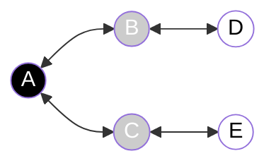

### Classificação de arestas

- T: **Árvore**
- C: **Avanço**
- R: **Retorno**
- F: **Cruzamento**

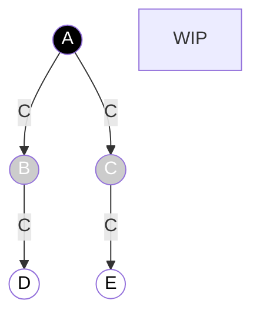

## Exercício 2. Prove ou refute: em uma busca em largura o conjunto formado pelos nós CINZAS sempre induz um grafo conexo

## Exercício 3. Prove ou refute: em uma busca em largura o conjunto formado pelos nós BRANCOS sempre induz um grafo conexo

transcrever da imagem

## Exercício 4. ~~O diâmetro~~ a altura de uma grafo é seu maior menor caminho caminho de uma folha até a raiz. Dado uma árvore $T = (V, E)$ escreva um algoritmo que calcula ~~o diâmetro~~ a altura dessa árvore. Qual a complexidade do seu algoritmo? Ele é eficiente?

- Tenho que rodar o BFS uma vez, passando como parâmetro a árvore e o vértice raiz. O retorno será o valor do maior nível encontrado.

```python
def altura_find(T, raiz)
  altura = bfs(T, raiz)
  return altura
```

## Exercício 5. Dado um grafo $G = (V, E)$ qualquer escreva um algoritmo que calcula o diâmetro do grafo. Qual a complexidade do seu algoritmo?

- Na BFS, pego o vetor distância u.d sendo $u \in V(G)$

```python
def diametro_find(G)
  d1[] = bfs(0)
  d_max = max(d1)
  d2[] = bfs(d1.index(d_max))
  d_max2 = max(d2)
  return d_max2
```

- $O(E + V)$

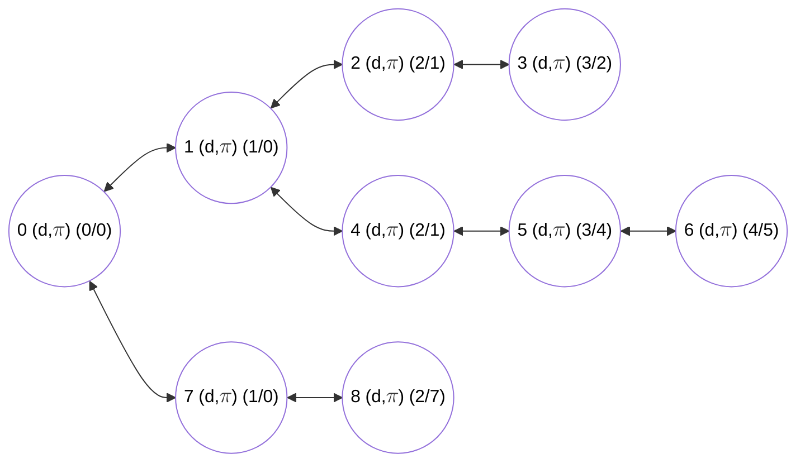

## Exercício 6. Aplique o algoritmo de busca em largura para o grafo abaixo

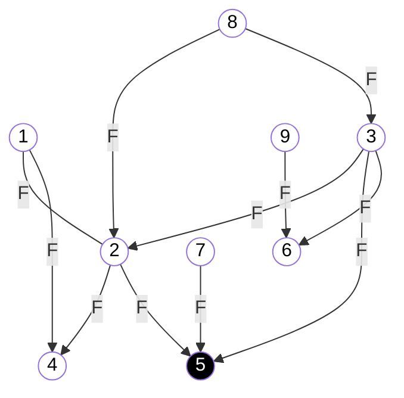

## Exercício 7. A aplicação da busca em largura em um grafo ponderado nas arestas não produz os caminhos de custo mínimo (considerando como o tamanho do caminho sendo a soma das arestas). Dê um exemplo para ilustrar esse fato

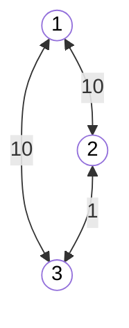

Nesse caso, a BFS vai retornar os vértices...

## Exercício 8. É possível modificar o algoritmo de busca em largura para calcular o menor caminho mesmo em um grafo ponderado? Como? Qual a nova complexidade desse algoritmo? Sua abordagem funciona se o grafo tiver pesos negativos?

Sim, é possível modificar. Fazendo com que a busca em largura atualize um vetor de menores caminhos até finalizar sua execução.

### Eles

bfs com fila de prioridade + relax 😄

Dijkstra

$O(N^2)$ - Lista e Matriz

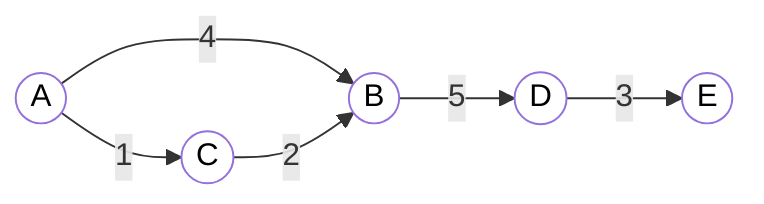

A matriz abaixo deve ser interpretada como sendo: a primeira linha indica

$$
BFS =
\begin{bmatrix}
  \text{Valores máximos até:}   & A & B & C &      D &      E \\
  \text{Vértice sendo visitado} &   &   &   &        &        \\
    A                           & 0 & 4 & 1 & \infty & \infty \\
    C                           & 0 & 3 & 1 &      6 & \infty \\
    B                           & 0 & 3 & 0 &      4 & \infty \\
    D                           & 0 & 3 & 1 &      4 &      7 \\
\end{bmatrix}
$$

Para pesos negativos teria que ser o Bellman-Ford

- Complexidades
  - Lista: $O(V \cdot E)$
  - Matriz: $O(V^3)$

## Exercício 9. Em um DAG, é possível executar o laço interior do algoritmo de Bellman-Ford apenas uma vez, se os vértices forem ordenados de forma conveniente antes. Qual seria essa ordenação? Qual a complexidade do algoritmo obtido dessa forma?

Ficamos muito em dúvida

```c
Bellman_Ford(G, pesos, inicial)
    para todo vertice ∈ V
        λ[vertice] ← ∞
        π[vertice] ← nulo

    λ[inicial] ← 0

    para i de 1 até |V| -1
        para toda aresta = (u,v) ∈ A
            se λ[v] > λ[u] + pesos(u,v) # relaxamento
               λ[v] ← λ[u] + pesos(u,v)
               π[v] ← u
```

$$
\begin{bmatrix*}
  X & A      & B      & E      & H      & F      & C      & D      & G      \\
  0 & \infty & \infty & \infty & \infty & \infty & \infty & \infty & \infty \\
  A & 0      & 2      & \infty & \infty & \infty & \infty & \infty & \infty \\
  B & 0      & 2      & 4      & \infty & \infty & 3      & \infty & \infty \\
  E & 0      & 2      & 4      & \infty & 8      & 3      & 9      & \infty \\
  H & 0      & 2      & 4      & \infty & 8      & 3      & 9      & \infty \\
  F & 0      & 2      & 4      & \infty & 8      & 3      & 9      & \infty \\
  C & 0      & 2      & 4      & \infty & 8      & 3      & 5      & \infty \\
  D & 0      & 2      & 4      & \infty & 8      & 3      & 5      & \infty \\
  % G & 0      & 2      & 4      & \infty & 8      & 3      & 9      & \infty \\
\end{bmatrix*}
$$

---

Copilot:

- Lógica do algoritmo de Bellman-Ford
  - Inicializa o vetor de distâncias com infinito
  - Atribui 0 para a distância do vértice raiz
  - Relaxa todas as arestas $|V| - 1$ vezes
  - Se houver um ciclo negativo, relaxa mais uma vez
  - Retorna o vetor de distâncias
  - Complexidade: $O(V \cdot E)$
  - Complexidade com ordenação: $O(V + E)$

---
---

## Exercício 10. Considere o conjunto de inequações abaixo

- $x_1 - x_2 \leq 1$
- $x_1 - x_4 \leq -4$
- $x_2 - x_3 \leq 2$
- $x_2 - x_5 \leq 7$
- $x_2 - x_6 \leq 5$
- $x_3 - x_6 \leq 10$
- $x_4 - x_2 \leq 2$
- $x_5 - x_1 \leq -1$
- $x_5 - x_4 \leq 3$
- $x_6 - x_3 \leq -8$

Determine uma solução viável (que respeite todas as restrições) para esse conjunto de inequações.

---

- $x_1 - x_2 \leq 1 \implies x_1 \leq 1 + x_2$
- $x_1 - x_4 \leq -4 \implies x_1 \leq -4 + x_4$
- $x_2 - x_3 \leq 2 \implies x_2 \leq 2 + x_3$
- $x_2 - x_5 \leq 7 \implies x_2 \leq 7 + x_5$
- $x_2 - x_6 \leq 5 \implies x_2 \leq 5 + x_6$
- $x_3 - x_6 \leq 10 \implies x_3 \leq 10 + x_6$
- $x_4 - x_2 \leq 2 \implies x_4 \leq 2 + x_2$
- $x_5 - x_1 \leq -1 \implies x_5 \leq -1 + x_1$
- $x_5 - x_4 \leq 3 \implies x_5 \leq 3 + x_4$
- $x_6 - x_3 \leq -8 \implies x_6 \leq -8 + x_3$

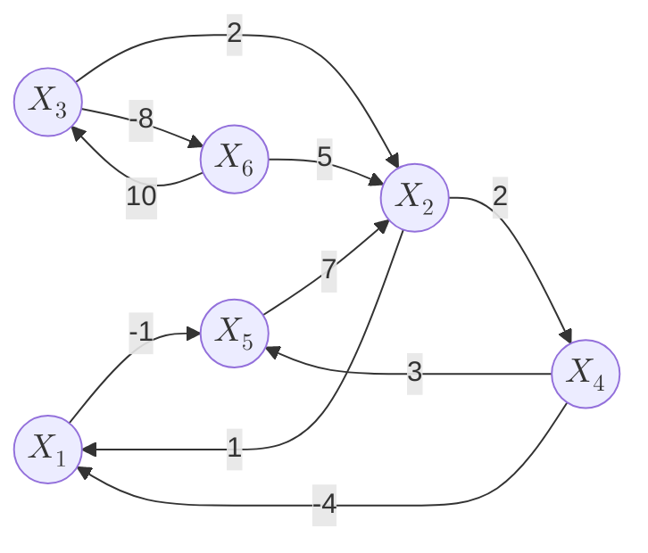

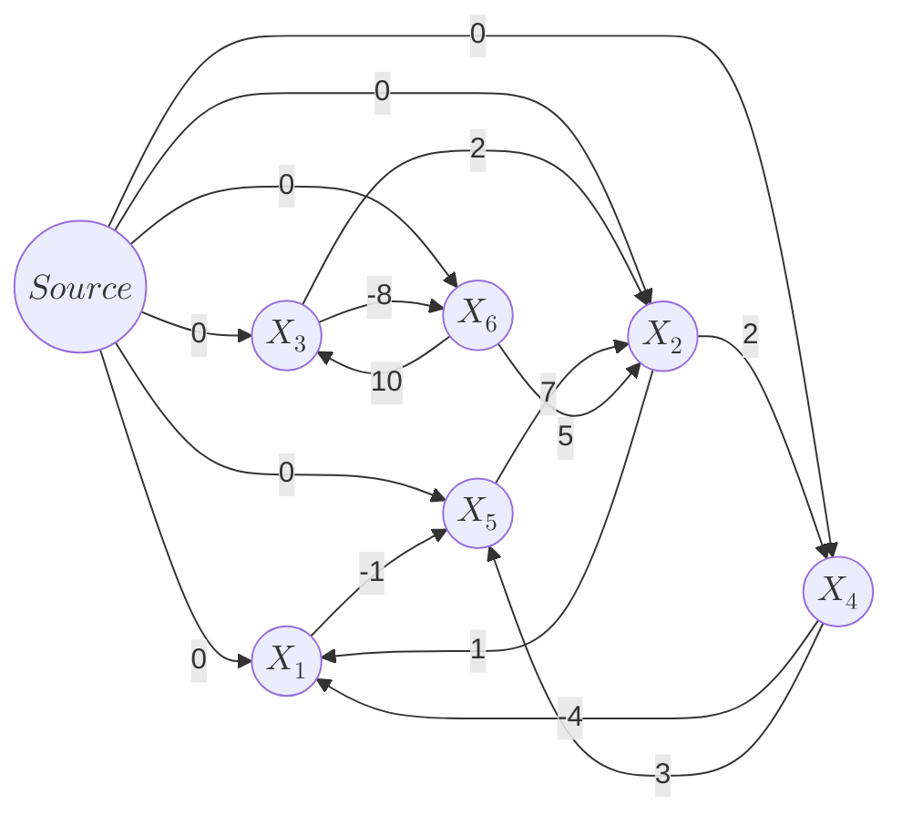

## Exercício 11. Considere um conjunto de $m$ inequações sobre $n$ variáveis na forma $x_i - x_j \leq b_k$. Apresente um algoritmo para determinar se esse conjunto de inequações possui uma solução viável ou não. Qual a complexidade do seu algoritmo?

> Considere um conjunto de $m$ inequações sobre $n$ variáveis na forma $x_i - x_j \leq b_k$. Apresente um algoritmo para determinar se esse conjunto de inequações possui uma solução viável ou não. Qual a complexidade do seu algoritmo?

- $x_1 - x_2 \leq 3$
- $x_2 - x_3 \leq -10$

Obs. 1: Vai ter algum zero, porque mesmo num caso em que haja, todos poderiam ser reduzidos pelo menor valor para que o menor se torne 0.

- $x_1 - x_2 \leq   3 \implies x_1 \leq   3 + x_2$
- $x_2 - x_3 \leq -10 \implies x_2 \leq -10 + x_3$

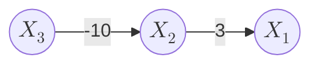

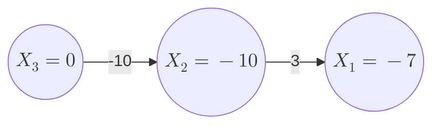

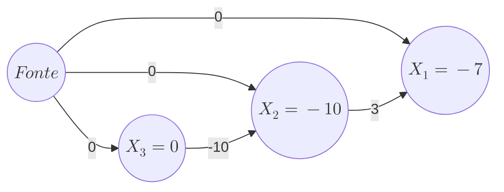

Bellman-Ford gera uma árvore de caminhos mínimos.

Se houver um ciclo negativo, então não há solução. Porque se somasse todas as equações o lado esquerdo viraria zero e o lado direito seria negativo, então $0 \leq negativo$ dá problema.

- $X_i - X_j = K$
  - $X_i - X_j \leq K$
  - $X_i - X_j \leq -K$

## Exercício 12. Usando as propriedades de caminho mínimo em um grafo não direcionado é possível conceber um algoritmo recursivo para calcular todos os menores caminhos a um vértice fixo $s \in V(G)$. Apresente um algoritmo recursivo (ou uma relação de recorrência) que faça exatamente isso

```python
def obter_menores_caminhos(G, visitados, s, visitarei):


def main():
  grafo = init_graph()
  visitados = []
  s = Grafos['Vértices'][0]
  menores_caminhos = len(Grafos['Vértices']) * [int(inf)]
  menores_caminhos = obter_menores_caminhos(grafo, visitados, s, visitarei)
  print(menores_caminhos)
```
