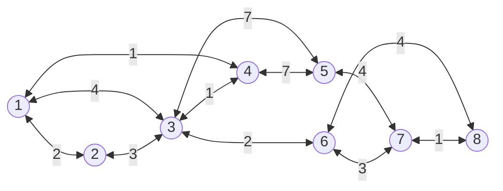

# Lista 5

Universidade Federal de Minas Gerais
Departamento de Computação
Projeto e Análise de Algoritmos - 2024.2
Professor: Marcio Costa Santos

---

## Exercício 1. Considere o grafo abaixo, apresente uma árvore geradora de custo mínimo

## Exercício 2. Considere o grafo abaixo, apresente uma árvore geradora de custo mínimo obtida pelo algoritmo de Prim

## Exercício 3. Considere o grafo abaixo, apresente uma árvore geradora de custo mínimo obtida pelo algoritmo de Kruskal

## Exercício 4. Mostre um grafo simples ponderado que possui duas árvores geradoras de custo mínimo distintas

## Exercício 5. Os algoritmos de Prim e Kruskal, também sofrem problemas se os pesos das arestas forem negativos?

## Exercício 6. O algoritmo de Kruskal pode dar árvores diferentes dependendo de como os empates são resolvidos. Dê um exemplo de grafo onde o algoritmo encontra duas árvores geradoras mínimas diferentes para dois critérios de desempate diferentes

## Exercício 7. Seja uv uma aresta de peso máximo de um ciclo de $G$. Mostre que $G$ e $G−uv$ (o grafo obtido de $G$ pela remoção de $uv$) possui uma mesma árvore geradora mínima

## Exercício 8. Assuma que os pesos das arestas do grafo de entrada são todos inteiros e limitados por um valor $W$ fixo e conhecido. É possível melhorar a complexidade do algoritmo de Kruskal?

Sim. Pois um dos passos do algoritmo de Kruskal é a ordenação das arestas. Se sabemos que os pesos das arestas são limitados por um valor $W$, podemos utilizar um algoritmo de ordenação que se aproveite dessa informação, como o Counting Sort, que tem complexidade $O(n)$. Mas isso, apenas se considerarmos que todo o resto do algoritmo de Kruskal tem complexidade menor ou igual que $O(n)$, visto que, caso contrário, a complexidade do algoritmo não seria alterada.

## Exercício 9. Assuma que os pesos das arestas do grafo de entrada são todos inteiros e limitados por um valor $W$ fixo e conhecido. É possível melhorar a complexidade do algoritmo de Prim?

Sim. Como o algoritmo de Prim utiliza de uma lista de prioridades, pode-se utilizar...

## Exercício 10. Escreva um algoritmo para decidir se um dado grafo é conexo. Que tipo de certificado o seu algoritmo pode devolver para provar uma resposta afirmativa? E para provar uma resposta negativa?
