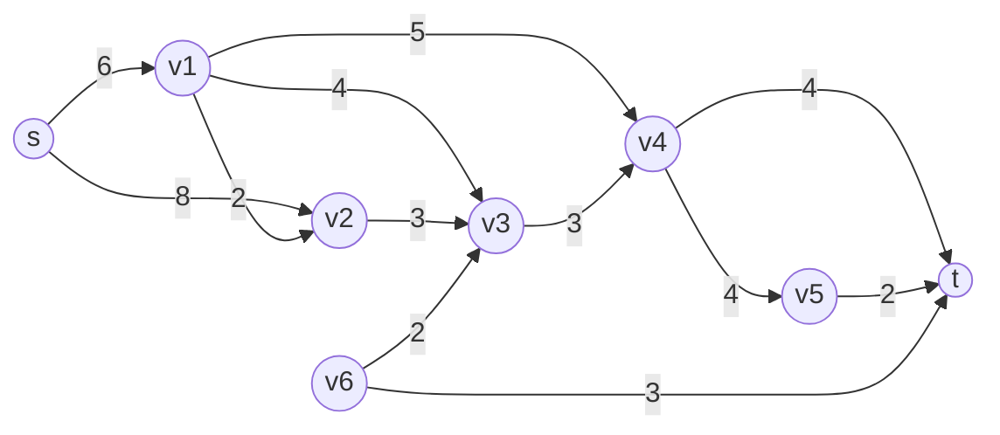

# Lista de Exercícios 6

## Cabeçalho

Universidade Federal de Minas Gerais - UFMG

Pós Graduação em Ciência da Computação - PPGCC

Projeto e Análise de Algoritmos - 2024.2

**Aluno(a):** XXX

**Matrícula:**

---

## Exercício 1

**Descrição:** Escreva uma função $graph\_check\_flow()$ que verifique se um suposto fluxo é de fato um fluxo. A função deve receber um grafo $G$, a fonte $s$, o sumidouro $t$ e um suposto fluxo representado por uma matriz $f$.

**Resposta do Exercício 1:**

- **Entrada:** Grafo $G$, fonte $s$, sumidouro $t$, matriz de fluxo $f$
- **Saída:** Booleano indicando se $f$ é um fluxo válido
- **for all** aresta $(u, v)$ em $G$ **do**:
  - **if** $f(u, v) > c(u, v)$ **then**
    - **Return** $Falso$
  - **endif**
- **endfor**
- **for all** vértice $v \neq s$, $t$ **do**:
  - **if** $\sum_{u} f(u, v) \neq \sum_{w} f(v, w)$ **then**
    - **return** $Falso$
  - **endif**
- **endfor**
- **Return** $Verdadeiro$

---

## Exercício 2

### **Descrição:** Determine o fluxo máximo na rede abaixo

### **Resposta do Exercício 2:**

Utilizando o Algoritmo de Ford-Fulkerson.

#### Iteração 1

- **Caminho Aumentante:**
  - $s \rightarrow v1 \rightarrow v4 \rightarrow t$
- **Capacidades residuais:**
  - $c_f(s, v1) = 6$,
  - $c_f(v1, v4) = 5$,
  - $c_f(v4, t) = 4$.
- **Gargalo:**
  - $\delta = \min\{6, 5, 4\} = 4$.
- **Atualização do fluxo:**
  - $f(s, v1) += 4$,
  - $f(v1, v4) += 4$,
  - $f(v4, t) += 4$.
- **Atualização das capacidades residuais:**
  - $c_f(s, v1) = 6 - 4 = 2$,
  - $c_f(v1, v4) = 5 - 4 = 1$,
  - $c_f(v4, t) = 4 - 4 = 0$.

#### Iteração 2

- **Caminho Aumentante:**
  - $s \rightarrow v2 \rightarrow v3 \rightarrow v4 \rightarrow v5 \rightarrow t$
- **Capacidades residuais:**
  - $c_f(s, v2) = 8$,
  - $c_f(v2, v3) = 3$,
  - $c_f(v3, v4) = 3$,
  - $c_f(v4, v5) = 4$,
  - $c_f(v5, t) = 2$.
- **Gargalo:**
  - $\delta = \min\{8, 3, 3, 4, 2\} = 2$.
- **Atualização do fluxo:**
  - $f(s, v2) += 2$,
  - $f(v2, v3) += 2$,
  - $f(v3, v4) += 2$,
  - $f(v4, v5) += 2$,
  - $f(v5, t) += 2$.
- **Atualização das capacidades residuais:**
  - $c_f(s, v2) = 8 - 2 = 6$,
  - $c_f(v2, v3) = 3 - 2 = 1$,
  - $c_f(v3, v4) = 3 - 2 = 1$,
  - $c_f(v4, v5) = 4 - 2 = 2$,
  - $c_f(v5, t) = 2 - 2 = 0$.

#### Iteração 3

Tentamos identificar novos caminhos aumentantes, porém todos estão saturados. Como não há mais caminhos que possam enviar fluxo de $s$ para $t$, o algoritmo termina.

Fluxo Máximo = $f(s, v1) + f(s, v2) = 4 + 2 = 6$.

O fluxo máximo da rede é **6 unidades de fluxo**.

**Representação do Fluxo Final:**

- $f(s, v1) = 4$
- $f(s, v2) = 2$
- $f(v1, v4) = 4$
- $f(v2, v3) = 2$
- $f(v3, v4) = 2$
- $f(v4, v5) = 2$
- $f(v4, t) = 4$
- $f(v5, t) = 2$

> *Observação:* As demais arestas possuem fluxo zero ou não foram utilizadas no fluxo máximo.

---

## Exercício 3

**Descrição:** Considere uma rede $G = (V,E)$ com capacidades $c(v, u)$ e dois fluxos $f_1$ e $f_2$. Defina a soma dos fluxos $f = f_1 + f_2$ como sendo:

$$f(u, v) = f_1(u, v) + f_2(u, v)$$

Prove ou refute: A soma de dois fluxos é um fluxo. Caso não seja um fluxo, qual propriedade de fluxo é violada?

**Resposta do Exercício 3:**

A soma de dois fluxos não é necessariamente um fluxo, pois pode violar a restrição de capacidade.

---

## Exercício 4

**Descrição:** Considere uma rede $G = (V,E)$ com capacidades $c(v, u)$, um fluxo $f$ e um real positivo $\beta$. Defina o produto do fluxo $f$ por $\beta$, $\beta f$, como sendo:

$$(\beta f)(u, v) = \beta f(u, v)$$

Prove ou refute: O produto de um fluxo por um real positivo $\beta$ é um fluxo. Caso não seja, o que ocorre se $\beta \leq 1$?

**Resposta do Exercício 4:**

O produto de um fluxo por um número positivo $\beta$ é um fluxo se e somente se $\beta \leq 1$, pois caso contrário, pode violar a restrição de capacidade.

---

## Exercício 5

**Descrição:** Mostre que, dado uma rede $G = (V,E)$ com capacidades $c(u, v)$, o conjunto de todos os fluxos nesta rede é um conjunto convexo. Ou seja, dados dois fluxos válidos $f_1$ e $f_2$ e $0 \leq \alpha \leq 1$, temos que $\alpha f_1 + (1-\alpha) f_2$ é um fluxo válido.

**Resposta do Exercício 5:**

O conjunto de todos os fluxos em uma rede é convexo, pois uma combinação convexa de dois fluxos ainda satisfaz as restrições de capacidade e conservação de fluxo.

---

## Exercício 6

**Descrição:** Considere o seguinte problema: Temos um conjunto de professores $P$ e um conjunto de disciplinas $D$. Cada professor $p$ pode dar um conjunto de disciplinas $D(p) \subseteq D$. Desejamos atribuir a cada professor uma disciplina de maneira a maximizar o número de disciplinas com professores para ministrá-las. Como podemos modelar esse problema como um problema em grafos?

**Resposta do Exercício 6:**

Podemos modelar o problema como um grafo bipartido, onde os professores formam um conjunto de vértices, as disciplinas formam outro conjunto, e há uma aresta entre um professor e uma disciplina se ele pode ministrá-la. O problema pode ser resolvido encontrando um emparelhamento máximo.

---

## Exercício 7

**Descrição:** Considere que temos uma rede $G = (V,E)$ com $k$ fontes $s_1, \dots, s_k$ e $p$ sumidouros $t_1, \dots, t_p$. Apresente um algoritmo para determinar o fluxo máximo nesta rede, assumindo que o fluxo é o mesmo e que o fluxo originado em uma fonte pode ser consumido em qualquer sumidouro.

**Resposta do Exercício 7:**

Cria-se uma superfonte conectada a todas as fontes originais e um supersumidouro conectado a todos os sumidouros. O problema se reduz a um fluxo máximo clássico.

---

## Exercício 8

**Descrição:** Considere o seguinte problema: Dado um grafo $G = (V,E)$ e dois vértices $v$ e $u$, desejamos determinar se existe um ciclo (não necessariamente induzido) contendo $v$ e $u$. É possível adaptar o Algoritmo de Ford-Fulkerson para responder essa pergunta?

**Resposta do Exercício 8:**

Pode-se adaptar o algoritmo de Ford-Fulkerson criando uma rede de fluxo onde se procura um fluxo positivo entre os vértices $v$ e $u$. Se houver fluxo, isso indica a existência de um ciclo conectando-os.
