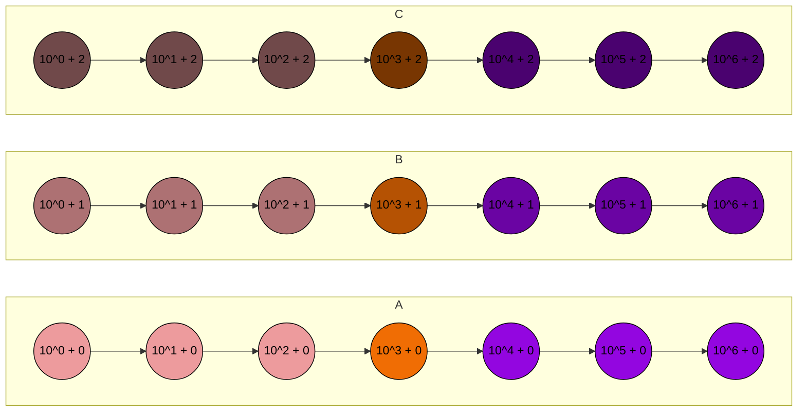

# Ponto Extra 2: 09/12/2024 - Divide-and-conquer: Quiz 5 - Mediana das medianas para uma divisão por 7

Suppose that we divide $n$ elements into $⌊ n/5 ⌋$ groups of $r$ elements each, and use the median-of-medians of these $⌈n/r⌉$ groups as the pivot. For which $r$ is the worst-case running time of select $O(n)$?

a. $r = 3$
b. $r = 7$
c. Both a and b
d. Neither a nor b

---

$C(n) \leq C( ⌊ n/5 ⌋ ) + C(n - 3 ⌊ n/10 ⌋ ) + \frac{11}{5}n$

Achar a constante que dá certo para $R = 7$

---

Quando consideramos 5 elementos, temos as seguintes 3 partes: $C(n) \leq X_5 + Y_5 + Z_5$

- $X_5 = C( ⌊ n/5 ⌋ )$
  - Onde $⌊ n/5 ⌋$ é o número de grupos de 5 elementos que serão comparados
- $Y_5 = C(n - 3 ⌊ n/10 ⌋ )$
  - Onde $n - 3 ⌊ n/10 ⌋$ é o número de elementos que não são a mediana
  - Ele também pode ser escrito como:
    - $n - ⌊ 3n/10 ⌋ =$
    - $n - ⌊ 3/5 * n/2 ⌋ =$
      - Onde $⌊ 3/5 * n/2 ⌋$ é o número de elementos que são definitivamente menores, ou definitivamente maiores que a mediana das medianas
    - que representa a quantidade total de elementos removidos os elementos explicados acima.
- $Z_5 = \frac{11}{5}n$
  - Onde $\frac{11}{5}n$ é o número de comparações que serão feitas para encontrar a mediana das medianas
  - Também pode ser reescrito como $6 \cdot (n/5) + n$ que representa a quantidade de comparações que serão feitas para encontrar a mediana nos grupos de 5 elementos.

---

Então, se considerarmos $r = 7$, teremos que:

- $X_7 = C( ⌊ n/7 ⌋ )$
  - Onde $⌊ n/7 ⌋$ é o número de grupos de 7 elementos que serão comparados
- $Y_7 = \dots$
  - Para calcularmos este valor, seguiremos o caminho inverso:
    - Considerando que ao invés de 5 elementos, temos 7 elementos; e que, ao invés de 3 elementos garantidamente menores, temos 4 elementos garantidamente menores, teremos que:
      - $n - ⌊(4/7)*(n/2)⌋ =$
      - Que no formato original seria:
      - $n - 4 ⌊ n/14 ⌋$
    - Assim, concluindo que
  - $Y_7 = C(n - 4 ⌊ n/14 ⌋ )$

- $Z_7 = \dots$
  - Também fazendo o caminho inverso, teremos que:
    - $\#Comp \cdot (n/7) + n$
    - Onde, $\#Comp$ é a quantidade de comparações que serão feitas para encontrar a mediana nos grupos de 7 elementos.
      - Segundo Donald Knuth:
        - 
      - O 4º menor elemento de um conjunto de 7 elementos pode ser encontrado com no máximo 10 comparações, então: $\#Comp = 10$
    - Assim, concluindo que
  - $Z_7 = 10 \cdot (n/7) + n$
    - $Z_7 = 10n/7 + n$
    - $Z_7 = 10n/7 + 7n/7$
    - $Z_7 = 17n/7$

---

Com isso, conclui-se que a recorrência para $r = 7$ é:

$C(n) \leq C( ⌊ n/7 ⌋ ) + C(n - 4 ⌊ n/14 ⌋ ) + 17n/7$

Ou, mais objetivamente, a constante da parte linear é: $17/7$
