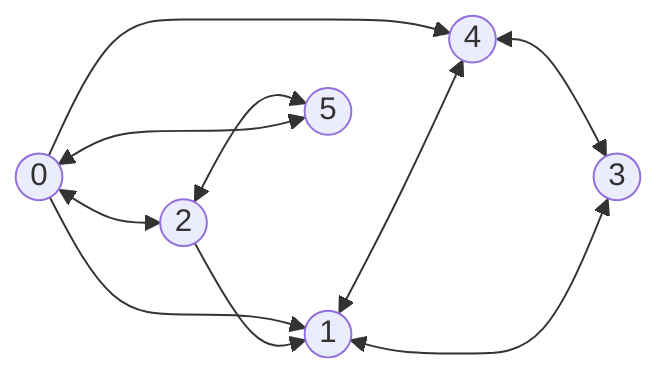
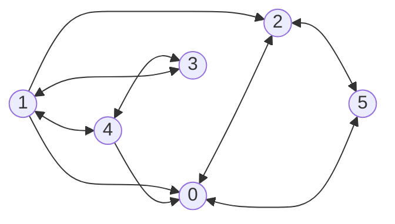

# a

{'quant_intersections': 6, 'quant_roads': 9, 'roads': [{
  'intersection': [0, 1], 'direction': 1}, {
  'intersection': [0, 2], 'direction': 2}, {
  'intersection': [0, 4], 'direction': 1}, {
  'intersection': [1, 4], 'direction': 2}, {
  'intersection': [2, 1], 'direction': 1}, {
  'intersection': [2, 5], 'direction': 2}, {
  'intersection': [3, 1], 'direction': 2}, {
  'intersection': [4, 3], 'direction': 2}, {
  'intersection': [5, 0], 'direction': 2}]}

---

Invertendo

