# Listas

## Lista 3

Universidade Federal de Minas Gerais
Departamento de Computação
Projeto e Análise de Algoritmos – 2024.2
Professor: Marcio Costa Santos
Lista 3

### Exercício 1. Mostre que dado um grafo não orientado $G = (V, E)$ temos que $\sum_{v \in V} d(v) = 2|E(G)|$

Como por definição uma aresta ($e$) liga dois vértices ($u, v$), se utilizarmos uma função $split(e)$ que divide a aresta $e$ nos dois vértices que ela liga, para cada aresta, teremos dois vértices.

Ao fazermos essa divisão para todas as arestas, teremos que a quantidade final de ocorrências de vértices (mesmo repetidos) será $2|E(G)|$.

Nessa concepção, a contagem de ocorrências de um determinado vértice nessa lista gerada por $split(e)$ será igual ao grau do vértice. Sendo assim, ao fazermos a soma de todos os graus dos vértices, teremos a quantidade de ocorrências de vértices na lista, que é $2|E(G)|$.

---

Prova por indução

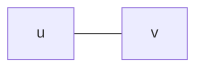

<!-- - **Base:** $\frac{2 \cdot |V| \cdot |E|}{|V|} = 2|E|$ -->
- **Base:** $d(u) + d(v) = 2 \cdot 1 = 2$
- **Hipótese:** $\sum_{v \in V} d(v) = 2|E|$
- **Passo:** $G + u'k' = 2 \cdot |E| + 2 = 2(|E| + 1)$

### Exercício 2. Prove que uma árvore com exatamente dois vértices de grau 1 é um caminho

Como por definição, um caminho terá uma sequência de arestas tal que cada vértice tem grau 1 caso seja extremidade do caminho e grau 2 caso seja um vértice intermediário. Em um caminho trivial constituído por dois vértices, ambos terão grau 1, pois serão extremidades do caminho. E esse grafo, é, por definição, uma árvore.

### Exercício 3. Prove que uma árvore $T = (V, E)$ com $\Delta(T) \geq k$ possui pelo menos $k$ vértices

### Exercício 3. Prove que uma árvore $T = (V, E)$ com $\Delta(T) \geq k$ possui pelo menos $k+1$ vértices

- $\Delta(T)$ é o grau máximo de um vértice em $T$

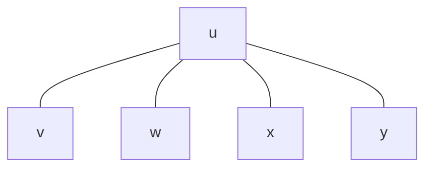

### Exercício 4. Definimos o complemento de um grafo simples $G = (V, E)$ não orientado, como o grafo $\overline{G} = (V, \overline{E})$ onde

- $V (\overline{G}) = V (G)$
- $E (\overline{G}) = \{uv | uv \neq E(G), u \neq v\}$

Apresente um algoritmo para essa operação e calcule a sua complexidade em cada uma das duas representações estudadas de um grafo.

---

#### L3Q4 - Matriz de Adjacência

```python
def complement_matrix(G):
    id = get_id_matrix(len(G)) # Filled with 0, but with 1 in the diagonal
    full_matrix = get_full_matrix(len(G)) # Filled with 1
    complement_matrix = get_zeroed_matrix(len(G)) # Filled with 0
    for i in range(len(G)):
        for j in range(len(G)):
            complement_matrix[i][j] = full_matrix[i][j] - G[i][j] - id[i][j]
    return complement_matrix
```

- **Complexidade:** $O(n^2)$

---

#### L3Q4 - Lista de Adjacência

```python
# G = {
#     0: [1, 2],
#     1: [0, 2],
#     2: [0, 1]
# }

def get_complement_list(G):
    complement_list = []
    for v in G.keys():
        new_adj_list = []
        for u in G[v]:
            if v != u and u not in G[v]:
                new_adj_list.append(u)
        complement_list.append(new_adj_list)
    return complement_list
```

- $X =$ complexidade de checagens de pertencimento ($\in$)
- **Complexidade:** $O(n^2 + X)$

```python
# Considere que cada par de vértices tem no máximo uma aresta
def get_complement_list(G):
    complement_list = {}
    vertices = set(G.keys())
    for v in vertices:
        adj_v = set(G[v])
        new_adj_list = []
        for u in adj_v:
            complement_set = vertices - adj_v - set(v)
        complement_list[v] = complement_set
    return complement_list
```

- $Y =$ complexidade de subtração de sets $(set(a) - set(b))$
- **Complexidade:** $O(n^2 + Y)$

---
---

### Exercício 5. Definimos a transposição de um grafo simples $G = (V, A)$ orientado, como o grafo $G^T = (V, A^T)$ onde

- $V (G^T) = V (G)$
- $E(G^T) =$ aos arcos de $G$ com sentido trocado

Apresente um algoritmo para essa operação e calcule a sua complexidade em cada uma das duas representações estudadas de um grafo.

---

#### L3Q5 - Grafos
  
##### L3Q5 - Grafo $G = (V, A)$

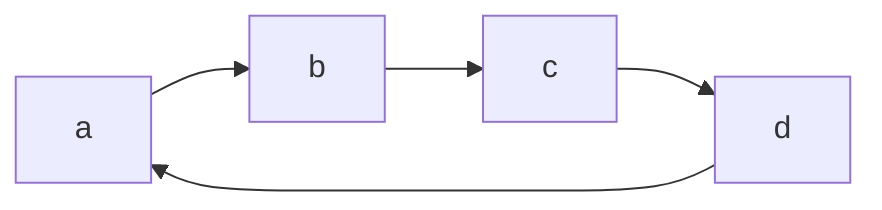

##### L3Q5 - Grafo Transposto $G^T = (V, A^T)$

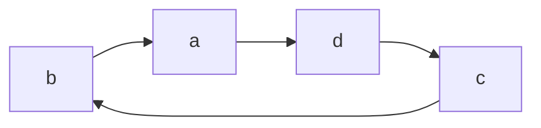

#### L3Q5 - Matriz de Adjacência

$$
G_M =
\begin{bmatrix}
0 & 1 & 0 & 0 \\
0 & 0 & 1 & 0 \\
0 & 0 & 0 & 1 \\
1 & 0 & 0 & 0 \\
\end{bmatrix} \cong
\begin{bmatrix}
G_M & a & b & c & d \\
a & 0 & 1 & 0 & 0 \\
b & 0 & 0 & 1 & 0 \\
c & 0 & 0 & 0 & 1 \\
d & 1 & 0 & 0 & 0 \\
\end{bmatrix}
$$

$$
T(G_M) =
\begin{bmatrix}
0 & 0 & 0 & 1 \\
1 & 0 & 0 & 0 \\
0 & 1 & 0 & 0 \\
0 & 0 & 1 & 0 \\
\end{bmatrix}
$$

```python
def get_transposed_matrix(G):
    transpose_matrix = get_zeroed_matrix(len(G))
    for i in range(len(G)):
        for j in range(len(G)):
            transpose_matrix[i][j] = G[j][i]
    return transpose_matrix
```

- **Complexidade:** $O(n^2)$

---

#### L3Q5 - Lista de Adjacência

$$
G_L =
\begin{cases}
a: [b] \\
b: [c] \\
c: [d] \\
d: [a] \\
\end{cases}
$$
$$
T(G_L) =
\begin{cases}
a: [d] \\
b: [a] \\
c: [b] \\
d: [c] \\
\end{cases}
$$

```python
# Considere que cada par de vértices tem no máximo uma aresta
def get_transposed_list(G):
    transposed_list = [len(G) * []]
    for v in range(len(G)):
        for u in G[v]:
            transposed_list[u].append(v)
    return transposed_list
```

---
---

### Exercício 6. Definimos o quadrado de um grafo simples $G = (V, A)$ não orientado, como o grafo $G^2 = (V, A^2)# onde

- $V (G^2) = V (G)$
- $E (G^2) = {uv | \exists z \in V (G), z \neq u \neq v, uz \in E(G), vz \in E(G)}$

Apresente um algoritmo para essa operação e calcule a sua complexidade em cada uma das duas representações estudadas de um grafo.

---

Serão 3 loops. O primeiro para percorrer todos os vértices ($v$). O segundo para obter os vizinhos desse vértice ($Viz(v)$). O terceiro para encontrar os vizinhos dos vizinhos.

---

#### L3Q6 - Grafos

##### L3Q6 - Grafo $G = (V, A)$

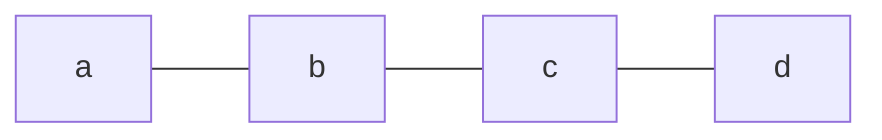

##### Grafo Quadrado $G^2 = (V, A^2)$

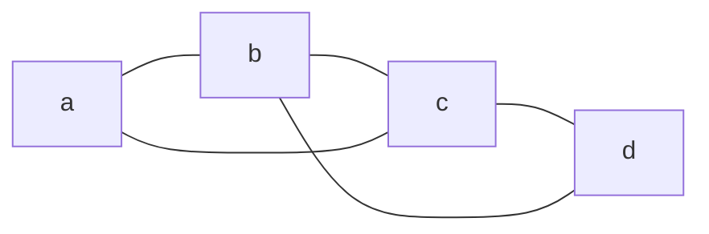

#### L3Q6 - Matriz de Adjacência

$$
G_M =
\begin{bmatrix}
0 & 1 & 0 & 0 \\
1 & 0 & 1 & 0 \\
0 & 1 & 0 & 1 \\
0 & 0 & 1 & 0 \\
\end{bmatrix}
$$

$$
G^2_M =
\begin{bmatrix}
0 & 1 & 1 & 0 \\
1 & 0 & 1 & 1 \\
1 & 1 & 0 & 1 \\
0 & 1 & 1 & 0 \\
\end{bmatrix}
$$

```python
def get_square_matrix(G):
    GG = G
    for i in range(len(G)):
        for j in range(len(G)):
            if G[i][j] == 1:
                for k in range(len(G)):
                    if G[j][k] == 1:
                        GG[i][k] = 1
    return square_matrix
```

- **Complexidade:** $O(n^3)$

---

#### L3Q6 - Lista de Adjacência

$$
G_L =
\begin{cases}
a: [b] \\
b: [a, c] \\
c: [b, d] \\
d: [c] \\
\end{cases}
$$
$$
G^2_L =
\begin{cases}
a: [b, c] \\
b: [a, c, d] \\
c: [b, d, a] \\
d: [c, b] \\
\end{cases}
$$

```python
def get_square_list(G):
    GG = G                                   # O(n^2)
    for v in range(len(G)):                  # O(V)
        for u in G[v]:                       # O(\Delta(d))
            for k in G[u]:                   # O(\Delta(d))
                if k != v and k not in G[v]: # O(\Delta(d))
                    GG[v].append(k)          # O(1)
    return GG
```

- **Complexidade:** $O(n^4)$
  - $O(n^2) + O(V) \cdot O(\Delta(d)) \cdot O(\Delta(d)) \cdot O(\Delta(d)) \cdot O(1)$
  - $O(n^2) + O(V) \cdot O(V) \cdot O(V) \cdot O(V) \cdot O(1)$
  - $O(n^2) + O(n^4)$
  - $O(n^4)$

### Exercício 7. Descreva como podemos modificar as duas estruturas de representação de grafo para acomodar grafos ponderados (grafos que possuem valores numéricos associados com suas arestas ou arcos)

---

#### L3Q7 - Matriz de Adjacência

Para a matriz de adjacência, onde temos valor inteiros positivos, podemos adicionar o peso da aresta na posição $M_{ij}$ da matriz.

Se permitirmos valores negativos, podemos adicionar um valor que represente a ausência de aresta, como $NULL$ ou $False$.

Uma outra abordagem seria adicionar uma nova dimensão na matriz, onde indicaríamos que no índice $M_{ij0}$ teríamos um valor booleano que indicaria se a aresta existe ou não, e no índice $M_{ij1}$ teríamos o valor do peso da aresta.

#### L3Q7 - Lista de Adjacência

Para a lista de adjacência, podemos criar uma tupla que represente a aresta, onde o primeiro valor seria o vértice de destino e o segundo valor seria o peso da aresta.

Poderíamos também criar uma lista de adjacência complementar, onde os valores nos mesmos índices da lista de adjacência original seriam os pesos das arestas.

---
---

### Exercício 8. Mostre que uma aresta $uv$ é

1. uma aresta de árvore ou de avanço se e somente se $i[u] < i[v] < f [v] < f [u]$;
2. uma aresta de retorno se e somente se $i[v] \leq i[u] < f [u] \leq f [v]$; e
3. uma aresta de passagem se e somente se $i[v] < f [v] < i[u] < f [u]$.

---

[JV: Eles fizeram, mas eu me perdi fazendo a pintura do grafo com Mermaid]

---

<details>

<summary>Pintura do grafo</summary>

- Cores:
  - Branco: `#fff`
  - Cinza: `#999`
  - Preto: `#000`
- Arestas
  - T: Árvore || Tree: are edges in depth-first forest $G_{\pi}$. $Edge(u, v)$ is a tree edge if $v$ was first discovered by exploring edge $(u, v)$.
  - R: Retorno || Back: are those edges $(u, v)$ connecting a vertex $u$ to an ancestor $v$ in a depth-first tree. We consider self-loops, which may occur in directed graphs, to be back edges.
  - F: Avanço || Forward: are those nontree edges $(u, v)$ connecting a vertex $u$ to a descendant $v$ in a depth-first tree.
  - P: Passagem || Cross: are all other edges. They can go between vertices in the same depth-first tree, as long as one vertex is not an ancestor of the other, or they can go between vertices in different depth-first trees.

<details>

<summary> ( 1 ) </summary>

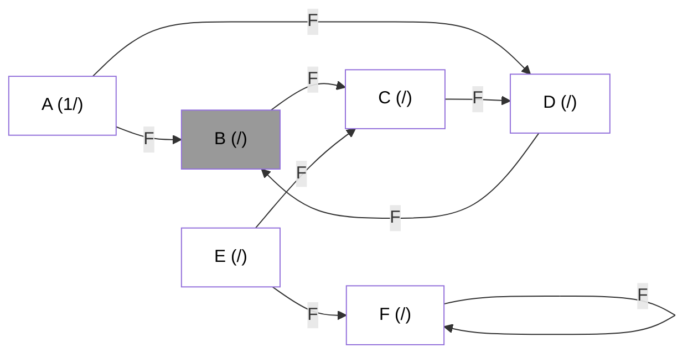

</details>

<details>

<summary> ( 1 ( 2 ) ) </summary>

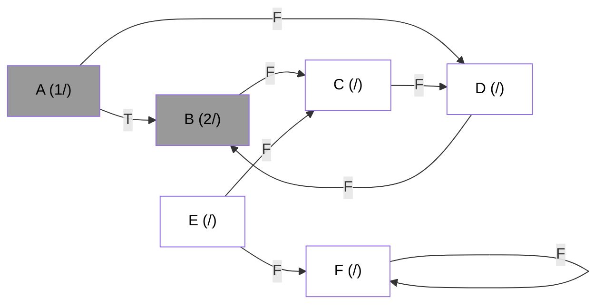

</details>

<details>

<summary> ( 1 ( 2 ( 3 ) ) ) </summary>

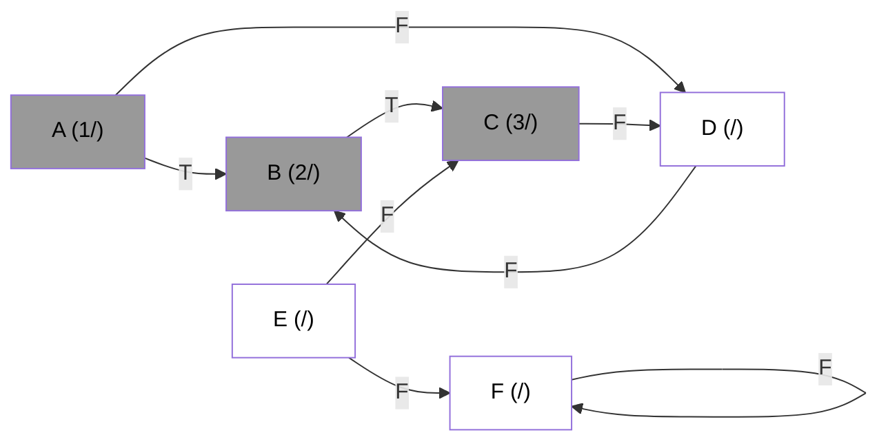

</details>

<details>

<summary> ( 1 ( 2 ( 3 ( 4 ) ) ) ) </summary>

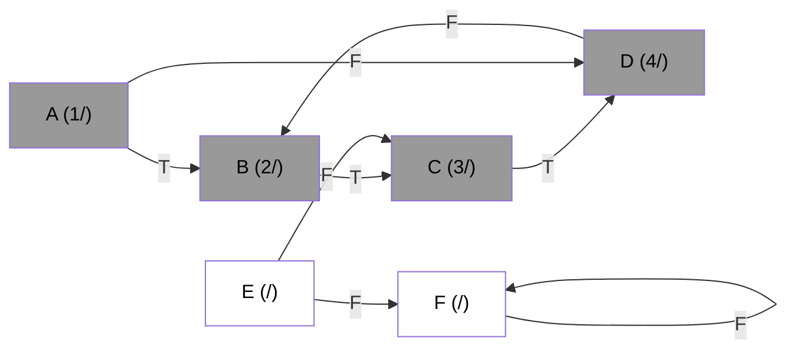

</details>

<details>

<summary> ( 1 ( 2 ( 3 ( 4 ( 5 ) ) ) ) ) </summary>

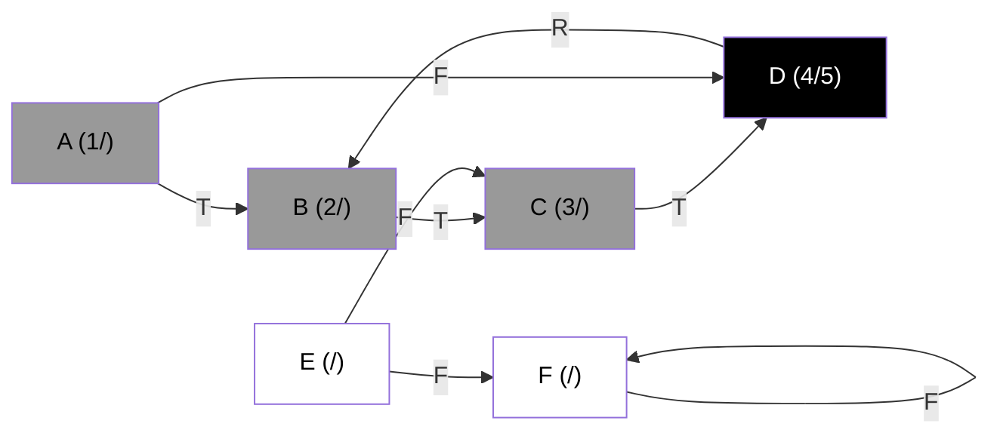

</details>

<details>

<summary> ( 1 ( 2 ( 3 ( 4 ( 5 6 ) ) ) ) ) </summary>

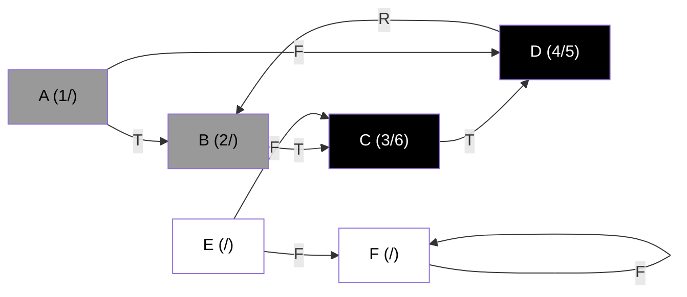

</details>

<details>

<summary> ( 1 ( 2 ( 3 ( 4 ( 5 6 ) 7 ) ) ) ) </summary>

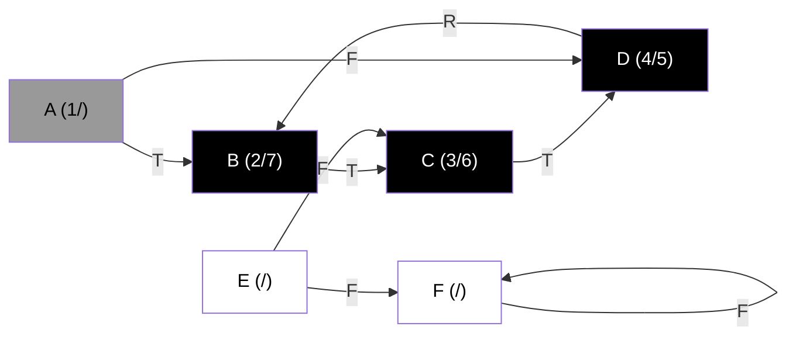

</details>

<details>

<summary> ( 1 ( 2 ( 3 ( 4 ( 5 6 ) 7 ) 8 ) ) ) </summary>

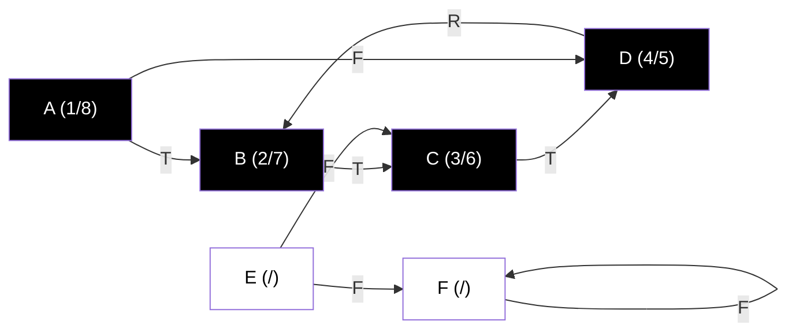

</details>

<details>

<summary> ( 1 ( 2 ( 3 ( 4 ( 5 6 ) 7 ) 8 ) ( 9 ) ) ) </summary>


</details>

<details>

<summary> ( 1 ( 2 ( 3 ( 4 ( 5 6 ) 7 ) 8 ) ( 9 ) ) ) </summary>

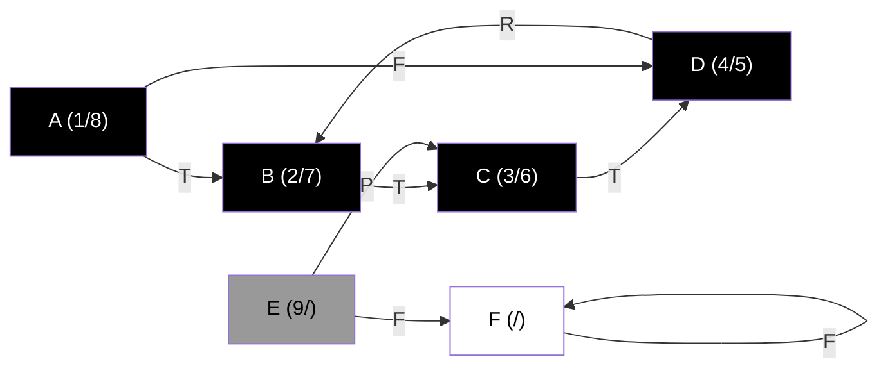

</details>

<details>

<summary> ( 1 ( 2 ( 3 ( 4 ( 5 6 ) 7 ) 8 ) ( 9 ( 10 ) ) ) </summary>

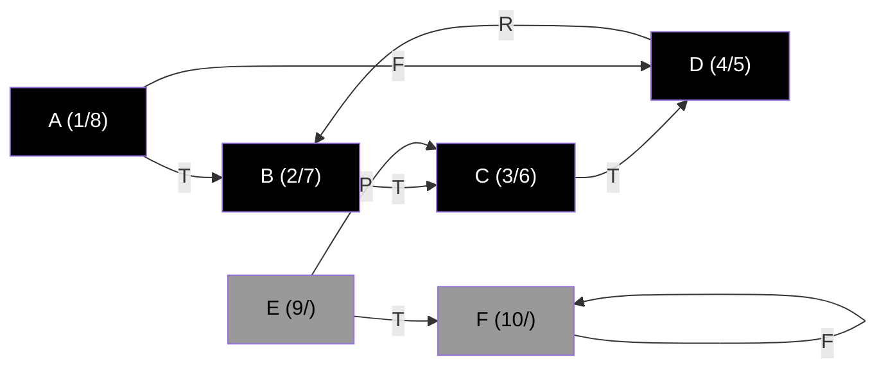

</details>

<details>

<summary> ( 1 ( 2 ( 3 ( 4 ( 5 6 ) 7 ) 8 ) ( 9 ( 10 ) ) ) </summary>

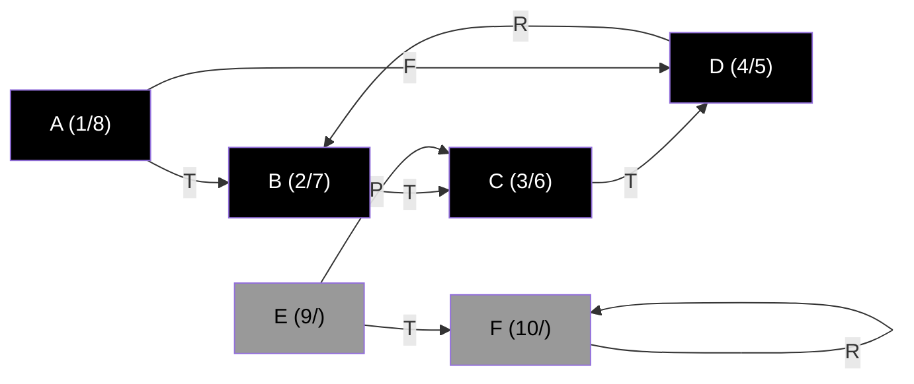

</details>

<details>

<summary> ( 1 ( 2 ( 3 ( 4 ( 5 6 ) 7 ) 8 ) (9 ( 10 11 ) ) </summary>

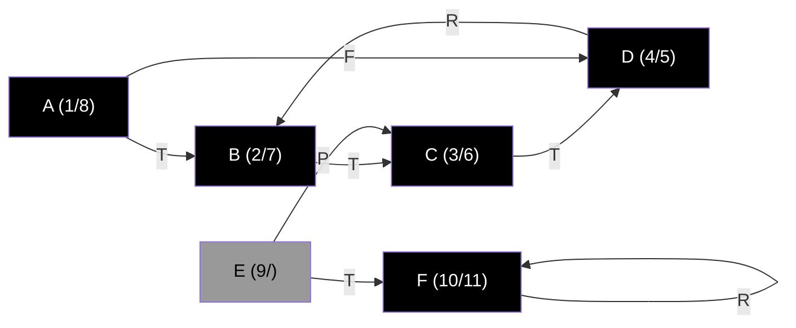

</details>

<details>

<summary> ( 1 ( 2 ( 3 ( 4 ( 5 6 ) 7 ) 8 ) ( 9 ( 10 11 ) 12 ) </summary>

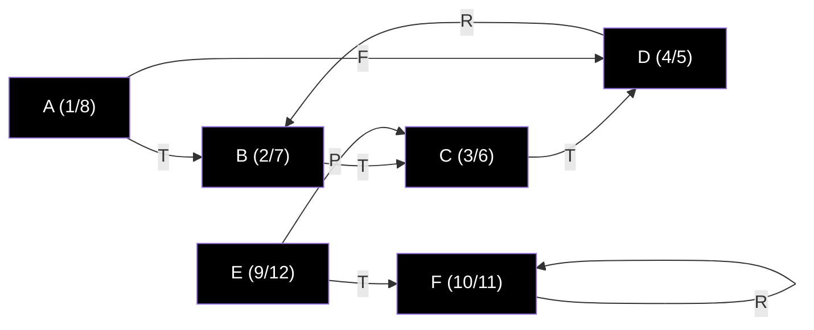

</details>

</details>

---
---

### Exercício 9. Na descrição da busca em profundidade vista em sala classificamos as arestas do grafo de entrada de acordo após a execução da busca em profundidade. É possível realizar essa classificação durante a execução da busca? Como?

[JV: Eles fizeram, mas eu me perdi fazendo a pintura do grafo com Mermaid]

### Exercício 10. Aplique o algoritmo de busca em profundidade para o grafo abaixo

```mermaid
graph LR
    %% Coloração: fundo branco, texto preto
    style V1 fill:#fff,color:#000
    style V2 fill:#fff,color:#000
    style V3 fill:#fff,color:#000
    style V4 fill:#fff,color:#000
    style V5 fill:#fff,color:#000
    style V6 fill:#fff,color:#000
    style V7 fill:#fff,color:#000
    style V8 fill:#fff,color:#000
    style V9 fill:#fff,color:#000

    %% Vértices
    V1["1 (/)"]
    V2["2 (/)"]
    V3["3 (/)"]
    V4["4 (/)"]
    V5["5 (/)"]
    V6["6 (/)"]
    V7["7 (/)"]
    V8["8 (/)"]
    V9["9 (/)"]

    %% Arestas
    V1 ---|F| V2
    V1 -->|F| V4
    V2 -->|F| V4
    V2 -->|F| V5
    V3 -->|F| V2
    V3 -->|F| V5
    V3 -->|F| V6
    V7 -->|F| V5
    V8 -->|F| V2
    V8 -->|F| V3
    V9 -->|F| V6
```

### Exercício 11. Apresente uma versão não recursiva para o algoritmo de busca em profundidade que possua a mesma complexidade da versão recursiva

---

```python

def dfs_iterative(G, v): # DFS usa pilha || BFS usa fila
    visited = []
    marked = [False] * len(G)
    stack = [v] # Pilha || queue = [v] # Fila
    while len(stack) > 0:
        v = stack.pop() # Pilha || v = queue.pop(0) # Fila
        if not marked[v]:
            visited.append(v)
            marked[v] = True
            for w in Vizinhos(v):
                if not marked[w]:
                    stack.append(w) # Pilha || queue.append(w) # Fila
    return visited
```

---
---

### Exercício 12. Aplique o algoritmo de ordenação topológica no DAG abaixo

---

```mermaid
graph LR
    %% Coloração: fundo branco, texto preto
    style V1  fill:#fff,color:#000
    style V2  fill:#fff,color:#000
    style V3  fill:#fff,color:#000
    style V4  fill:#fff,color:#000
    style V5  fill:#fff,color:#000
    style V6  fill:#fff,color:#000
    style V7  fill:#fff,color:#000
    style V8  fill:#fff,color:#000
    style V9  fill:#fff,color:#000
    style V10 fill:#fff,color:#000
    style V11 fill:#fff,color:#000

    %% Vértices
    V1["1 (1/10)"]
    V2["2 (6/9)"]
    V3["3 (19/20)"]
    V4["4 (2/5)"]
    V5["5 (7/8)"]
    V6["6 (13/14)"]
    V7["7 (16/17)"]
    V8["8 (18/21)"]
    V9["9 (12/15)"]
    V10["10 (11/22)"]
    V11["11 (3/4)"]

    %% Arestas
    V1 ---|T| V2
    V1 -->|T| V4
    V1 -->|F| V11
    V2 -->|F| V4
    V2 -->|T| V5
    V3 -->|P| V2
    V3 -->|P| V5
    V3 -->|F| V6
    V4 -->|T| V11
    V7 -->|P| V5
    V8 -->|P| V2
    V8 -->|T| V3
    V9 -->|T| V6
    V10 -->|T| V7
    V10 -->|T| V8
    V10 -->|T| V9
```

Ordenação topológica: Ordenar os vértices em ordem decrescente do tempo de finalização. Ou seja, inverte a lista.

DFS = [1, 4, 11, 2, 5, 9, 6, 7, 8, 3, 10]
DFS invertida = [10, 3, 8, 7, 6, 9, 5, 2, 11, 4, 1]

---
---

### Exercício 13. O que acontece quando utilizamos o algoritmo de ordenação topológica em um grafo orientado que contém ciclos? A ordenação obtida faz sentido?

---

A ordenação topológica representa a ordem de execução de tarefas, onde uma tarefa só pode ser executada após a execução de outra tarefa. Se houver um ciclo, a ordenação topológica não faz sentido, pois a tarefa A depende da tarefa B, que depende da tarefa C, que depende da tarefa A.

Uma ordenação topológica coerente resultaria em uma sequência de tarefas que podem ser executadas sem necessitar de outras tarefas que ainda não foram executadas.

Quando ocorre o ciclo, existirá uma tarefa que depende que uma tarefa ainda não executada. Dessa forma, mesmo que o algoritmo resulte em uma ordenação topológica, ela não faz sentido.

---
---

### Exercício 14. Apresente um algoritmo que determina se um grafo não direcionado possui ou não um ciclo. Qual a complexidade desse algoritmo?

---

```python
# O algoritmo deve rodar uma DFS e, quando uma aresta de retorno (um nó cinza encontrar outro nó cinza) for encontrada, o grafo possui um ciclo
def has_cycle(G):
    # [JV: Não verifiquei esse código. O Copilot que cuspiu isso pra mim]
    def dfs(G, v, parent, visited):
        visited[v] = True
        for w in G[v]:
            if not visited[w]:
                if dfs(w, v):
                    return True
            elif w != parent:
                return True
        return False

    visited = [False] * len(G)
    for v in range(len(G)):
        if not visited[v]:
            if dfs(G, v, -1, visited):
                return True
    return False
```

- **Complexidade:** $O(|V| + |E|)$

---
---

### Exercício 15. É possível fazer o algoritmo da questão anterior executar em $O(|V|)$ para toda entrada? Se sim, como?

---

[JV: Segundo eles...]

Sim. Usando Union-Find.

[JV: Segundo Copilot...]

Sim, é possível. Basta adicionar um vetor de pais para cada vértice. Quando um vértice for visitado, o pai do vértice será atualizado. Se um vértice cinza encontrar outro vértice cinza, basta verificar se o vértice encontrado é o pai do vértice atual. Se for, o grafo não possui ciclo. Se não for, o grafo possui ciclo.

---
---

## Exercício 16. Como o número de componentes fortemente conexas de um grafo pode mudar pela adição de um arco?

---

A partir da adição de um arco, o número de componentes fortemente conexas pode aumentar, se manter ou diminuir.

**Aumentando:** Se o arco adicionado pode conectar dois nós que não estavam conectados anteriormente, assim criando uma nova componente fortemente conexa.

Exemplo:

```mermaid
graph TD
    subgraph CFC2
        N'1 --> N'2
    end
    subgraph CFC1
        N1 --> N2
    end
```

**Mantendo:** Se o arco adicionado não alterar a conexão entre os nós, mantendo as componentes fortemente conexas.

Exemplo:

```mermaid
graph TD
    subgraph CFC2
        N'1 --> N'2
        N'2 --> N'3
    end
    subgraph CFC1
        N1 --> N2
        N3
    end
```

**Diminuindo:** Se o arco adicionado pode desconectar dois nós que estavam conectados anteriormente, assim diminuindo o número de componentes fortemente conexas.

Exemplo:

```mermaid
graph TD
    subgraph G_CFC2
        CFC'1 --> CFC'2
        CFC'2 --> CFC'3
        CFC'3 --> CFC'1
    end
    subgraph G_CFC1
        CFC1 --> CFC2
        CFC2 --> CFC3
    end
```

---
---

### Exercício 17. Aplique o algoritmo para determinar componentes fortemente conexas no grafo orientado abaixo

[JV: não prestei muita atenção nisso]

```mermaid
graph LR
    %% Coloração: fundo branco, texto preto
    style V1  fill:#fff,color:#000
    style V2  fill:#fff,color:#000
    style V3  fill:#fff,color:#000
    style V4  fill:#fff,color:#000
    style V5  fill:#fff,color:#000
    style V6  fill:#fff,color:#000
    style V7  fill:#fff,color:#000
    style V8  fill:#fff,color:#000
    style V9  fill:#fff,color:#000
    style V10 fill:#fff,color:#000
    style V11 fill:#fff,color:#000
    style V12 fill:#fff,color:#000
    style V13 fill:#fff,color:#000

    %% Vértices
    V1["1 (1/10)"]
    V2["2 (16/17)"]
    V3["3 (15/18)"]
    V4["4 (2/9)"]
    V5["5 (5/8)"]
    V6["6 (14/19)"]
    V7["7 (24/25)"]
    V8["8 (22/23)"]
    V9["9 (12/21)"]
    v10["10 (11/26)"]
    v11["11 (3/4)"]
    v12["12 (6/7)"]
    v13["13 (13/20)"]

    %% Arestas
    V1 --- V2
    V1 --> V4
    V1 --> V11
    V2 --> V4
    V2 --> V5
    V3 --> V2
    V3 --> V5
    V3 --> V6
    v3 --> V8
    V4 --> V5
    V4 --> V11
    V5 --> V12
    v6 --> V3
    V6 --> V9
    V7 --> V5
    V8 --> V3
    V8 --> V10
    V9 --> V6
    V9 --> V10
    V9 --> V13
    V10 --> V7
    V10 --> V8
    V10 --> V9
    V12 --> V4
    V13 --> V6
```

## Lista 4

Universidade Federal de Minas Gerais
Departamento de Computação
Projeto e Análise de Algoritmos – 2024.2
Professor: Marcio Costa Santos
Lista 4

### Exercício 1. Prove ou refute: em uma busca em largura o conjunto formado pelos nós PRETOS sempre induz um grafo conexo

### Exercício 2. Prove ou refute: em uma busca em largura o conjunto formado pelos nós CINZAS sempre induz um grafo conexo

### Exercício 3. Prove ou refute: em uma busca em largura o conjunto formado pelos nós BRANCOS sempre induz um grafo conexo

### Exercício 4. O diâmetro de uma grafo é seu maior menor caminho caminho de uma folha até a raiz. Dado uma árvore $T = (V, E)$ escreva um algoritmo que calcula o diâmetro dessa árvore. Qual a complexidade do seu algoritmo? Ele é eficiente?

### Exercício 5. Dado um grafo $G = (V, E)$ qualquer escreva um algoritmo que calcula o diâmetro do grafo. Qual a complexidade do seu algoritmo?

### Exercício 6. Aplique o algoritmo de busca em largura para o grafo abaixo

```mermaid
graph LR
    %% Coloração: fundo branco, texto preto
    style V1 fill:#fff,color:#000
    style V2 fill:#fff,color:#000
    style V3 fill:#fff,color:#000
    style V4 fill:#fff,color:#000
    style V5 fill:#fff,color:#000
    style V6 fill:#fff,color:#000
    style V7 fill:#fff,color:#000
    style V8 fill:#fff,color:#000
    style V9 fill:#fff,color:#000

    %% Vértices
    V1["1 (/)"]
    V2["2 (/)"]
    V3["3 (/)"]
    V4["4 (/)"]
    V5["5 (/)"]
    V6["6 (/)"]
    V7["7 (/)"]
    V8["8 (/)"]
    V9["9 (/)"]

    %% Arestas
    V1 ---|F| V2
    V1 -->|F| V4
    V2 -->|F| V4
    V2 -->|F| V5
    V3 -->|F| V2
    V3 -->|F| V5
    V3 -->|F| V6
    V7 -->|F| V5
    V8 -->|F| V2
    V8 -->|F| V3
    V9 -->|F| V6
```

### Exercício 7. A aplicação da busca em largura em um grafo ponderado nas arestas não produz os caminhos de custo mínimo (considerando como o tamanho do caminho sendo a soma das arestas). Dê um exemplo para ilustrar esse fato

### Exercício 8. É possível modificar o algoritmo de busca em largura para calcular o menor caminho mesmo em um grafo ponderado? Como? Qual a nova complexidade desse algo ritmo? Sua abordagem funciona se o grafo tiver pesos negativos?

### Exercício 9. Em um DAG, é possível executar o laço interior do algoritmo de Bellman-Ford apenas uma vez, se os vértices forem ordenados de forma conveniente antes. Qual seria essa ordenação? Qual a complexidade do algoritmo obtido dessa forma?

### Exercício 10. Considere o conjunto de inequações abaixo

- $x_1 - x_2 \leq 1$
- $x_1 - x_4 \leq -4$
- $x_2 - x_3 \leq 2$
- $x_2 - x_5 \leq 7$
- $x_2 - x_6 \leq 5$
- $x_3 - x_6 \leq 10$
- $x_4 - x_2 \leq 2$
- $x_5 - x_1 \leq -1$
- $x_5 - x_4 \leq 3$
- $x_6 - x_3 \leq -8$

Determine uma solução viável (que respeite todas as restrições) para esse conjunto de inequações.

### Exercício 11. Considere um conjunto de m inequações sobre n variáveis na forma $x_i - x_j \leq b_k$. Apresente um algoritmo para determinar se esse conjunto de inequações possui uma solução viável ou não. Qual a complexidade do seu algoritmo?

### Exercício 12. Usando as propriedades de caminho mínimo em um grafo não direcionado é possível conceber um algoritmo recursivo para calcular todos os menores caminhos a um vértice fixo $s \in V(G)$. Apresente um algoritmo recursivo (ou uma relação de recorrência) que faça exatamente isso

## Lista 5


de ⁨2⁩


Universidade Federal de Minas Gerais
Departamento de Computação
Projeto e Análise de Algoritmos – 2024.2
Professor: Marcio Costa Santos
Lista 5

### Exercício 1. Considere o grafo abaixo, apresente uma árvore geradora de custo mínimo.

1
2 3
4 5
6
7
8
2
1
3
4 1
7
2
3
4
1
4
1

### Exercício 2. Considere o grafo abaixo, apresente uma árvore geradora de custo mínimo

obtida pelo algoritmo de Prim.
1
2 3
4 5
6
7
8
2
1
3
4 1
7
2
3
4
1
4
1

### Exercício 3. Considere o grafo abaixo, apresente uma árvore geradora de custo mínimo

obtida pelo algoritmo de Kruskal.
1
2 3
4 5
6
7
8
2
1
3
4 1
7
2
3
4
1
4
1

### Exercício 4. Mostre um grafo simples ponderado que possui duas árvores geradoras de custo

mínimo distintas.

### Exercício 5. Os algoritmos de Prim e Kruskal, também sofrem problemas se os pesos das

arestas forem negativos?

### Exercício 6. O algoritmo de Kruskal pode dar árvores diferentes dependendo de como os

empates são resolvidos. Dê um exemplo de grafo onde o algoritmo encontra duas árvores
geradoras mínimas diferentes para dois critérios de desempate diferentes.

### Exercício 7. Seja uv uma aresta de peso máximo de um ciclo de G. Mostre que G e G-uv(o

grafo obtido de G pela remoção de uv) possui uma mesma árvore geradora mínima.

### Exercício 8. Assuma que os pesos das arestas do grafo de entrada são todos inteiros e

limitados por um valor W fixo e conhecido. É possível melhorar a complexidade do algoritmo
de Kruskal?

### Exercício 9. Assuma que os pesos das arestas do grafo de entrada são todos inteiros e

limitados por um valor W fixo e conhecido. É possível melhorar a complexidade do algoritmo
de Prim?

### Exercício 10. Escreva um algoritmo para decidir se um dado grafo é conexo. Que tipo de

certificado o seu algoritmo pode devolver para provar uma resposta afirmativa? E para provar
uma resposta negativa?
2

## Lista 6


de ⁨2⁩


Universidade Federal de Minas Gerais
Departamento de Computação
Projeto e Análise de Algoritmos – 2024.2
Professor: Marcio Costa Santos
Lista 6

### Exercício 1. Escreva uma função graph check flow() que verifique se um suposto fluxo é

de fato um fluxo. A função deve receber um grafo G, a fonte s, o sumidouro t, e um suposto
fluxo representado por uma matriz f .

### Exercício 2. Determine o fluxo máximo na rede abaixo.

s
v1
v2 v3
v4 v5
v6
t
6
8
2
5
3
4 3
4
4
2
2
3

### Exercício 3. Considere uma rede G = (V, E) com capacidades c(v, u) e dois fluxos f1 e f2.

Defina a soma dos fluxos f = f1 + f2 como sendo:
f (u, v) = f1(u, v) + f2(u, v)
. Prove ou refute: A soma de dois fluxos é um fluxo. Caso não seja um fluxo, qual pro-
priedade de fluxo é violada?

### Exercício 4. Considere uma rede G = (V, E) com capacidades c(v, u), um fluxo f e um real

positivo β. Defina o produto do fluxo f por β, βf , como sendo:
(βf )(u, v) = βf (u, v)
. Prove ou refute: O produto de um fluxo por um real positivo β é um fluxo. Caso não seja,
o que ocorre se β \leq 1?

### Exercício 5. Mostre que dado uma rede G = (V, E) com capacidades c(u, v), o conjunto de

todos os fluxos nesta rede é um conjunto convexo. Ou seja, dados dois fluxos válidos f1 e f2
e 0 \leq α \leq 1 temos que αf1 + (1 - α)f2 é um fluxo válido.

### Exercício 6. Considere o seguinte problema: Temos um conjunto professores $P$ e um conjunto de disciplinas $D$. Cada professor $p$ pode dar um conjunto de disciplinas $D(p) \subseteq D$. Desejamos atribuir a cada professor uma disciplina de maneira a maximizar o número de disciplinas com professores para ministrá-las. Como podemos modelar esse problema como um problema em grafos?

### Exercício 7. Considere que temos uma rede G = (V, E) com k fontes s1, . . . , sk e p sum-
idouros t1, . . . , tp. Apresente um algoritmo para determinar o fluxo máximo nesta rede,
assumindo que o fluxo é o mesmo e que o fluxo originado em uma fonte pode ser consumido
em qualquer sumidouro.

### Exercício 8. Considere o seguinte problema: Dado um grafo G = (V, E) e dois vértices v e

u, desejamos determinar se existe um ciclo (não necessariamente induzido) contendo v e u.
É possível adaptar o Algoritmo de Ford-Fulkerson para responder essa pergunta?
2
