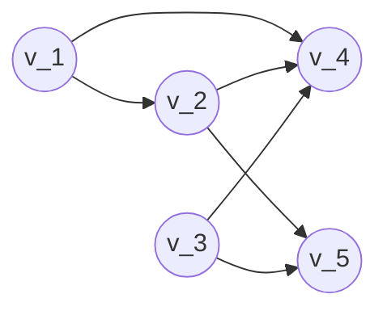

# Módulo 3, Lista 1

## Lista de Exercícios

- [Módulo 3, Lista 1](#módulo-3-lista-1)
  - [Lista de Exercícios](#lista-de-exercícios)
  - [Lista de Exercícios - Olga](#lista-de-exercícios---olga)
  - [Módulo 3 - Paradigma Divisão e Conquista](#módulo-3---paradigma-divisão-e-conquista)
    - [Livro Kleinberg e Tardos: Cap. 5](#livro-kleinberg-e-tardos-cap-5)
      - [Cap. 5, Solved Exercise 1 (Pag. 242)](#cap-5-solved-exercise-1-pag-242)
        - [Cap. 5, Solved Exercise 1 (Pag. 243-244) - Solution](#cap-5-solved-exercise-1-pag-243-244---solution)
      - [Cap. 5, Solved Exercise 2 (Pag. 244-245)](#cap-5-solved-exercise-2-pag-244-245)
        - [Cap. 5, Solved Exercise 2 (Pag. 245-246) - Solution](#cap-5-solved-exercise-2-pag-245-246---solution)
      - [Cap. 5, Exercise 1 (Pag. 246)](#cap-5-exercise-1-pag-246)
      - [Cap. 5, Exercise 2 (Pag. 246)](#cap-5-exercise-2-pag-246)
      - [Cap. 5, Exercise 6 (Pag. 246)](#cap-5-exercise-6-pag-246)
    - [Livro Cormen (3rd Ed.): Cap. 9](#livro-cormen-3rd-ed-cap-9)
      - [Cap. 9, Exercises 9.1-1 (Pag. 215)](#cap-9-exercises-91-1-pag-215)
      - [Cap. 9, Exercises 9.1-2 \* (Pag. 215)](#cap-9-exercises-91-2--pag-215)
      - [Cap. 9, Exercises 9.3-1 (Pag. 223)](#cap-9-exercises-93-1-pag-223)
      - [Cap. 9, Exercises 9.3-5 (Pag. 223)](#cap-9-exercises-93-5-pag-223)
      - [Cap. 9, Exercises 9.3-8 (Pag. 223)](#cap-9-exercises-93-8-pag-223)
  - [Módulo 3 - Paradigma Programação Dinâmica](#módulo-3---paradigma-programação-dinâmica)
    - [Livro Kleinberg e Tardos: Cap. 6](#livro-kleinberg-e-tardos-cap-6)
      - [Cap. 6, Solved Exercise 1 (Pag. 307)](#cap-6-solved-exercise-1-pag-307)
        - [Cap. 6, Solved Exercise 1 (Pag. 307) - Solution](#cap-6-solved-exercise-1-pag-307---solution)
      - [Cap. 6, Exercise 1 (Pag. 312)](#cap-6-exercise-1-pag-312)
        - [Figure 6.28](#figure-628)
        - [Cap. 6, Exercise 1a (Pag. 312)](#cap-6-exercise-1a-pag-312)
        - [Cap. 6, Exercise 1b (Pag. 312)](#cap-6-exercise-1b-pag-312)
        - [Cap. 6, Exercise 1c (Pag. 313)](#cap-6-exercise-1c-pag-313)
      - [Cap. 6, Exercise 3 (Pag. 314)](#cap-6-exercise-3-pag-314)
        - [Figure 6.29](#figure-629)
        - [Cap. 6, Exercise 3a (Pag. 314)](#cap-6-exercise-3a-pag-314)
        - [Cap. 6, Exercise 3b (Pag. 315)](#cap-6-exercise-3b-pag-315)
      - [Cap. 6, Exercise 7 (Pag. 318-319)](#cap-6-exercise-7-pag-318-319)
      - [Cap. 6, Exercise 13 (Pag. 324)](#cap-6-exercise-13-pag-324)
  - [Módulo 4 - NP e Intratabilidade Computacional](#módulo-4---np-e-intratabilidade-computacional)
    - [Livro Kleinberg e Tardos: Cap. 8](#livro-kleinberg-e-tardos-cap-8)
      - [Cap. 8, Solved Exercise 1 (Pag. 500-502)](#cap-8-solved-exercise-1-pag-500-502)
        - [Cap. 8, Solved Exercise 1 (Pag. 501-502) - Solution](#cap-8-solved-exercise-1-pag-501-502---solution)
        - [Cap. 8, Solved Exercise 1 (Pag. 501-502) - Proof](#cap-8-solved-exercise-1-pag-501-502---proof)
      - [Cap. 8, Solved Exercise 2 (Pag. 502-505)](#cap-8-solved-exercise-2-pag-502-505)
        - [Cap. 8, Solved Exercise 2 (Pag. 503-505) - Solution](#cap-8-solved-exercise-2-pag-503-505---solution)
      - [Cap. 8, Exercise 1 (Pag. 505)](#cap-8-exercise-1-pag-505)
      - [Cap. 8, Exercise 2 (Pag. 505)](#cap-8-exercise-2-pag-505)
      - [Cap. 8, Exercise 3 (Pag. 505-506)](#cap-8-exercise-3-pag-505-506)
      - [Cap. 8, Exercise 5 (Pag. 506-507)](#cap-8-exercise-5-pag-506-507)
      - [Cap. 8, Exercise 17 (Pag. 513)](#cap-8-exercise-17-pag-513)
      - [Cap. 8, Exercise 26 (Pag. 518)](#cap-8-exercise-26-pag-518)

## Lista de Exercícios - Olga

- [Módulo 3 – Paradigma Divisão e Conquista](#módulo-3---paradigma-divisão-e-conquista)
  - [Livro Kleinberg e Tardos: Cap. 5](#livro-kleinberg-e-tardos-cap-5)
    - Exercícios resolvidos 1 e 2, e
    - Exercícios 1, 2, 6 (ao final do capítulo).
  - [Livro Cormen (3rd Ed.): Cap. 9](#livro-cormen-3rd-ed-cap-9)
    - Exercícios 9-1, 9.3-1, 9.3-5, 9.3-8.
- [Módulo 3 – Paradigma Programação Dinâmica](#módulo-3---paradigma-programação-dinâmica)
  - [Livro Kleinberg e Tardos: Cap. 6](#livro-kleinberg-e-tardos-cap-6)
    - Exercício resolvido 1, e
    - Exercícios 1, 3, 7, 13 (ao final do capítulo).
- [Módulo 4 – NP e Intratabilidade Computacional](#módulo-4---np-e-intratabilidade-computacional)
  - [Livro Kleinberg e Tardos: Cap. 8](#livro-kleinberg-e-tardos-cap-8)
    - Exercícios resolvidos 1 e 2, e
    - Exercícios 1, 2, 3, 5, 17, 26 (ao final do capítulo).

## Módulo 3 - Paradigma Divisão e Conquista

### Livro Kleinberg e Tardos: Cap. 5

#### Cap. 5, Solved Exercise 1 (Pag. 242)

Suppose you are given an array $A$ with $n$ entries, with each entry holding a distinct number. You are told that the sequence of values $A[1], A[2], \dots, A[n]$ is unimodal: For some index $p$ between $1$ and $n$, the values in the array entries increase up to position $p$ in $A$ and then decrease the remainder of the way until position $n$. (So if you were to draw a plot with the array position $j$ on the $x$-axis and the value of the entry $A[j]$ on the $y$-axis, the plotted points would rise until $x$-value $p$, where they'd achieve their maximum, and then fall from there on.)

You'd like to find the "peak entry" $p$ without having to read the entire array-in fact, by reading as few entries of $A$ as possible. Show how to find the entry $p$ by reading at most $O(\log n)$ entries of $A$.

##### Cap. 5, Solved Exercise 1 (Pag. 243-244) - Solution

Let's start with a general discussion on how to achieve a running time of $O(\log n)$ and then come back to the specific problem here. If one needs to compute something using only $O(\log n)$ operations, a useful strategy that we discussed in Chapter 2 is to perform a constant amount of work, throw away half the input, and continue recursively on what's left. This was the idea, for example, behind the $O(\log n)$ running time for binary search.

We can view this as a divide-and-conquer approach: for some constant $c > 0$, we perform at most $c$ operations and then continue recursively on an input of size at most $n/2$. As in the chapter, we will assume that the recursion "bottoms out" when $n = 2$, performing at most $c$ operations to finish the computation. If $T(n)$ denotes the running time on an input of size $n$, then we have the recurrence

(5.16)

$$T(n) \leq T(n/2) + c$$

when $n > 2$, and

$$T(2) \leq c.$$

It is not hard to solve this recurrence by unrolling it, as follows.

- Analyzing the first few levels: At the first level of recursion, we have a single problem of size $n$, which takes time at most c plus the time spent in all subsequent recursive calls. The next level has one problem of size at most $n/2$, which contributes another $c$, and the level after that has one problem of size at most $n/4$, which contributes yet another $c$.
- Identifying a pattern: No matter how many levels we continue, each level will have just one problem: level $j$ has a single problem of size at most $n/2^j$, which contributes $c$ to the running time, independent of $j$.
- Summing over all levels of recursion: Each level of the recursion is contributing at most $c$ operations, and it takes $\log_2 n$ levels of recursion to reduce $n$ to 2. Thus the total running time is at most $c$ times the number of levels of recursion, which is at most $c \log_2 n = O(\log n)$.

We can also do this by partial substitution. Suppose we guess that $T(n) \leq k \log_{b} n$, where we don't know $k$ or $b$. Assuming that this holds for smaller values of $n$ in an inductive argument, we would have

$$
T(n) \leq T(n/2) + c
\leq k \log_{b}(n/2) + c
= k \log_{b} n - k \log_{b} 2 + c.
$$

The first term on the right is exactly what we want, so we just need to choose $k$ and $b$ to negate the added $c$ at the end. This we can do by setting $b = 2$ and $k = c$, so that $k \log_{b} 2 = c \log_{2} 2 = c$. Hence we end up with the solution $T(n) \leq c \log_{2} n$, which is exactly what we got by unrolling the recurrence.

Finally, we should mention that one can get an $O(\log n)$ running time, by essentially the same reasoning, in the more general case when each level of the recursion throws away any constant fraction of the input, transforming an instance of size $n$ to one of size at most an, for some constant $a < 1$. It now takes at most $\log_{1/a} n$ levels of recursion to reduce $n$ down to a constant size, and each level of recursion involves at most $c$ operations.

Now let's get back to the problem at hand. If we wanted to set ourselves up to use (5.16), we could probe the midpoint of the array and try to determine whether the "peak entry" $p$ lies before or after this midpoint.

So suppose we look at the value $A[n/2]$. From this value alone, we can't tell whether p lies before or after $n/2$, since we need to know whether entry $n/2$ is sitting on an "up-slope" or on a "down-slope." So we also look at the values $A[n/2 - 1]$ and $A[n/2 + 1]$. There are now three possibilities.

- If $A[n/2 - 1] < A[n/2] < A[n/2 + 1]$, then entry $n/2$ must come strictly before $p$, and so we can continue recursively on entries $n/2 + 1$ through $n$.
- If $A[n/2 - 1] > A[n/2] > A[n/2 + 1]$, then entry $n/2$ must come strictly after $p$, and so we can continue recursively on entries 1 through $n/2 - 1$.
- Finally, if $A[n/2]$ is larger than both $A[n/2 - 1]$ and $A[n/2 + 1]$, we are done: the peak entry is in fact equal to $n/2$ in this case.

In all these cases, we perform at most three probes of the array A and reduce the problem to one of at most half the size. Thus we can apply (5.16) to conclude that the running time is $O(\log n)$.

#### Cap. 5, Solved Exercise 2 (Pag. 244-245)

You're consulting for a small computation-intensive investment company, and they have the following type of problem that they want to solve over and over. A typical instance of the problem is the following. They're doing a simulation in which they look at $n$ consecutive days of a given stock, at some point in the past. Let's number the days $i = 1, 2, \dots, n$; for each day $i$, they have a price $p(i)$ per share for the stock on that day. (We'll assume for simplicity that the price was fixed during each day.) Suppose during this time period, they wanted to buy $1,000$ shares on some day and sell all these shares on some (later) day. They want to know: When should they have bought and when should they have sold in order to have made as much money as possible? (If there was no way to make money during the n days, you should report this instead.)

For example, suppose $n = 3$, $p(1) = 9$, $p(2) = 1$, $p(3) = 5$. Then you should return "buy on $2$, sell on $3$" (buying on day $2$ and selling on day $3$ means they would have made \$4 per share, the maximum possible for that period).

Clearly, there's a simple algorithm that takes time $O(n^2)$: try all possible pairs of buy/sell days and see which makes them the most money. Your investment friends were hoping for something a little better.

Show how to find the correct numbers $i$ and $j$ in time $O(n \log n)$.

##### Cap. 5, Solved Exercise 2 (Pag. 245-246) - Solution

We've seen a number of instances in this chapter where a brute-force search over pairs of elements can be reduced to $O(n \log n)$ by divide and conquer. Since we're faced with a similar issue here, let's think about how we might apply a divide-and-conquer strategy.

A natural approach would be to consider the first $n/2$ days and the final $n/2$ days separately, solving the problem recursively on each of these two sets, and then figure out how to get an overall solution from this in $O(n)$ time. This would give us the usual recurrence $T(n) \leq 2T \left( \frac{n}{2} \right) + O(n)$, and hence $O(n \log n)$ by (5.1).

Also, to make things easier, we'll make the usual assumption that n is a power of 2. This is no loss of generality: if $n'$ is the next power of 2 greater than $n$, we can set $p(i) = p(n)$ for all $i$ between $n$ and $n'$. In this way, we do not change the answer, and we at most double the size of the input (which will not affect the $O()$ notation).

Now, let $S$ be the set of days $1, \dots, n/2$, and $S'$ be the set of days $n/2 + 1, \dots, n$. Our divide-and-conquer algorithm will be based on the following observation: either there is an optimal solution in which the investors are holding the stock at the end of day $n/2$, or there isn't. Now, if there isn't, then the optimal solution is the better of the optimal solutions on the sets $S$ and $S'$. If there is an optimal solution in which they hold the stock at the end of day $n/2$, then the value of this solution is $p(j) - p(i)$ where $i \in S$ and $j \in S'$. But this value is maximized by simply choosing $i \in S$ which minimizes $p(i)$, and choosing $j \in S'$ which maximizes $p(j)$.

Thus our algorithm is to take the best of the following three possible solutions.

- The optimal solution on $S$.
- The optimal solution on $S'$.
- The maximum of $p(j) - p(i)$, over $i \in S$ and $j \in S'$.

The first two alternatives are computed in time $T(n/2)$, each by recursion, and the third alternative is computed by finding the minimum in $S$ and the maximum in $S'$, which takes time $O(n)$. Thus the running time $T(n)$ satisfies

$$T(n) \leq 2T \left( \frac{n}{2} \right) + O(n)$$,

as desired.

We note that this is not the best running time achievable for this problem. In fact, one can find the optimal pair of days in $O(n)$ time using dynamic programming, the topic of the next chapter; at the end of that chapter, we will pose this question as Exercise 7.

#### Cap. 5, Exercise 1 (Pag. 246)

You are interested in analyzing some hard-to-obtain data from two separate databases. Each database contains n numerical values-so there are $2n$ values total-and you may assume that no two values are the same. You'd like to determine the median of this set of $2n$ values, which we will define here to be the $n^{th}$ smallest value.

However, the only way you can access these values is through queries to the databases. In a single query, you can specify a value $k$ to one of the two databases, and the chosen database will return the $k^{th}$ smallest value that it contains. Since queries are expensive, you would like to compute the median using as few queries as possible.

Give an algorithm that finds the median value using at most $O(\log n)$ queries.

#### Cap. 5, Exercise 2 (Pag. 246)

Recall the problem of finding the number of inversions. As in the text, we are given a sequence of $n$ numbers $a_1, \dots, a_n$, which we assume are all distinct, and we define an inversion to be a pair $i < j$ such that $a_i > a_j$.

We motivated the problem of counting inversions as a good measure of how different two orderings are. However, one might feel that this measure is too sensitive. Let's call a pair a significant inversion if $i < j$ and $a_i > 2a_j$. Give an $O(n \log n)$ algorithm to count the number of significant inversions between two orderings.

#### Cap. 5, Exercise 6 (Pag. 246)

Consider an $n$-node complete binary tree $T$, where $n = 2^d - 1$ for some $d$. Each node $v$ of $T$ is labeled with a real number $x_v$. You may assume that the real numbers labeling the nodes are all distinct. A node $v$ of $T$ is a local minimum if the label $x_v$ is less than the label $x_w$ for all nodes $w$ that are joined to $v$ by an edge.

You are given such a complete binary tree $T$, but the labeling is only specified in the following implicit way: for each node $v$, you can determine the value $x_v$ by probing the node $v$. Show how to find a local minimum of $T$ using only $O(\log n)$ probes to the nodes of $T$.

### Livro Cormen (3rd Ed.): Cap. 9

#### Cap. 9, Exercises 9.1-1 (Pag. 215)

Show that the second smallest of $n$ elements can be found with $n + ⌈\log n⌉ - 2$ comparisons in the worst case. (Hint: Also find the smallest element.)

#### Cap. 9, Exercises 9.1-2 * (Pag. 215)

Prove the lower bound of $⌈3n/2⌉$ comparisons in the worst case to find both the maximum and minimum of $n$ numbers. (Hint: Consider how many numbers are potentially either the maximum or minimum, and investigate how a comparison affects these counts.)

#### Cap. 9, Exercises 9.3-1 (Pag. 223)

In the algorithm SELECT, the input elements are divided into groups of 5. Will
the algorithm work in linear time if they are divided into groups of 7? Argue that
SELECT does not run in linear time if groups of 3 are used.

#### Cap. 9, Exercises 9.3-5 (Pag. 223)

Suppose that you have a "black-box" worst-case linear-time median subroutine. Give a simple, linear-time algorithm that solves the selection problem for an arbitrary order statistic.

#### Cap. 9, Exercises 9.3-8 (Pag. 223)

Let $X[1 .. n]$ and $Y[1 .. n]$ be two arrays, each containing $n$ numbers already in sorted order. Give an $O(\log n)$-time algorithm to find the median of all $2n$ elements in arrays $X$ and $Y$.

## Módulo 3 - Paradigma Programação Dinâmica

### Livro Kleinberg e Tardos: Cap. 6

#### Cap. 6, Solved Exercise 1 (Pag. 307)

Suppose you are managing the construction of billboards on the Stephen Daedalus Memorial Highway, a heavily traveled stretch of road that runs west-east for $M$ miles. The possible sites for billboards are given by numbers $x_1, x_2, \dots, x_n$, each in the interval $[0, M]$ (specifying their position along the highway, measured in miles from its western end). If you place a billboard at location $x_i$, you receive a revenue of $r_i > 0$.

Regulations imposed by the county's Highway Department require that no two of the billboards be within less than or equal to 5 miles of each other. You'd like to place billboards at a subset of the sites so as to maximize your total revenue, subject to this restriction.

**Example.** Suppose $M = 20$, $n = 4$,

```math
\{x_1, x_2, x_3, x_4\} = \{6, 7, 12, 14\},
```

and

```math
\{r_1, r_2, r_3, r_4\} = \{5, 6, 5, 1\}.
```

Then the optimal solution would be to place billboards at $x_1$ and $x_3$, for a total revenue of 10.

Give an algorithm that takes an instance of this problem as input and returns the maximum total revenue that can be obtained from any valid subset of sites. The running time of the algorithm should be polynomial in $n$.

##### Cap. 6, Solved Exercise 1 (Pag. 307) - Solution

We can naturally apply dynamic programming to this problem if we reason as follows. Consider an optimal solution for a given input instance; in this solution, we either place a billboard at site $x_n$ or not. If we don't, the optimal solution on sites $x_1, \dots, x_n$ is really the same as the optimal solution on sites $x_1, \dots, x_{n-1}$; if we do, then we should eliminate $x_n$ and all other sites that are within 5 miles of it, and find an optimal solution on what's left. The same reasoning applies when we're looking at the problem defined by just the first $j$ sites, $x_1, \dots, x_j$: we either include $x_j$ in the optimal solution or we don't, with the same consequences.

Let's define some notation to help express this. For a site $x_j$, we let $e(j)$ denote the easternmost site $x_i$ that is more than 5 miles from $x_j$. Since sites are numbered west to east, this means that the sites $x_1, x_2, \dots, x_e(j)$ are still valid options once we've chosen to place a billboard at $x_j$, but the sites $x_{e(j)+1}, \dots, x_{j-1}$ are not.

Now, our reasoning above justifies the following recurrence. If we let $OPT(j)$ denote the revenue from the optimal subset of sites among $x_1, \dots, x_j$, then we have

$$OPT(j) = \max(r_j + OPT(e(j)), OPT(j - 1)).$$

We now have most of the ingredients we need for a dynamic programming algorithm. First, we have a set of $n$ subproblems, consisting of the first $j$ sites for $j = 0, 1, 2, \dots, n$. Second, we have a recurrence that lets us build up the solutions to subproblems, given by $OPT(j) = \max(r_j + OPT(e(j)), OPT(j - 1))$.

To turn this into an algorithm, we just need to define an array $M$ that will store the $OPT$ values and throw a loop around the recurrence that builds up the values $M[j]$ in order of increasing $j$.

---

- Initialize $M[0] = 0$ and $M[1] = r1$
- For $j = 2, 3, \dots, n:$
  - Compute $M[j]$ using the recurrence
- Endfor
- Return $M[n]$

---

As with all the dynamic programming algorithms we've seen in this chapter, an optimal _set_ of billboards can be found by tracing back through the values in array $M$.

Given the values $e(j)$ for all $j$, the running time of the algorithm is $O(n)$, since each iteration of the loop takes constant time. We can also compute all $e(j)$ values in $O(n)$ time as follows. For each site location $x_i$, we define $x^{'}_ {i} = x_ i - 5$. We then merge the sorted list $x_1, \dots, x_n$ with the sorted list $x^{'}_ {1}, \dots, x^{'}_ {n}$ in linear time, as we saw how to do in Chapter 2. We now scan through this merged list; when we get to the entry $x^{'}_ {j}$, we know that anything from this point onward to $x_j$ cannot be chosen together with $x_j$ (since it's within 5 miles), and so we simply define $e(j)$ to be the largest value of $i$ for which we've seen $x_i$ in our scan.

Here's a final observation on this problem. Clearly, the solution looks very much like that of the Weighted Interval Scheduling Problem, and there's a fundamental reason for that. In fact, our billboard placement problem can be directly encoded as an instance of Weighted Interval Scheduling, as follows. Suppose that for each site $x_i$, we define an interval with endpoints $[x_i - 5, x_i]$ and weight $r_i$. Then, given any nonoverlapping set of intervals, the corresponding set of sites has the property that no two lie within 5 miles of each other. Conversely, given any such set of sites (no two within 5 miles), the intervals associated with them will be nonoverlapping. Thus the collections of nonoverlapping intervals correspond precisely to the set of valid billboard placements, and so dropping the set of intervals we've just defined (with their weights) into an algorithm for Weighted Interval Scheduling will yield the desired solution.

#### Cap. 6, Exercise 1 (Pag. 312)

Let $G = (V, E)$ be an undirected graph with $n$ nodes. Recall that a subset of the nodes is called an independent set if no two of them are joined by an edge. Finding large independent sets is difficult in general; but here we'll see that it can be done efficiently if the graph is "simple" enough.

Call a graph $G = (V, E)$ a path if its nodes can be written as $v_1, v_2, \dots, v_n$, with an edge between $v_i$ and $v_j$ if and only if the numbers $i$ and $j$ differ by exactly 1. With each node $v_i$, we associate a positive integer weight $w_i$.

Consider, for example, the five-node path drawn in [Figure 6.28](#figure-628). The weights are the numbers drawn inside the nodes.

The goal in this question is to solve the following problem:

_Find an independent set in a path_ $G$ _whose total weight is as large as possible._

---

##### Figure 6.28


##### Cap. 6, Exercise 1a (Pag. 312)

Give an example to show that the following algorithm _does not_ always find an independent set of maximum total weight.

- The "heaviest-first" greedy algorithm
  - Start with $S$ equal to the empty set
  - While some node remains in $G$
    - Pick a node $v_i$ of maximum weight
    - Add $v_i$ to $S$
    - Delete $v_i$ and its neighbors from $G$
  - Endwhile
  - Return $S$

##### Cap. 6, Exercise 1b (Pag. 312)

Give an example to show that the following algorithm also does not always find an independent set of maximum total weight.

---

- Let $S_1$ be the set of all $v_i$ where $i$ is an odd number
- Let $S_2$ be the set of all $v_i$ where $i$ is an even number
- (Note that $S_1$ and $S_2$ are both independent sets)
- Determine which of $S_1$ or $S_2$ has greater total weight, and return this one

---

##### Cap. 6, Exercise 1c (Pag. 313)

Give an algorithm that takes an $n$-node path $G$ with weights and returns an independent set of maximum total weight. The running time should be polynomial in $n$, independent of the values of the weights.

#### Cap. 6, Exercise 3 (Pag. 314)

Let $G = (V, E)$ be a directed graph with nodes $v_1, \dots, v_n$. We say that $G$ is an _ordered graph_ if it has the following properties.

1. Each edge goes from a node with a lower index to a node with a higher index. That is, every directed edge has the form $(v_i, v_j)$ with $i < j$.
2. Each node except $v_n$ has at least one edge leaving it. That is, for every node $v_i$, $i = 1, 2, \dots, n - 1$, there is at least one edge of the form $(v_i, v_j)$.

The length of a path is the number of edges in it. The goal in this question is to solve the following problem (see [Figure 6.29](#figure-628) for an example).

> Given an ordered graph $G$, find the length of the longest path that begins at $v_1$ and ends at $v_n$.

---

##### Figure 6.29

The correct answer for this ordered graph is 3: The longest path from $v_1$ to $v_n$ uses the three edges $(v_1, v_2)$, $(v_2, v_4)$, and $(v_4, v_5)$.



##### Cap. 6, Exercise 3a (Pag. 314)

Show that the following algorithm does not correctly solve this problem, by giving an example of an ordered graph on which it does not return the correct answer.

---

- Set $w = v_1$
- Set $L = 0$
- While there is an edge out of the node $w$
  - Choose the edge $(w, v_j)$
    - for which $j$ is as small as possible
  - Set $w = v_j$
  - Increase $L$ by $1$
- end while
- Return $L$ as the length of the longest path

---

In your example, say what the correct answer is and also what the algorithm above finds.

##### Cap. 6, Exercise 3b (Pag. 315)

Give an efficient algorithm that takes an ordered graph $G$ and returns the length of the longest path that begins at $v_1$ and ends at $v_n$. (Again, the length of a path is the number of edges in the path.)

#### Cap. 6, Exercise 7 (Pag. 318-319)

As a solved exercise in Chapter 5, we gave an algorithm with $O(n \log n)$ running time for the following problem. We're looking at the price of a given stock over $n$ consecutive days, numbered $i = 1, 2, \dots, n$. For each day $i$, we have a price $p(i)$ per share for the stock on that day. (We'll assume for simplicity that the price was fixed during each day.) We'd like to know: How should we choose a day $i$ on which to buy the stock and a later day $j > i$ on which to sell it, if we want to maximize the profit per share, $p(j) - p(i)$? (If there is no way to make money during the $n$ days, we should conclude this instead.)

In the solved exercise, we showed how to find the optimal pair of days $i$ and $j$ in time $O(n \log n)$. But, in fact, it's possible to do better than this. Show how to find the optimal numbers $i$ and $j$ in time $O(n)$.

#### Cap. 6, Exercise 13 (Pag. 324)

The problem of searching for cycles in graphs arises naturally in financial trading applications. Consider a firm that trades shares in $n$ different companies. For each pair $i \neq j$, they maintain a trade ratio $r_{ij}$, meaning that one share of $i$ trades for $r_{ij}$ shares of $j$. Here we allow the rate $r$ to be fractional; that is, $r_{ij} = \frac{2}{3}$ means that you can trade three shares of $i$ to get two shares of $j$.

A trading cycle for a sequence of shares $i_1, i_2, \dots, i_k$ consists of successively trading shares in company $i_1$ for shares in company $i_2$, then shares in company $i_2$ for shares $i_3$, and so on, finally trading shares in i k back to shares in company $i_1$. After such a sequence of trades, one ends up with shares in the same company $i_1$ that one starts with. Trading around a cycle is usually a bad idea, as you tend to end up with fewer shares than you started with. But occasionally, for short periods of time, there are opportunities to increase shares. We will call such a cycle an opportunity cycle, if trading along the cycle increases the number of shares. This happens exactly if the product of the ratios along the cycle is above 1. In analyzing the state of the market, a firm engaged in trading would like to know if there are any opportunity cycles.

Give a polynomial-time algorithm that finds such an opportunity cycle, if one exists.

## Módulo 4 - NP e Intratabilidade Computacional

### Livro Kleinberg e Tardos: Cap. 8

#### Cap. 8, Solved Exercise 1 (Pag. 500-502)

You're consulting for a small high-tech company that maintains a high-security computer system for some sensitive work that it's doing. To make sure this system is not being used for any illicit purposes, they've set up some logging software that records the IP addresses that all their users are accessing over time. We'll assume that each user accesses at most one IP address in any given minute; the software writes a log file that records, for each user $u$ and each minute $m$, a value $I(u, m)$ that is equal to the IP address (if any) accessed by user $u$ during minute $m$. It sets $I(u, m)$ to the null symbol $\bot$ if $u$ did not access any IP address during minute $m$.

The company management just learned that yesterday the system was used to launch a complex attack on some remote sites. The attack was carried out by accessing $t$ distinct IP addresses over $t$ consecutive minutes: In minute 1, the attack accessed address $i_1$; in minute 2, it accessed address $i_2$; and so on, up to address it in minute $t$.

Who could have been responsible for carrying out this attack? The company checks the logs and finds to its surprise that there's no single user $u$ who accessed each of the IP addresses involved at the appropriate time; in other words, there's no $u$ so that $I(u, m) = i_m$ for each minute $m$ from $1$ to $t$.

So the question becomes: What if there were a small _coalition_ of $k$ users that collectively might have carried out the attack? We will say a subset $S$ of users is a _suspicious coalition_ if, for each minute $m$ from $1$ to $t$, there is at least one user $u \in S$ for which $I(u, m) = i_m$. (In other words, each IP address was accessed at the appropriate time by at least one user in the coalition.)

The _Suspicious Coalition_ Problem_ asks: Given the collection of all values $I(u, m)$, and a number $k$, is there a suspicious coalition of size at most $k$?

##### Cap. 8, Solved Exercise 1 (Pag. 501-502) - Solution

First of all, _Suspicious Coalition_ is clearly in $\mathcal{NP}$: If we were to be shown a set $S$ of users, we could check that $S$ has size at most $k$, and that for each minute $m$ from $1$ to $t$, at least one of the users in $S$ accessed the IP address $i_m$.

Now we want to find a known NP-complete problem and reduce it to _Suspicious Coalition_. Although _Suspicious Coalition_ has lots of features (users, minutes, IP addresses), it's very clearly a covering problem (following the taxonomy described in the chapter): We need to explain all $t$ suspicious accesses, and we're allowed a limited number of users ($k$) with which to do this. Once we've decided it's a covering problem, it's natural to try reducing Vertex Cover or Set Cover to it. And in order to do this, it's useful to push most of its complicated features into the background, leaving just the bare-bones features that will be used to encode Vertex Cover or Set Cover.

Let's focus on reducing Vertex Cover to it. In Vertex Cover, we need to cover every edge, and we're only allowed $k$ nodes. In Suspicious Coalition, we need to "cover" all the accesses, and we're only allowed k users. This parallelism strongly suggests that, given an instance of Vertex Cover consisting of a graph $G = (V, E)$ and a bound $k$, we should construct an instance of Suspicious Coalition in which the users represent the nodes of G and the suspicious accesses represent the edges.

So suppose the graph $G$ for the Vertex Cover instance has $m$ edges $e_1, \dots, e_m$, and $e_j = (v_j, w_j)$. We construct an instance of Suspicious Coalition as follows. For each node of $G$ we construct a user, and for each edge $e_t = (v_t, w_t)$ we construct a minute $t$. (So there will be $m$ minutes total.) In minute $t$, the users associated with the two ends of $e_t$ access an IP address $i_t$, and all other users access nothing. Finally, the attack consists of accesses to addresses $i_1, i_2, \dots, i_m$ in minutes $1, 2, \dots, m$, respectively.

The following claim will establish that Vertex Cover $\leq_{P}$ Suspicious Coalition and hence will conclude the proof that Suspicious Coalition is NP-complete. Given how closely our construction of the instance shadows the original Vertex Cover instance, the proof is completely straightforward.

> **(8.28)** In the instance constructed, there is a suspicious coalition of size at most $k$ if and only if the graph $G$ contains a vertex cover of size at most $k$.

##### Cap. 8, Solved Exercise 1 (Pag. 501-502) - Proof

First, suppose that $G$ contains a vertex cover $C$ of size at most $k$. Then consider the corresponding set $S$ of users in the instance of Suspicious Coalition. For each $t$ from $1$ to $m$, at least one element of $C$ is an end of the edge $e_t$, and the corresponding user in $S$ accessed the IP address $i_t$. Hence the set $S$ is a suspicious coalition.

Conversely, suppose that there is a suspicious coalition $S$ of size at most $k$, and consider the corresponding set of nodes $C$ in $G$. For each $t$ from $1$ to $m$, at least one user in $S$ accessed the IP address $i_t$, and the corresponding node in $C$ is an end of the edge $e_t$. Hence the set $C$ is a vertex cover.

#### Cap. 8, Solved Exercise 2 (Pag. 502-505)

You've been asked to organize a freshman-level seminar that will meet once a week during the next semester. The plan is to have the first portion of the semester consist of a sequence of $l$ guest lectures by outside speakers, and have the second portion of the semester devoted to a sequence of $p$ hands-on projects that the students will do.

There are $n$ options for speakers overall, and in week number $i$ (for $i = 1, 2, \dots, l$) a subset $L_i$ of these speakers is available to give a lecture.

On the other hand, each project requires that the students have seen certain background material in order for them to be able to complete the project successfully. In particular, for each project $j$ (for $j = 1, 2, \dots, p$), there is a subset $P_j$ of relevant speakers so that the students need to have seen a lecture by _at least one_ of the speakers in the set $P_j$ in order to be able to complete the project.

So this is the problem: Given these sets, can you select exactly one speaker for each of the first $l$ weeks of the seminar, so that you only choose speakers who are available in their designated week, and so that for each project $j$, the students will have seen at least one of the speakers in the relevant set $P_j$? We'll call this the _Lecture Planning Problem_.

To make this clear, let's consider the following sample instance. Suppose that $l = 2, p = 3$, and there are $n = 4$ speakers that we denote $A, B, C, D$. The availability of the speakers is given by the sets $L_1 = {A, B, C}$ and $L_2 = {A, D}$. The relevant speakers for each project are given by the sets $P_1 = {B, C}$, $P_2 = {A, B, D}$, and $P_3 = {C, D}$. Then the answer to this instance of the problem is yes, since we can choose speaker $B$ in the first week and speaker $D$ in the second week; this way, for each of the three projects, students will have seen at least one of the relevant speakers.

Prove that Lecture Planning is NP-complete.

##### Cap. 8, Solved Exercise 2 (Pag. 503-505) - Solution

The problem is in $\mathcal{NP}$ since, given a sequence of speakers, we can check (a) all speakers are available in the weeks when they're scheduled, and (b) that for each project, at least one of the relevant speakers has been scheduled.

Now we need to find a known NP-complete problem that we can reduce to Lecture Planning. This is less clear-cut than in the previous exercise, because the statement of the Lecture Planning Problem doesn't immediately map into the taxonomy from the chapter.

There is a useful intuitive view of Lecture Planning, however, that is characteristic of a wide range of constraint satisfaction problems. This intuition is captured, in a strikingly picturesque way, by a description that appeared in the _New Yorker_ of the lawyer David Boies's cross-examination style:

> During a cross-examination, David takes a friendly walk down the hall with you while he's quietly closing doors. They get to the end of the hall and David turns on you and there's no place to go. He's closed all the doors.

What does constraint satisfaction have to do with cross-examination? In Lecture Planning, as in many similar problems, there are two conceptual phases. There's a first phase in which you walk through a set of choices, selecting some and thereby closing the door on others; this is followed by a second phase in which you find out whether your choices have left you with a valid solution or not.

In the case of Lecture Planning, the first phase consists of choosing a speaker for each week, and the second phase consists of verifying that you've picked a relevant speaker for each project. But there are many NP-complete problems that fit this description at a high level, and so viewing Lecture Planning this way helps us search for a plausible reduction. We will in fact describe two reductions, first from 3-SAT and then from Vertex Cover. Of course, either one of these by itself is enough to prove NP-completeness, but both make for useful examples.

3-SAT is the canonical example of a problem with the two-phase structure described above: We first walk through the variables, setting each one to true or false; we then look over each clause and see whether our choices 3 Ken Auletta quoting Jeffrey Blattner, The New Yorker, 16 August 1999. have satisfied it. This parallel to Lecture Planning already suggests a natural reduction showing that 3-SAT $\leq_P$ Lecture Planning: We set things up so that the choice of lecturers sets the variables, and then the feasibility of the projects represents the satisfaction of the clauses.

More concretely, suppose we are given an instance of 3-SAT consisting of clauses $C_1, \dots, C_k$ over the variables $x_1, x_2, \dots, x_n$. We construct an instance of Lecture Planning as follows. For each variable $x_i$, we create two lecturers $z_i$ and $z'$ i that will correspond to $x_i$ and its negation. We begin with $n$ weeks of lectures; in week $i$, the only two lecturers available are $z_i$ and $z'_i$. Then there is a sequence of $k$ projects; for project $j$, the set of relevant lecturers $P_j$ consists of the three lecturers corresponding to the terms in clause $C_j$. Now, if there is a satisfying assignment $v$ for the 3-SAT instance, then in week $i$ we choose the lecturer among $z_i$, $z'_i$ that corresponds to the value assigned to $x_i$ by $v$; in this case, we will select at least one speaker from each relevant set $P_j$. Conversely, if we find a way to choose speakers so that there is at least one from each relevant set, then we can set the variables $x_i$ as follows: $x_i$ is set to $1$ if $z_i$ is chosen, and it is set to $0$ if $z'_i$ is chosen. In this way, at least one of the three variables in each clause $C_j$ is set in a way that satisfies it, and so this is a satisfying assignment. This concludes the reduction and its proof of correctness.

Our intuitive view of Lecture Planning leads naturally to a reduction from Vertex Cover as well. (What we describe here could be easily modified to work from Set Cover or 3-Dimensional Matching too.) The point is that we can view Vertex Cover as having a similar two-phase structure: We first choose a set of $k$ nodes from the input graph, and we then verify for each edge that these choices have covered all the edges.

Given an input to Vertex Cover, consisting of a graph $G = (V, E)$ and a number $k$, we create a lecturer $z_v$ for each node $v$. We set $l = k$, and define $L_1 = L_2 = \dots = L_k = {z_v: v \in V}$. In other words, for the first $k$ weeks, all lecturers are available. After this, we create a project $j$ for each edge $e_j = (v, w)$, with set $P_j = {z_v, z_w}$.

Now, if there is a vertex cover $S$ of at most $k$ nodes, then consider the set of lecturers $Z_S = {z_v: v \in S}$. For each project $P_j$, at least one of the relevant speakers belongs to $Z_S$, since $S$ covers all edges in $G$. Moreover, we can schedule all the lecturers in $Z_S$ during the first $k$ weeks. Thus it follows that there is a feasible solution to the instance of Lecture Planning.

Conversely, suppose there is a feasible solution to the instance of Lecture Planning, and let $T$ be the set of all lecturers who speak in the first $k$ weeks. Let $X$ be the set of nodes in $G$ that correspond to lecturers in $T$. For each project $P_j$, at least one of the two relevant speakers appears in $T$, and hence at least one end of each edge $e_j$ is in the set $X$. Thus $X$ is a vertex cover with at most $k$ nodes.

This concludes the proof that Vertex Cover $\leq_P$ Lecture Planning.

#### Cap. 8, Exercise 1 (Pag. 505)

For each of the two questions below, decide whether the answer is (i) "Yes," (ii) "No," or (iii) "Unknown, because it would resolve the question of whether $\mathcal{P}$ = $\mathcal{NP}$." Give a brief explanation of your answer.

1. Let's define the decision version of the Interval Scheduling Problem from Chapter 4 as follows: Given a collection of intervals on a time-line, and a bound $k$, does the collection contain a subset of nonoverlapping intervals of size at least $k$?
   - Question: Is it the case that Interval Scheduling $\leq_P$ Vertex Cover?
2. Question: Is it the case that Independent Set $\leq_P$ Interval Scheduling?

#### Cap. 8, Exercise 2 (Pag. 505)

A store trying to analyze the behavior of its customers will often maintain a two-dimensional array $A$, where the rows correspond to its customers and the columns correspond to the products it sells. The entry $A[i, j]$ specifies the quantity of product $j$ that has been purchased by customer $i$.

Here's a tiny example of such an array $A$.

$$
\begin{matrix}
                  & \text{liquid detergent} & \text{beer} &  \text{diapers} & \text{cat litter} \\
  \text{Raj}      &                       0 &           6 &               0 &                 3 \\
  \text{Alanis}   &                       2 &           3 &               0 &                 0 \\
  \text{Chelsea}  &                       0 &           0 &               0 &                 7 \\
\end{matrix}
$$

One thing that a store might want to do with this data is the following. Let us say that a subset $S$ of the customers is _diverse_ if no two of the of the customers in $S$ have ever bought the same product (i.e., for each product, at most one of the customers in $S$ has ever bought it). A diverse set of customers can be useful, for example, as a target pool for market research.

We can now define the Diverse Subset Problem as follows: Given an $m \times n$ array $A$ as defined above, and a number $k \leq m$, is there a subset of at least $k$ of customers that is _diverse_?

Show that Diverse Subset is NP-complete.

#### Cap. 8, Exercise 3 (Pag. 505-506)

Suppose you're helping to organize a summer sports camp, and the following problem comes up. The camp is supposed to have at least one counselor who's skilled at each of the $n$ sports covered by the camp (baseball, volleyball, and so on). They have received job applications from m potential counselors. For each of the n sports, there is some subset of the m applicants qualified in that sport. The question is: For a given number $k < m$, is it possible to hire at most k of the counselors and have at least one counselor qualified in each of the n sports? We'll call this the _Efficient Recruiting Problem_.

Show that Efficient Recruiting is NP-complete.

#### Cap. 8, Exercise 5 (Pag. 506-507)

Consider a set $A = {a_1, \dots, a_n}$ and a collection $B_1, B_2, \dots, B_m$ of subsets of $A$ (i.e., $B_i \subseteq A$ for each $i$).

We say that a set $H \subseteq A$ is a _hitting_ set for the collection $B_1, B_2, \dots, B_m$ if $H$ contains at least one element from each $B_i$—that is, if $H \cap B_i$ is not empty for each $i$ (so $H$ "hits" all the sets $B_i$).

We now define the $Hitting Set Problem$ as follows. We are given a set $A = {a_1, \dots, a_n}$, a collection $B_1, B_2, \dots, B_m$ of subsets of $A$, and a number $k$. We are asked: Is there a hitting set $H \subseteq A$ for $B_1, B_2, \dots, B_m$ so that the size of $H$ is at most $k$?

Prove that Hitting Set is NP-complete.

#### Cap. 8, Exercise 17 (Pag. 513)

You are given a directed graph $G = (V, E)$ with weights $w$ e on its edges $e \in E$. The weights can be negative or positive. The _Zero-Weight-Cycle Problem_ is to decide if there is a simple cycle in $G$ so that the sum of the edge weights on this cycle is exactly 0. Prove that this problem is NP-complete.

#### Cap. 8, Exercise 26 (Pag. 518)

You and a friend have been trekking through various far-off parts of the world and have accumulated a big pile of souvenirs. At the time you weren't really thinking about which of these you were planning to keep and which your friend was going to keep, but now the time has come to divide everything up.

Here's a way you could go about doing this. Suppose there are n objects, labeled $1, 2, \dots, n$, and object $i$ has an agreed-upon _value_ $x_i$. (We could think of this, for example, as a monetary resale value; the case in which you and your friend don't agree on the value is something we won't pursue here.) One reasonable way to divide things would be to look for a _partition_ of the objects into two sets, so that the total value of the objects in each set is the same.

This suggests solving the following _Number Partitioning Problem_. You are given positive integers $x1, \dots, x_n$; you want to decide whether the numbers can be partitioned into two sets $S_1$ and $S_2$ with the same sum:

$$\sum_{x_i \in S_1} x_i = \sum_{x_j \in S_2} x_j.$$

Show that Number Partitioning is NP-complete.
