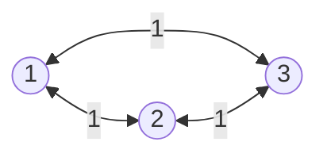
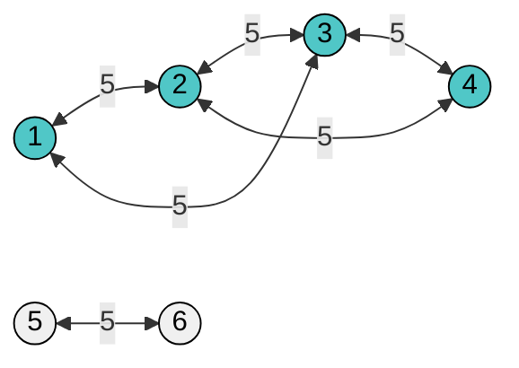

# Trabalho Prático 1

|   #   |      | Problema                        | Submissão | Aceito | Nível | Peso |
| :---: | ---- | ------------------------------- | :-------: | :----: | ----: | ---: |
|   1   | 1128 | [Ir e Vir][IrEVir]              |     -     |   -    |     4 |  100 |
|   2   | 1447 | [Back to the Future][BttF]      |     -     |   -    |     7 |  100 |
|   3   | 1550 | [Inversão][Inversao]            |     -     |   -    |     7 |  100 |
|   4   | 3158 | [O Bom Presidente][OBP]         |     -     |   -    |     5 |  100 |
|   5   | 3356 | [Reprodução Controlada][RC]     |     -     |   -    |     3 |  100 |
|   6   | 1362 | [Minha Camiseta Me Serve][MCMS] |     -     |   -    |     6 |  100 |

---

## [beecrowd | 3158 - O Bom Presidente][OBP]

[IrEVir]: https://judge.beecrowd.com/pt/problems/view/1128

Por Samuel Eduardo da Silva, IFSULDEMINAS/UFF BR Brazil

Timelimit: 1

Livrolândia é um país que, como o nome já diz, preza pela leitura. Nesta cidade há uma regra universal: toda cidade do país deve ter acesso a bibliotecas. Todos os presidentes que passaram por Livrolândia conseguiram manter esta regra.

Roci é o atual presidente, e fez questão de dar manutenção a todas as bibliotecas do país, além de manter a boa qualidade das estradas entre as cidades, para que cidades que não tem biblioteca, consigam acesso a cidades vizinhas que tenham.

Infelizmente, Roci é muito azarado e, logo em seu mandato, um tornado destruiu todas as bibliotecas e obstruiu todas as estradas de Livrolândia. Agora, o presidente terá que bolar um plano para reconstruir o país, seguindo sua regra universal e com o menor custo possível para as obras.

Livrolândia tem $N$ cidades numeradas de $1$ a $N$. As cidades são conectadas por $M$ estradas bidirecionadas. Uma cidade tem acesso a um biblioteca se:

- Esta cidade tem uma biblioteca;
- É possível, a partir desta cidade, viajar para uma cidade que contém uma biblioteca.

O custo para reparar uma estrada é E tolkiens (tolkiens é a moeda de Livrolândia) e o custo para construir uma biblioteca é B tolkiens.

Dado o mapa de Livrolândia e os custos de reparo e construção, escreva um programa que retorne o custo mínimo para reconstruir o país, seguindo a regra universal, e assim, salve Roci.

### Entrada - beecrowd | 3158

A primeira linha da entrada contém um inteiro $T$ indicando o número de possíveis mapas.

A segunda linha da entrada contém 4 inteiros, $N$, $M$, $B$ e $E$, número de cidades, número de estradas, custo para construir uma biblioteca e o custo para construir uma estrada, respectivamente.

Depois há $M$ linhas indicando as estradas obstruídas, em que cada uma há dois inteiros $X$ e $Y$, indicando que há uma estrada que liga a cidade $X$ à cidade $Y$.

Limites:

$1 ≤ T ≤ 10;$
$1 ≤ N ≤ 10^5;$
$0 ≤ M ≤ min(10^5, (N*(N-1))/2);$
$1 ≤  B, E ≤ 10^5;$
$1 ≤ X,Y ≤ N.$

### Saída - beecrowd | 3158

Para cada possível mapa, indique o custo mínimo para reconstruir o país.

| Exemplo de Entrada | Exemplo de Saída |
| ------------------ | ---------------- |
| 2                  | &nbsp;           |
| 3 3 2 1            | 4                |
| 1 2                | &nbsp;           |
| 3 1                | &nbsp;           |
| 2 3                | &nbsp;           |
| 6 6 2 5            | 12               |
| 1 3                | &nbsp;           |
| 3 4                | &nbsp;           |
| 2 4                | &nbsp;           |
| 1 2                | &nbsp;           |
| 2 3                | &nbsp;           |
| 5 6                | &nbsp;           |

X Olimpíada Interna de Programação do IFSULDEMINAS - OLIP 2020

---

---

## [beecrowd | 3356 - Reprodução Controlada][RC]

[BttF]: https://judge.beecrowd.com/pt/problems/view/1447

Por Ricardo J. Pfitscher, UNISOCIESC BR Brazil

Timelimit: 1

Uma das forças motoras que auxiliaram no desenvolvimento da região sul do Brasil foi a força equina. Talvez por isso a região tem uma cultura de criação de cavalos de raça, sendo possível encontrar fazendas de cavalos tanto no estado do Paraná, quanto em Santa Catarina e no Rio Grande do Sul.

Uma dessas fazendas pretende realizar um mapeamento genealógico de seus animais e melhorar a característica genética das reproduções. A ideia do veterinário responsável é não cruzar animais que tenham relação de parentesco, ou seja, antes de cruzar dois animais, os veterinários pretendem verificar se eles tem algum ascendente em comum. Se este for o caso, os animais não deverão formar um casal para reprodução. Para realizar tal mapeamento, o veterinário solicitou um programa que, dada uma lista de parentesco e um par de animais, decida se eles têm parentesco ou não.

Na figura exemplo, Alice e Bob geraram dois filhos, Gina e Bonnie. Ainda, um teste entre Elis e Ped deve retornar verdadeiro (existe parentesco) e entre Zec e Perf deve retornar falso (não existe parentesco).

### Entrada - beecrowd | 3356

A primeira linha da entrada possui três números inteiros $N (3 \leq N \leq 15)$, $C (0 < C \leq N)$ e $T (0 < T \leq N*(N-1))$, que representam, respectivamente, o número de animais, o número de relações de parentesco conhecidas e o número de casos de teste. Em seguida, são fornecidas as $C$ relações de parentesco com os dois nomes dos pais e o respectivo filho gerado. Depois dos cruzamentos são fornecidos os $T$ casos de teste, cada um composto pelos nomes dos dois animais que se pretende cruzar. Cada nome de animal é composto por até 10 letras do alfabeto português (26 letras) e todos os nomes são separados por um único espaço entre si.

### Saída - beecrowd | 3356

Seu programa deve imprimir, para cada caso de teste, "verdadeiro" se existir parentesco entre os animais e "falso" se não existir.

| Exemplo de Entrada | Exemplo de Saída |
| ------------------ | ---------------- |
| 13 7 3             | falso            |
| Juca Caju Olivier  | verdadeiro       |
| Juca Caju Gin      | falso            |
| Alice Bob Gina     |                  |
| Alice Bob Bonnie   |                  |
| Bonnie Perf Elis   |                  |
| Gin Gina Ped       |                  |
| Marie Olivier Zec  |                  |
| Juca Caju          |                  |
| Elis Ped           |                  |
| Zec Perf           |                  |

1a Maratona de Programação do Sul

---

## [beecrowd | 1550 - Inversão][Inversao]

[Inversao]: https://judge.beecrowd.com/pt/problems/view/1550

Por Gabriel Dalalio, ITA BR Brazil

Timelimit: 3

Pedro é um garoto curioso que gostava de eletrônica. Certo dia, o menino estava mexendo no laboratório de sua escola e encontrou uma caixa cheia de pequenos aparelhos eletrônicos feitos por outros alunos em anos anteriores.

Dentro dessa caixa havia um aparelho que possuía apenas um visor e dois botões. Esse visor apresentava um número inteiro. Mexendo nos botões, Pedro descobriu para que servia cada um deles. O primeiro botão adicionava uma unidade ao número no visor. O segundo botão invertia os dígitos do número, por exemplo, 123 invertido resulta em 321 e 150 invertido resulta em 51 (ignora-se os zeros a esquerda).

Inicialmente, o visor apresentava o número A. Após a descoberta da função dos botões, Pedro quer saber como fazer o número do visor mudar de A para um número maior igual a B. O seu trabalho nesse problema é ajudar Pedro a descobrir qual é o número mínimo de apertos de botão para que o número no visor passe a ser igual a B.

### Entrada - beecrowd | 1550

A entrada é iniciada por um inteiro $T, 0 < T ≤ 500$, que indica a quantidade de casos de teste a ser processados. Segue-se $T$ linhas cada uma contendo dois inteiros $A$ e $B$, $0 < A < B < 10000$, indicando respectivamente o número inicial no visor e o número que deve ser mostrado no visor depois de apertar os botões.

### Saída - beecrowd | 1550

Para cada caso de teste, o programa deve imprimir um inteiro indicando o número mínimo de apertos de botão para que o número do visor passe de $A$ para $B$.

| Exemplo de Entrada | Exemplo de Saída |
| ------------------ | ---------------- |
| 4                  | 8                |
| 1 9                | 4                |
| 100 301            | 3                |
| 808 909            | 3                |
| 133 233            |                  |

Aquecimento para a OBI 2014

---

## [beecrowd | 1447 - Back to the Future][BttF]

[OBP]: https://judge.beecrowd.com/pt/problems/view/3158

Maratona de Programação IME-USP  Brasil

Timelimit: 2

Um grupo de amigos resolveu ir à Alemanha para apoiar a seleção brasileira em sua jornada gloriosa rumo ao hexa. Como as passagens aéreas e as estadias eram caras, cada um trouxe uma quantidade de dinheiro que julgou suficiente para passar o mês com conforto e voltar para casa sem problemas.

Porém, após a bela campanha do Brasil na copa do mundo, o grupo de amigos se viu obrigado a gastar o dinheiro que tinha guardado para as etapas finais da copa com a famosa cerveja alemã. As consequências de tais atos foram terríveis. Após uma grande bebedeira, todos foram pegos pela polícia local dormindo na rua, e receberam multas pesadíssimas. Além disso, todos perderam suas passagens de volta. Devido a esses contratempos, a viagem de volta ficou ameaçada. De repente, eles descobriram que precisavam voltar para casa gastando a menor quantidade possível de dinheiro.

Analisando as rotas aéreas disponíveis, os amigos notaram que em todas as rotas o número de assentos disponíveis nos aviões era sempre o mesmo. Porém, os preços das viagens entre uma cidade e outra eventualmente variavam bastante. Assustados com a possibilidade de não encontrar lugares suficiente nos aviões para que todos pudessem voltar e preocupados em gastar a menor quantidade possível de dinheiro, o grupo de amigos resolveu pedir sua ajuda.

### Entrada - beecrowd | 1447

O problema é composto por várias instâncias. Cada instância começa com uma linha com dois inteiros positivos $N (2 ≤ N ≤ 100)$ e $M (1 ≤ M ≤ 5000)$, onde $N$ é o número de cidades que pertencem às $M$ rotas de voo consideradas. Os amigos querem ir da cidade $1$ até a cidade $N$.

Nas próximas $M$ linhas são fornecidos triplas de inteiros $A B C$ descrevendo a rota do avião ($A$ e $B$) e o preço da passagem aérea por pessoa ($C$). Os valores de $A$ e $B$ estão entre $1$ e $n$. As rotas são bidirecionais (ou seja, há um voo de $A$ até $B$ e um voo de $B$ até $A$ com preço $C$) e haverá no máximo uma rota entre duas cidades. Na próxima linha são dados dois inteiros, $D$ e $K$, onde $D$ é o número de amigos e $K$ é o número de assentos livres em cada voo. Cada rota só pode ser utilizada uma vez.

### Saída - beecrowd | 1447

Para cada instância, imprima a linha "Instancia $k$", onde $k$ é o número da instância atual. Além disso, imprima a menor quantidade possível de dinheiro que os amigos vão gastar para voltar ao Brasil (que está limitada por 1015). Caso não seja possível escolher um conjunto de voos que levem todos para casa, imprima "impossivel".

Imprima uma linha em branco após cada instância.

| Exemplo de Entrada | Exemplo de Saída |
| ------------------ | ---------------- |
| 4 5                | Instancia 1      |
| 1 4 1              | 80               |
| 1 3 3              |                  |
| 3 4 4              | Instancia 2      |
| 1 2 2              | 140              |
| 2 4 5              |                  |
| 20 10              | Instancia 3      |
| 4 4                | impossivel       |
| 1 3 3              |                  |
| 3 4 4              |                  |
| 1 2 2              |                  |
| 2 4 5              |                  |
| 20 100             |                  |
| 4 4                |                  |
| 1 3 3              |                  |
| 3 4 4              |                  |
| 1 2 2              |                  |
| 2 4 5              |                  |
| 20 1               |                  |

X Maratona de Programação IME-USP 2006.

---

## [beecrowd | 1128 - Ir e Vir][IrEVir]

[RC]: https://judge.beecrowd.com/pt/problems/view/3356

Maratona de Programação da SBC  Brasil

Timelimit: 1

Numa certa cidade há $N$ intersecções ligadas por ruas de mão única e ruas com mão dupla de direcão. É uma cidade moderna, de forma que muitas ruas atravessam túneis ou têm viadutos. Evidentemente é necessário que se possa viajar entre quaisquer duas intersecções, isto é, dadas duas intersecções $V$ e $W$, deve ser possível viajar de $V$ para $W$ e de $W$ para $V$.

Sua tarefa é escrever um programa que leia a descrição do sistema de tráfego de uma cidade e determine se o requisito de conexidade é satisfeito ou não.

### Entrada - beecrowd | 1128

A entrada contém vários casos de teste. A primeira linha de um caso de teste contém dois números inteiros $N$ e $M$, separados por um espaço em branco, indicando respectivamente o número de intersecções $(2 ≤ N ≤ 2000)$ e o número de ruas $(2 ≤ M ≤ N(N−1)/2)$. O caso de teste tem ainda mais $M$ linhas, que contêm, cada uma, uma descrição de cada uma das $M$ ruas. A descrição consiste de três inteiros $V$, $W$ e $P$, separados por um espaço em branco, onde $V$ e $W$ são identificadores distintos de intersecções $(1 ≤ V, W ≤ N , V ≠ W)$ e $P$ pode ser 1 ou 2; se $P = 1$ então a rua é de mão única, e vai de $V$ para $W$; se $P = 2$ então a rua é de mão dupla, liga $V$ e $W$. Não existe duas ruas ligando as mesmas intersecções.

O ultimo caso de teste é seguido por uma linha que contém apenas dois números zero separados por um espaço em branco.

### Saída - beecrowd | 1128

Para cada caso de teste seu programa deve imprimir uma linha contendo um inteiro $G$, onde $G$ é igual a 1 se o requisito de conexidade está satisfeito, ou $G$ é igual a $0$, caso contrário.

| Exemplo de Entrada | Exemplo de Saída |
| ------------------ | ---------------- |
| 4 5                | 1                |
| 1 2 1              | 1                |
| 1 3 2              | 0                |
| 2 4 1              | 0                |
| 3 4 1              |                  |
| 4 1 2              |                  |
| 3 2                |                  |
| 1 2 2              |                  |
| 1 3 2              |                  |
| 3 2                |                  |
| 1 2 2              |                  |
| 1 3 1              |                  |
| 4 2                |                  |
| 1 2 2              |                  |
| 3 4 2              |                  |
| 0 0                |                  |

Maratona de Programação da SBC 2010

---

## [beecrowd | 1362 - Minha Camiseta Me Serve][MCMS]

[MCMS]: https://judge.beecrowd.com/pt/problems/view/1362

Por Ginés García Mateos, UM  Espanha

Timelimit: 1

Nosso amigo Victor é instrutor em um programa ambiental voluntário. O chefe de Victor pediu para ele distribuir $N$ camisetas para $M$ voluntários ($N$ é múltiplo de seis, e $N \geq M$). Cada voluntário deve receber exatamente uma camiseta (se $N \neq M$, algumas camisetas podem sobrar). Há o mesmo número de camisetas disponíveis para cada tamanho de camiseta possível: XXL, XL, L, M, S e XS (siglas em inglês para P, M, G, etc.). Victor tem um pequeno problema: apenas dois tamanhos de camisetas servem para cada voluntário.

Você deve escrever um programa que decide se Victor pode distribuir as camisetas de tal forma que todo voluntário tenha uma camiseta que lhe serve.

## Entrada - beecrowd | 1362

A primeira linha da entrada contém o número de casos de teste.

Para cada caso de teste, há uma linha contendo os números $N$ e $M$. O número $N$ é múltiplo de seis, $1 \leq N \leq 36$, e indica o número total de camisetas disponíveis. O número $M$, $1 \leq M \leq 30$, indica o número de voluntários, com $N \geq M$. As próximas $M$ linhas descrevem os voluntários, um por linha. Cada linha contém dois tamanhos de camiseta possíveis (XXL, XL, L, M, S ou XS) separados por um espaço, indicando quais tamanhos servem para o voluntário.

## Saída - beecrowd | 1362

Para cada caso teste, imprima uma linha contendo YES se existe pelo menos uma maneira de distribuir as camisetas de tal forma que todo voluntário tenha uma camiseta que lhe serve, ou NO caso contrário.

| Exemplo de Entrada | Exemplo de Saída |
| ------------------ | ---------------- |
| 3                  | YES              |
| 18 6               | &nbsp;           |
| L XL               | &nbsp;           |
| XL L               | &nbsp;           |
| XXL XL             | &nbsp;           |
| S XS               | &nbsp;           |
| M S                | &nbsp;           |
| M L                | &nbsp;           |
| 6 4                | NO               |
| S XL               | &nbsp;           |
| L S                | &nbsp;           |
| L XL               | &nbsp;           |
| L XL               | &nbsp;           |
| 6 1                | YES              |
| L M                | &nbsp;           |

[JV: Precisei colocar "&nbsp;" porque o ipynb não aceita tabelas com células vazias.]

OMP'09, Facultad de Informatica. Universidad de Murcia (SPAIN).

---
