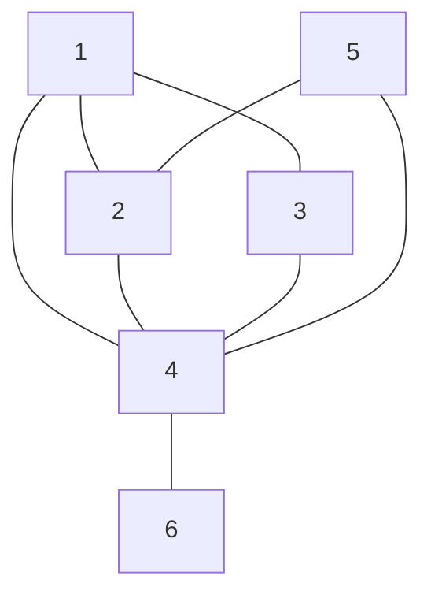
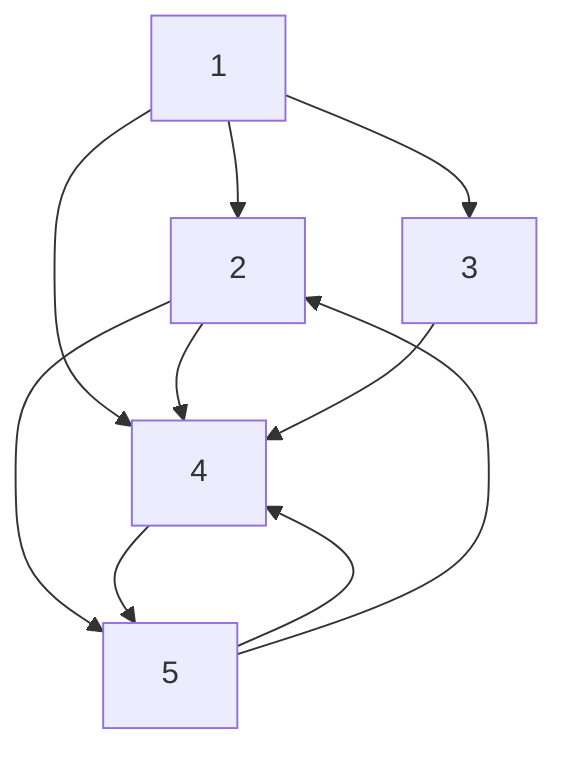
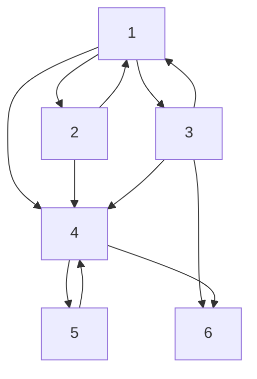

# PAA 2024 - Marcio Costa Santos <marciocs@dc.ufmg.br> & Olga NIkolaevna Goussevskaia

livro do cormen e do udi manber

## Módulo 1

### Aula 1 - 25/09/24

Primeira aula é pra explicar

- Análise e complexidade de algoritmos
- Algoritmos em grafos
- Projetos e Design de algoritmos
- Complexidade de problemas

Os dois primeiros é dele. As duas últimas é com a Olga.

Cada um dos módulos vale 25 pontos. O primeiro módulo só tem uma prova que vale 25. Nos outros terá uma prova mais uma atividade, podendo ser uma lista de exercícios ou um trabalho prático. Cada professor define de que forma distribui os 25 pontos entre prova e atividade.

Muito provavelmente pra ele será 20 pra prova e 5 pra atividade/lista. Geralmente a Olga faz (20 e 5), e (15, 10)

Vâo postar o cronograma de PAA no Moodle.

Algumas das avaliações são também pelo Moodle

Ele geralmente usa slide e também escreve muito no quadro. Algumas coisas como algoritmos e desenhos ele prefere ter no slide.

Os slides e as listas ele disponibiliza no Moodle, mesmo que ele não faça atividades só de exercícios. Ele deve fazer duas aulas assim antes de cada uma das provas dos dois primeiros módulos. Porém, tente resolver todos os exercícios antes das aulas.

Pretende enviar todo o material do módulo de uma só vez.

Ele segue um livro e a Olga, outro. Ele gosta de seguir o Cormen "de cabo a rabo".

Ele vai indicar quais capítulos correspondem àquela aula.

#### Sobre o módulo

Ela não é uma disciplina pra aprender a programar, nem é das mais fáceis de teoria.

Exemplo que ele vai fingir que vc sabe: PA, PG, Logaritmo; Estruturas de controle em programação; Estruturas de dados básicos (filha, pilha, árvore, heap);

A disciplina é de Análise e construção de algoritmo. A ideia do curso é que você já entende o básico e vai partir daí.

O professor Coutinho criou um material de estudo que é o "Pré-PAA" que tem uma sequência de materiais para estudo próprio. Se não souber de algo, pare e tente resolver.

É importante seguir o cronograma e fazer isso o mais rápido possível.

As aulas vão começar básicas e elas tendem a se tornar muito complicadas.

Exemplo: Aula 1 é o básico de grafos. Aula 2 já seria a notação matemática para o que foi dado na aula 1.

Ele deve usar bastante transformação de logaritmo.

- Que linguagem de programação é usada em PAA?
  - Nenhuma. O que ele vai mostrar são algoritmos. Exemplos: `while (deu certo)`, `Inclui V NaLista L`, `R = folhas da árvore T`.
  - No início ele deve tentar esquematizar mais a parte da estrutura dos dados, mas com o tempo vai se tornar cada vez mais abstrato.

Especialmente em algoritmos recursivos ele vai explicar como funciona o algoritmo, principalmente na ideia, mas faltando alguns passos. Exemplo: ignorando todos os corner-cases e focar na ideia que é principal.

Python, Java, C ou C++. Ele é muito fanboy de Julia kkkkkkkkkkkkkkkkkkkkkk

O trabalho provavelmente vai envolver alguma coisa de programação.

- Ele mais se importa que a ideia do algoritmo esteja certa. Não importa muito os pormenores. Aqueles últimos detalhes:
  - Divide em grupos de cinco
    - E se não for múltiplo?
  - Divide na metade
    - E se for ímpar?

A primeira parte da disciplina não é criar algoritmos, apenas analisá-los.

Nessa primeira parte é aquela análise de Big-O para definir a quantidade de passos que o algoritmo executa.

Geralmente vai se utilizar formas matemáticas de se utilizar Somatórios, que geralmente são PAs ou PGs.

- Às vezes o somatório é muito esquisito, que resulta em algo ainda mais esquisito. Exemplo:
  - $\sum^{n}_{i = 0} = \frac{1}{i} = \log n$
  - Mas nesses casos ele geralmente informa que esses "passes de mágica" serão utilizados nas provas.

Recursão será muito utilizado. Mesmo algoritmos não recursivos ele tende a escrevê-las de forma recursiva. Então, teremos que analisar bem cuidadosamente a complexidade de algoritmos recursivos.

Veremos dois métodos para a análise de algoritmos recursivos.

Muitos dos resultados ele tentará provar matematicamente que algumas análises estão corretas.

Faremos algumas demonstrações na disciplina, especialmente nos módulos 3 e 4, principalmente no 4.

Um dos principais é prova por indução. Ele tentará já utilizar algumas provas por indução, especialmente as provas que envolvem grafos na segunda parte da disciplina.

Na primeira parte é mais conta.

Ele vai tentar não exigir provas matemáticas nas avaliações, mas geralmente tem na lista. Mesmo que não precise demonstrar, geralmente é útil que se saiba como que acontece para ficar mais fácil de entender certas coisas.

Geralmente os alunos tem mais dificuldade nos algoritmos recursivos.

A disciplina será muito corrida é o tempo da disciplina é muito curto. Raramente ele demorará mais do que uma aula por assunto.

Raramente eles voltarão nos assuntos das aulas anteriores.

Se perder alguma aula (Por favor não faça isso). É a pior coisa que você pode fazer nessa disciplina.

Os módulos geralmente são bem desconexos. Mas num mesmo módulo, se perder algo, dificilmente vai conseguir recuperar essa informação. Se perdeu algo, vai ter que refazer todas as aulas perdidas antes das aulas posteriores. No primeiro módulo ainda dá pra faltar algumas, mas nas próximas... 💀

Quem não tem acesso ao Moodle, tenha o mais rápido possível.

Sexta já deve ter todos os materiais lá.

Existe a chance de que mude de sala. E se avisar, será pelo moodle.

#### Dúvidas dos alunos

- Tem monitor?
  - Ele tem X% de certeza que sim, mas ainda não temos. Até o começo de outubro devem saber quem é. Geralmente serão na sexta que é quando estamos mais livres. Ele recomenda fortemente que venhamos nas monitorias. Ele gosta de postar uma lista por semana. À priori elas não valem ponto.
- Enquanto não tem monitor, com quem tirar dúvidas?
  - O Márcio geralmente tem as manhãs livres, depois das 8h30 na sala dele 4322 no anexo do DCC. Normalmente é só chegar lá e bater. Sexta ele geralmente tá aqui o dia todo. Se for algo que demore mais, pode mandar e-mail.
- Vai ter alguma aula de pré-PAA ou vai direto na matéria?
  - Ele vai direto na matéria, até porque a matéria é muito extensa.
- Tem vídeo-aulas gravadas?
  - Acha que sim, provavelmente o Gabriel Coutinho tem.
- As datas das provas do cronograma estão definidas a serem nesses dias mesmo?
  - Sim. Dificilmente mudarão a não ser que aconteça algo mt atípico (pandemia/greve). Se acontecer algo com as aulas, ainda dá pra repor em outros horários, mas prova é pouco provável que se altere.
- A substitutiva [funciona como]?
  - Se você perder uma avaliação, ele sempre abre uma substitutiva para cobrir uma que vc perdeu. Ele costuma deixar que vc faça a substitutiva mesmo que tenha feito as provas. E a nota da substitutiva sobrescreve a que você já fez, independente de ser maior ou menor.
  - A substitutiva ocorre no sábado. Sempre sábado de manhã, normalmente às 9h. As provas geralmente são nos horários de aula. A Olga geralmente prefere fazer as provas no sábado também.
- O conteúdo da substitutiva é qual?
  - O conteúdo vai ser de acordo com a prova que você quer substituir.
- Alguma pergunta que não vi
  - Ele vai dizer quais vão ser os capítulos que ele dará em cada aula. O livro é da terceira versão.
- Qual a diferença entre "PG2" e "PG1_PG2 - Metaturma"?
  - Nenhuma. São duas turmas diferente acontecendo no mesmo horário, com o mesmo professor, na mesma sala. A Meta-turma é para reencaminhar os conteúdos para as turmas menores.
- E onde enviaremos as atividades?
  - Na Metaturma.
- Qual o capítulo da aula de segunda?
  - Se não se engana, os capítulos 2 e 3. E veja também os conteúdos de pré-PAA.

### Aula 2 - 30/09/2024 - [13h08, 14h40]

#### Slide: Complexidade de Algoritmos

- Algoritmos no geral serão considerados como funções $f(n)$ que transformam conjunto de entrada em conjunto de saída.
- Para descrever os algoritmos, serão utilizados pseudocódigos de forma imperativa com estruturas usuais de controle de fluxo.
- atribuição como setas e iguais como comparação
- Estruturas de dados simples.
- Considera-se memória infinita sem se preocupar com a atribuição.

Dúvida 1: Exemplo algoritmo 1: o i=1 seria uma comparação ou atribuição?

- Dúvida 2: Exemplo algoritmo 2: Por que a saída tá como "?"?
  - Resposta: Para pensarmos sobre o que o algoritmo tá fazendo, sem dar a resposta de cara.

- Todos os algoritmos ignoram completamente quaisquer dos cornercases que poderiam dar errado: overflow, alocação de memória, typechecking, etc.
- O problema do módulo 1 é analisar quão bons ou ruins são os algoritmos. Suponho eu que seja a notação de Big-O.
- A complexidade de um algoritmo é uma função que descreve o número de operações elementares que o algoritmo executa em função do tamanho da entrada.
- "Custos"
  - Se = Escolha, subconjunto. [Considero que seja algo do tipo um "ou", ou uma multiplicação entre as possibilidades.]
  - Para e enquanto: Somatório
  - Atribuição: tempo unitário
  - Matemática e regras: tempo unitário  (a depender da complexidade das regras)
  - Estruturas de dados: Tempo de cada operação.
- O laço tem custo de "2" porque incrementa e compara se chegou na condição.
- No caso do Algoritmo 1, a Função seria: $F_1(x, n) = 1 + \sum_{i=1}^{n} (2 + 3) = 1 + \sum_{i=1}^{n} (5) = 1 + 5n$.
- No caso do Algoritmo 2, a Função seria: $F_2(x, n) = 2 + \sum_{i=2}^{n} (1 [checagem do loop] +2 [comparação condicional + indexação] +1 [somatório do iterador]) + \sum_{i=2; se x[i] for par}^{n} (1) [CASOS EM QUE OCORRE A OPERAÇÃO *SE*] = 2 + (n-1)*4 [N-1 porque começou i pelo valor 2] + \sum_{i=2; se x[i] for par}^{n} (1)$.
  - Poderia também utilizar algo como $\sum_{i=2; se x[i] for par}^{n} (1) = (x[i]\%2)*1$
- Exemplo Algoritmo 3:
  - 1: n*m: preencher a matriz Z NxM
  - 2: comparação e incremento do loop i
  - 2: comparação e incremento do loop j
  - 8: 2: indexação $z[i][j]$, 2: indexação $x[i][j]$, 2: indexação $y[i][j]$, 1: soma x e y, 1: atribuição em $z[i][j]$
  - $F_3(x, y, n, m) = n*m + \sum_{i=1}^{n} (2 + \sum_{j=1}^{m} (2+8)) = n*m + \sum_{i=1}^{n} (2 + 10m) = n*m + 2n + 10nm = 11nm + 2n$

- Instância: conjunto de dados de entrada de um algoritmo: $I$
- Tamanho de uma instância: tamanho em bits da entrada: $I_n$
- Complexidade de um algoritmo: é a função que leva o tamanho da instância em...

- Complexidade de pior caso: o maior número de passos para uma instância de tamanho $n$.
  - $T(n) = \max_{x \in I_n} F(n, x)$
- Complexidade de melhor caso: o menor número de passos para uma instância de tamanho $n$.
  - $T(n) = \min_{x \in I_n} F(n, x)$

Dúvida: Existe um cálculo estatístico de quão prováveis de ocorrer são os melhores e maiores casos?
Resposta: Pelo que eu entendi, até dá, só que é bem difícil calcular

- Complexidade de médio caso: o número esperado de passos para uma instância de tamanho $n$.
  - $T(n) = \sum_{x \in I_n} P(x)F(n, x)$
  - $P(x)$ é a probabilidade de ocorrer a instância $x$.
    - "Mas como calcular a probabilidade de uma instância?" "Não é tão fácil assim"
- Ele sempre considerará "complexidade" como sendo "complexidade de pior caso".

- Algoritmo 1:
  - Melhor: [...] 1+5n
  - Pior:  [...] 1+5n
  - Médio:  [...] 1+5n
    - Entendi +- como que o F(x, n) foi pra fora do somatório.
- Algoritmo 2:
  - Melhor: todos elementos são ímpares [...] 5n - 4
  - Pior: todos elementos são pares [...] 7n-6
  - Médio:  [...] Mó trampo. Favor ignorar 😄👍

- Análise Assintótica
  - O objetivo é analisar o comportamento de uma função quando $n$ tende ao infinito.

- Dúvida: Por que eu compararia n=infinito do pior com o n=infinito do melhor?
- Resposta: Porque no caso, o que a gente tá comparando é a melhor e pior distribuição dos valores para uma mesma quantidade de elementos. Então, a gente tá comparando o melhor caso de uma quantidade de elementos com o pior caso de uma quantidade de elementos.

- Simbolos:
  - $O$
  - $o$
  - $\Theta$
  - $\Omega$

- f = G(g). Essa parte ficou Muito confusa.
- f = O(g) Existem $n_0$ e $c$ tal que: $f(n) \leq c*g(n)$ para todo $n \geq n_0$
  - Entende-se o $c$ como sendo uma forma de chutar o valor de $g$ para cima. E o $n_0$ indica o momento em que $f$ começa a ser menor que $g$.

- Geralmente e procura o menor limite superior assintótico, mas usar outros maiores também é válido. (Menos na prova)
  - $N^k + N^{k-1} \dots + N + 1 = O(N^k)$

Alguns exercícios serão mostrar valores $C$ e $N_o$ que satisfaçam a equação e provem o limite superior.

Geralmente o que ele vai pedir é encontrar o O() de uma função.

### Aula 3 - 02/10/2024 - [13h06, 14h40]

- Aulas extras
  - 13h às 15h
  - Não tem presença
  - Não precisa dos conteúdos, mas os conteúdos podem ser úteis.
  - Irão confirmar quais serão os tópicos de cada aula
  - Pontuação extra por presença nas aulas. Muito provavelmente 0,5 ponto por aula.
  - Quase como se fosse aula de pré-PAA

#### Aula 3: Slide - Aula 2 - Complexidade e Notação Assintótica

- Limite superior
  - $f() = O(g())$ pode ser rústicamente definido como $f() \leq g()$
- Limite superior estrito
  - $f() = o(g())$ pode ser rústicamente definido como $f() < g()$
  - $f = o(g)$ Para todo $c > 0$ existe $n_0$ tal que: $f(n) < c*g(n)$ para todo $n > n_0$
  - É importante analisar matematicamente de que forma que o descubramos quais os possíveis valores de $C$ e seu respectivo $n_0$.
  - Podemos entender que $n \neq o(n)$ e que $n = O(n)$
- Limite Inferior
  - $f() = \Omega(g())$ pode ser rústicamente definido como $f() \geq g()$
  - Existem $n_0$ e $c$ tal que: $f(n) \geq c*g(n)$ para todo $n \geq n_0$
- Limite Inferior Estrito
  - $f() = \omega(g())$ pode ser rústicamente definido como $f() > g()$
  - Para todo $c > 0$ existe $n_0$ tal que: $f(n) > c*g(n)$ para todo $n > n_0$
- Equivalência
  - $f() = \Theta(g())$ pode ser rústicamente definido como $f() = g()$
  - Existem $n_0$, $c_1$ e $c_2$ tal que: $c_1*g(n) \leq f(n) \leq c_2*g(n)$ para todo $n \geq n_0$
  - Que equivale a dizer que $f() = \Omega(g())$ e $f() = O(g())$
  - Exemplos: $2n^2 + n = \Theta(n^2)$
  - Geralmente busca-se o $\Theta$ de uma função, mas foca-se mais no $O$.

- Propriedades
  - $k*f(n) = O(f(n))$ para todo $k \in \R$
  - $f(n) * g(n) = O(f(n) * g(n))$
  - $O(f(n)) + O(g(n)) = O(f(n) + g(n))$
  - $O(f(n)) * O(g(n)) = O(f(n) * g(n))$
  - Extra: $O(n)*n = O(n*n) = O(n^2)$

- Entende-se que $O(f(n)) = [conjunto] {g \in F | g = O(f(n))}$
  - Sendo $F$ todas as funções possíveis

- É importante considerar que os somatórios entre funções é o somatório normal. E o somatório entre $O()$'s é um tipo de agrupamento entre conjuntos de funções.
- Na prova sempre considerar que estamos buscando o limite mais estrito possível.
- Quando não se tem condicional, podemos considerar que o $O()$ é o mesmo que o $\Omega()$, que são iguais ao $\Theta()$.

#### Aula 3: Slide - Aula 3 - Algoritmos Recursivos e Relações de Recorrência

[JV: O que é função de recorrência?
R Copilot: É uma função que é definida em termos de si mesma. Exemplo: $f(n) = f(n-1) + 1$]

- Sempre consideraremos que $F(1)$ e $F(0)$ são constantes e iguais a $O(1)$, sendo $F$ uma função recursiva.

- Algoritmo Recursivo 1

```pseudocode
Algoritmo 1: REC
Entrada: inteiro x.
Saída: ?
se x <= E REC(x-1) >= 1 então
  RETORNA REC(x-1) + 1
RETORNA 1;  
```

"A parte de encontrar a função de recorrência para o algoritmo é tranquila. O problema é a análise da parte recursiva"

- Resolução de Recorrências
  - Podemos resolver equações na forma:
    1. $T(n) = aT(n/b) + f(n)$
        - Num caso de divisão e conquista, a parte da divisão seria o $b$, e a agregação das respostas seria o $a$.
    2. $T(n) = aT(n-b) + f(n)$
        - Esse geralmente se refere a casos em que vá removendo alguns itens de uma estrutura de dados a cada passo.
  - Não podemos resolver equações na forma:
    - 3. $T(n) = T(n-a) + T(n-b)$
      - [Tipo Fibonacci]
      - Tendem  a ser ineficientes

$F(n) = F(n-1) + 1$; Condição de parada: $F(1) = 1; F(0) = 1$

$$
F(n) =\\
F(n-1) + 1 =\\
(F(n-2) + 1) + 1 = F(n-2) + 2 =\\
(F(n-3) + 1) + 1 + 1 = F(n-3) + 3 =\\
\vdots\\
F(n) = F(n-k) + k\\
\text{Para n = k}\\
F(k) = F(0) + n = O(1) + n = O(n)
$$

---

$F(n) = F(n-1) + n$

$$
F(n) = F(n-1) + n =\\
(F(n-2) + n-1) + n = F(n-2) + 2n - 1 =\\
(F(n-3) + n-2) + n-1 = F(n-3) + 3n - 2 - 1 =\\
\vdots
F(n-k) + kn - \sum_{i=1}^{k} i=\\
F(0) + n^2 - \sum_{i=1}^{n-1} i \implies \frac{(n-1)*n}{2} \implies O(n^2)
F(0) + n^2 - O(n^2) = O(n^2)
$$

"Teorema mestre"

Revisar PA e PG.

---

Dúvida: Quando na soma assintótica há uma subtração, a gente ignora ela? Sim. Considera-se como se fosse soma normal. Mas a mesma ignorância não ocorre na divisão e multiplicação

#### Aula 4: Slide - Aula 3 - Algoritmos Recursivos e Relações de Recorrência

- $T(n) = T(n - b) + f(n)$
- $T(n) = a * T(\frac{n}{b}) + f(n)$

- Exemplo:
  - $T(n) = 2T(n-4)+5$
    - $T(0) = O(1)$
    - $T(1) = O(1)$
    - $T(2) = O(1)$
    - $T(3) = O(1)$
  - Ele não precisa especificar, nem pretende, mas a ideia é que todas tenham esses critérios de parada.
  - Resolvendo pelo método da substituição:

$$
T(n)   = 2( T(n-4)    ) + 5 \\
T(n-4) = 2(2T(n-8) + 5) + 5 = 2^2 T(n-8) + 5*2 + 5 \\
T(n-8) = 2^2 (2T(n-12) + 5) + 5*2 + 4 =  \\
\vdots \\
\text{PASSO K:} 2^k T(n- k*4) + \sum_{i=0}^{k - 1} 2^i*5
$$

- Caso de término: n - k*4 = 0; 4k = n; k = n/4
- Complexidade: $2^(n/4) * \Theta(1) + 5 * \sum_{i=0}^{n/4 - 1} 2^i = \Theta(2^{n/4}) + 2^{n/4} - 1 = \Theta(2^{n/4})$

Não mexer com constantes em expoentes

- Teorema Mestre
  - Sejam $a \geq 1$ e $b > 1$ constantes, $f(n)$ uma função, e $T(n) = aT(\frac{n}{b}) + f(n)$, então, para algum $\epsilon > 0$:
    - Se $f(n) = O(n^{\log_{b}(a) - \epsilon}) \implies T(n) = \Theta(n^{\log_{b}(a)})$ leq
    - Se $f(n) = \Theta(n^{\log_{b}(a)}) \implies T(n) = \Theta(n^{\log_{b}(a)} * log(n))$ =
    - Se $f(n) = \Omega(n^{\log_{b}(a) + \epsilon})$ e $a f (\frac{n}{b}) \leq cf(n)$ então $\implies T(n) = \Theta(f(n))$ geq

Esse $\epsilon$ quando usa a propriedade de potência, torna o caso do Big-O numa divisão e o caso do Big-Omega numa multiplicação.

- Revisar propriedade de logaritmo

Ele fez dois exemplos no quado que eu n anotei.

- $T(n) = 2T(\frac{n}{2}) + 1$
  - $a = 2; b = 2; f(n) = 1$
  - $\log_{b}(a) = \log_{2}(2) = 1$
  - $n^{\log_{b}a = n^1 = n}$
  - $f(n) = O(n^{\log_{b}(a)})$
  - $1 = O(n^{1-\epsilon}) = \Theta(n)$
- $T(n) = 4T(\frac{n}{4}) + n + 1$
  - $a = 4; b = 4; f(n) = n + 1$
  - $\log_{b}(a) = \log_{4}(4) = 1$
  - $n^{\log_{b}a} = n^1 = n$
  - $f(n) = \Theta(n^{\log_{b} a})$
  - $n+1 = \Theta(n)$
  - $\Theta (n * log n)$

Exercício: Descobrir pq que $\log_{b}(n) = O(\log_{2}(n))$ para $b > 1$

- $T(n) = 4T (\frac{n}{2}) + n^3 + n - 5$
  - $a = 4; b = 2; f(n) = n^3 + n - 5$
  - $\log_{b}(a) = \log_{2}(4) = 2$
  - $n^3 + n - 5 = \Omega(n^{2+\epsilon})$
  - $\Theta(f(n)) = \Theta(n^3 + n - 5) = \Theta(n^3)$
- $T(n) = 4T (\frac{n}{2}) + n^2\log_{{2}}(n)$: Não dá pra usar o teorema mestre nessa função.
  - Tentando usar o teorema mestre
  - $a = 4; b = 2; f(n) = n^2\log_{2}(n)$
  - $\log_{b}(a) = \log_{2}(4) = 2$
  - $n^{\log_{b}(a)} = n^2$
  - $n^2$ e $n^2 * log(n)$ são equivalentes?
  - ... [Tentativa de resolução pelo Teorema Mestre]

Na prova ele espera que se diga "não dá para usar Teorema Mestre". Ele não espere que se resolva a equação. Até pode sair abrindo se preferir.

O problema surge quando comparamos o $f(n)$ com a equação com $a$ e $b$ e que a única diferença seja o log.

"Tem que ser um polinônimo menor ou maior para ter diferença entre elas."

Algumas questões não vão dar pra fazer. Às vezes tem como, mas é meio tortuoso.

- Exemplo: $T(n) = T(\frac{n}{3}) + T(\frac{n}{4}) + 1$
  - Divide em duas equações falsas do tipo:
    - $F(n) = F(\frac{n}{3}) + F(\frac{n}{3}) + 1 = 2F(\frac{n}{3}) + 1$
    - $G(n) = G(\frac{n}{4}) + G(\frac{n}{4}) + 1 = 2G(\frac{n}{4}) + 1$

- Vai ter gabarito das listas?
  - +-, ele vai tirar dúvidas no final. Teremos monitoria e a monitora deve responder boa parte das respostas da lista.

"Essa é a parte mais fácil da matéria"

"Estude isso *freneticamente*"

### Aula 4 - 09/10/2024 - [13h08, 14h47]

#### Pré-aula 4

- Monitoria possivelmente remota e/ou presencial
- BeeCrowd para trabalhos
- Ele adiantará a aula de exercícios e provavelmente serão 3 horas no sábado.
- Alguns tópicos extras nas aulas de sexta

#### Slide: Análise Amortizada

##### Contador Binário

- Assume que temos um vetor de $n$ bits.
- Este vetor representa um número.
- Vamos criar uma função para incrementar uma unidade no número representado.

$$
{1, 3, 4} =
\begin{bmatrix}
  5 && 4 && 3 && 2 && 1 && 0\\
  0 && 1 && 1 && 0 && 1 && 0\\
\end{bmatrix} =
26
$$

$$
{2} =
\begin{bmatrix}
  4 && 3 && 2 && 1 && 0\\
  1 && 1 && 0 && 1 && 0\\
\end{bmatrix} =
4
$$

---

- 0: 0000
- 1: 0001
- 2: 0010
- 3: 0011
- 4: 0100
- 5: 0101
- 6: 0110
- 7: 0111
- 8: 1000

O que o algoritmo faz?

- Enquanto tem um, troca pra zero, quando achar o primeiro zero troca pra um, o resto não faz nada.

##### Algoritmo

...

##### Contador Binário - Complexidade

- Complexidade de Pior caso: O(n).
- Mas esse pior caso acontece muito raramente...
- As operações têm uma relação clara entre elas.
- Seria interessante ter uma ligação entre a complexidade e as operações

##### Contador Binário - Análise Amortizada

- Considere o número de operações para se realizar uma sequência de n operações: $T(n)$.
- Desejamos calcular
  - $\frac{T(n)}{n}$
- Complexidade Amortizada.

Dúvida: quão distante a complexidade amortizada está do caso médio?
Resposta: Razoavelmente distante. Porque nesse caso o output de um é o input do outro. Já no caso médio, sorteia-se números aleatórios como input.

- Três métodos:
  - (esqueci)
  - Método dos potenciais
  - Análise Financeira/Método contável

---

- Vamos realziar $n$ operações de incremento.
- Calcular o número de cada chamada é complicado.
- Vamos pensar em quantas vezes cada bit é trocado de 0 para 1 ou vice versa.
- Seja $F(i)$ o número de vezes que o bit na posição $i$ é flipado.

##### Contador Binário - $F(0)$

- $F(0) = n$
- ...

##### Contador Binário - $F(1)$

- $F(1) = \frac{n}{2}$
- ...

- $F(2) = \frac{n}{4}$
- $F(3) = \frac{n}{8}$
- ...
- $F(k) = \frac{n}{2^k}$
- ...
- $F(n - 1) = 2$ "Ele volta pra zero" [JV: Não entendi muito bem] "Esse $n$ é relacionado ao tamanho do vetor", aqueles $n$'s acima são da quantidade de operações.

$T(n) = \sum_{i=0}^{n-1} F(i) = \sum_{i=0}^{n-1} \frac{n}{2^i} = n \sum_{i=0}^{n-1} \frac{1}{2^i} \leq 3n$ "Não precisa responder isso exatamente"

$\frac{T(n)}{n} \leq \frac{3n}{n} \leq 3 = \Theta(1)$

[JV: Ele se embolou um pouco na notação dos índices e quantidades de operações]

Na teoria, deveria ser $\lim_{n \cond \inf} \frac{T(n)}{n}$, mas ele vai ignorar o limite.

##### Método do Potencial

- VAmos atribuir uma energia potencial para a estrutura de dados.
- Temos uma função que calcula esse potencial $\phi()$.
- Seja $D_0$ uma estrutura de dados, temos $\phi(D_0)$.
- Vamos realizar $n$ operações com essa estrutura.
- Seja $D_i$ é a estrutura após a i-ésima operação.

---

... [Não anotei]

---

... [Não anotei]

Consideramos que a energia potencial é a quantidade de bits que estão em 1.

---

- $b_0 = 0$ e $b_n = k$
- $b_i = b_{i-1} - t_i + 1$ isso significa que $b_i - b_{i-1} = -t_i + 1$
- $c^{\^}_i = c_i + \Phi(D_i) - \Phi(D_{i-1}) = t_i + 1 + (-t_i + 1) = 2$

Dúvida Manu: de que forma é definido o que é uma operação?

##### Método Contável

- Vamos analisar o nosso contador Binário.
- Vamos modificar os custos do nosso programa.
- Vamos assumir que flipar um bit para 1 custa 2.
- Por que?
- Porque vamos mudar umbit para 0 de graça!

A lógica disso é que em cada execução da função, apenas há uma mudança de 0 para 1, então, cada uma das operações custa exatamente 2.

Esse último método nem sempre é o mais direto, mas deve-ser ter cuidado na hora de se equilibrar as operações.

"Pode sempre ter lucro, o problema é ficar no vermelho"

---

Fim da matéria da P1

### Aula 6.1 (Extra) - 19/10/2024 - [09h03, 12h00]

#### Lista 1

##### Exercício 15

- É adequado recordar:
  - série de Taylor
    - $f(x) = \frac{1}{?} f(x_{1}^{i} + \frac{1}{?} G)$
  - Teorema de Stirling
    - $n^{\ln} = n^n$

##### **Exercício 14.** Prove que $\sum^{n}_{i=1} i = \Theta (n^2)$, utilizando uma prova por indução

- $\sum^{n}_{i=1} i = O(n^2)$ || $\sum^{n}_{i=1} i = \Omega(n^2)$
  - $\sum^{n}_{i=1} i = O(n^2)$
    - [JV: Primeiro precisa escolher um $c$ e um $n_0$ que serão usados por toda a prova indutiva.]
    - Ele escolheu $c = 3$ e $n_0 = 1$
    - Base: ($n_0 = 1$)
      - $1 \leq 3*(1)^2$ - OK
    - Hipótese de indução: ($n = k$)
      - $\sum^{k}_{i=1} i \leq k^2$ - [No geral seria isso]
      - $\sum^{k}_{i=1} i \leq C*k^2$ - [Mas usamos a constante $C$ escolhida durante a prova por indução]
      - $\sum^{k}_{i=1} i \leq 3*k^2$ - [O $C$ escolhido foi 3]
    - Passo: ($n = k + 1$)
      - $\sum^{k+1}_{i=1} i = O(3*(k+1)^2)$
        - $\sum^{k+1}_{i=1} i = \sum^{k}_{i=1} i + (k+1) \leq 3*k^2 + (k+1) \leq 3*k^2 + 3(k+1) = 3(k^2 + k + 1) \leq 3(k+1)^2$
          - Primeiro ele removeu o último termo do somatório; depois ele fez a mesma soma de (k+1) no lado direito da hipótese; E então foi trabalhando no lado direito da inequação até chegar no lado direito do passo inicial.
          - Obs.: $\sum^{k+1}_{i=1} i = \sum^{k}_{i=1} i + (k+1)$ [JV: Isso só é verdade caso $N_0$ tenha pelo menos uma unidade, porque senão o $k+1$ não existiria]
  - $\sum^{n}_{i=1} i = \Omega(n^2)$
    - Ele não vai fazer porque é praticamente a mesma coisa que o anterior.
    - Para fazer o $\Omega$ eu poderia usar outros $C$ e $N_0$. Se eu fosse fazer a prova do Theta de uma vez só, eu teria que escolher $C_1$, $C_2$ e $N_0$ para o $\Omega$ e para o $O$.

##### **Exercício 11.** Dadas funções $f(n)$, $h(n)$ e $g(n)$ prove que

###### 11.1. Se $f(n) = O(g(n))$ e $g(n) = O(h(n))$ então $f(n) = O(h(n))$

- $\exists n_{0}^{f}, C^f$ tal que $f(n) \leq C^f * g(n)$ para todo $n \geq n_{0}^{f}$
- $\exists n_{0}^{g}, C^g$ tal que $g(n) \leq C^g * h(n)$ para todo $n \geq n_{0}^{g}$
  - $C^f * g(n) \leq C^f * C^g * h(n) | n \geq \max(n_{0}^{f}, n_{0}^{g})$ [Multiplicando g(n) por $C^f$ nos dois lados]
    - Obs.: Não precisa ser o máximo, podemos somar ambos para simplificar.
  - $C^f * g(n) \leq C^f * C^g * h(n) | n \geq n_{0}^{f} + n_{0}^{g}$ ["Plugando" a inequação de f(n) em g(n)]
  - $f(n) \leq C^f * C^g * h(n) | n \geq n_{0}^{f} + n_{0}^{g}$ [Removendo o $g(n)$ da inequação]
  - Podemos agora dizer que $C = C^f * C^g$ e $n_0 = n_{0}^{f} + n_{0}^{g}$, com isso, podemos dizer que:
  - $f(n) \leq C * h(n) | n \geq n_0$

###### 11.2. $f (n) = O(f (n))$

- $N_0 = 1; C = 2$
  - $f(1) \leq 2*f(1)$
  - $f(n) \leq 2*f(n); n \leq n_0$

###### 11.3. Se $f (n) = \Omega(g(n))$ e $g(n) = \Omega(h(n))$ então $f (n) = \Omega(h(n))$

Acho que ele falou dessa, mas não prestei atenção 🫣.

###### 11.4. $f (n) = \Omega(f (n))$

Acho que ele falou dessa, mas não prestei atenção 🫣.

###### 11.5. $f (n) \neq o(f (n))$

Se não me engano ele falou para tentar provar que isso é correto e rapidamente você chega na conclusão de que isso é absurdo.

##### **Exercício 13.** Prove que $n \neq O(\log n)$

Prova por absurdo: negar a afirmação e chegar numa contradição.

- $n = O(log n)$
  - $\exists n_0, C$ tal que $n \leq C * \log n | n \geq n_0$
  - $2^n \leq 2^{C * \log n} = 2^{log n^C} = n^C$
  - $2^n \leq n^C \implies \frac{2^n}{n^C} \leq 1$
    - "Isso daqui é completamente absurdo, o que prova que $n = O(log n)$ é falso, logo $n \neq O(log n)$" é verdadeiro.

> Normalmente quando eu te mostrar uma desigualdade, geralmente a prova mais comum é por absurdo.
>
> Provar ao escolher um $C$ e um $n_0$ que satisfaçam a equação não é a forma adequada de provar esse caso de desigualdade. Preciso provar que não existe um $C$ e um $n_0$ que satisfaçam a equação.

---

> Se você for usar alguma propriedade bem específica, te peço para que primeiro prove que essa sua propriedade seja verdadeira.

##### **Exercício 12.** Prove que $n^3 \neq O(n^2)$

- Por absurdo:
  - $n^3 = O(n^2)$
    - $\exists n_0, C$ tal que $n^3 \leq C * n^2 | n \geq n_0$
    - $n \leq C | n \geq n_0$
      - Isso é absurdo, logo $n^3 \neq O(n^2)$

##### **Exercício 10.** Determine uma equivalência assintótica para as funções abaixo

- $\Omega(n^k) = n^k = O(n^k)$
- $\omega(n^{k-1}) = n^k = o(n^{k+1})$

###### 10.5. $4^n + 2^n + n$

- $4^n + 2^n + n = O(4^n)$ =? $O(2^n)$

- $4^n = O(2^n)$?
- $(2^2)^n = O(2^n)$?
- $2^{2n} = O(2^n)$?

- $2^{2n} = c*2^n | n \geq n_0$
- $\frac{2^{2n}}{2^n} = \frac{c*2^n}{2^n} = c$
- $2^n = c$?
  - Não.
  
- $a^n = O(b^n) se a \leq b$

"Pra potência eu olho a base, pra polinômio eu olho o expoente, pra logaritmo eu não preciso"

- $\log_a(n) = \Theta(\log_2(n)); para a > 1$

Prova: mudança de base no log

- $\log_a(n) * \frac{1}{\log_a(2)} = \log_2(n)$

---

No geral ele deseja o mais apertado, mas às vezes resolver o especificamente mais apertado é mais complicado.

Então por exemplo

Fibonacci: $Fib(n) = Fib(n-1) + Fib(n-2)$, qual é o $O(Fib)$?

"À rigor", o $O(Fib)$ é $O((1+\phi)^n)$, mas ele aceitaria $O(2^n)$.

---

Quando ele só pede para dizer o limite de uma função, ele não espera que se prove. Ele apenas espera que se diga o limite.

##### Q2

Insertion
Melhor: O(n)
Pior caso: invertido

##### Q3

Bubble sort
Pior caso: invertido

---

Ele não vai exigir a justificativa da complexidade, mas sugere que justifique. Porque com a justificativa ele pode dar alguma pontuação pelo raciocínio.

---

Questões 1 e 2 só servem pra ilustrar o que é essa cálculo de complexidade, mas esse somatório miúdo de operações não é a prioridade do momento. Ele não vai pedir essa função explícita do número de passos específico.

"Eu nunca vou te pedir o caso médio... a não ser que eu elabore a prova de uma forma muito esquisita"

---

#### Lista 2

Eu perguntei sobre a ideia de que $T(n) = 2T(n/2)$ serem duas chamadas com metade dos $n$ valores, então manteria sempre a mesma quantidade de valores sendo processados em todas as chamadas, e se com isso daria pra ter algum tipo de noção intuitiva.

Ele comentou que toda vez que tu tá multiplicando uma recorrência, já dá pra entender que no final terá uma exponencial.

Entendo eu, então, que daria para ir analisando a recorrência em duas partes.

##### **Exercício 1.** Determine e prove uma equivalência assintótica para todas as recorrências abaixo

###### 2. $T (n) = 2T (n - 2) + \log n$

- $T (n  ) = 2T (n - 2) + \log n$
- $T (n  ) = 2(2T ((n-2) - 2) + \log (n-2)) + \log n$
  - $T (n  ) = 2^2T (n - 4) + 2\log (n-2) + \log n$
- $T (n  ) = 2^2(2T ((n-4) - 2) + \log (n-4)) + 2\log (n-2) + \log n$
  - $T (n  ) = 2^3T (n - 6) + 2^2\log (n-4) + 2\log (n-2) + \log n$
- $\vdots$
- $T (n  ) = 2^kT (n - 2k) + \sum_{i=0}^{k-1} 2^i\log (n-2i)$
- $\vdots$ Eq 1.2:
- $T(n) = 2^{n/2}*\Theta(1) + \sum_{i=0}^{n/2 - 1} 2^i\log (n-2i)$
- $T(n) = \Theta(2^{n/2}) + \dots$
  - $\dots = \sum_{i=0}^{n/2 - 1} 2^i\log (n-2i) \leq \sum_{i=0}^{n/2 - 1} 2^i\log n$
  - $\dots = \log n \sum_{i=0}^{n/2 - 1} 2^i = (2^{n/2} - 1) \log n = O(2^{n/2} * \log n)$

---

$$
\text{Eq 1.2:}\\
T(n - 2k) = T(0)\\
n-2k = 0\\
n = 2k\\
k = \frac{n}{2}\\
$$

---

Sugestão: tentar fazer essa indução pro caso base do teorema mestre $T(n) = aT(\frac{n}{b}) + n^k$

#### **Exercício 3.** Usando o teorema mestre determine uma equivalência assintótica para

##### 1. $T (n) = 2T ( \frac{n}{4} ) + 1$

- $a = 2; b = 4; \log_{b}(a) = \log_{4}(2) = \frac{1}{2}$
- $n^{\log_{b}(a)} = n^{\frac{1}{2}} = \sqrt{n}$
- $f(n) = 1
- 1º caso: $\Theta(\sqrt{n})$

Se $T(n) = 2T(\frac{n}{4}) + \sqrt{n}$, então: 2º caso: $\Theta(\sqrt{n}*\log n)$
Se $T(n) = 2T(\frac{n}{4}) + n$, então: 3º caso: $\Theta(n)$
Se $T(n) = 2T(\frac{n}{4}) + \sqrt{n}*\log n$, então: 4º caso: não dá!

---

##### **Exercício 2.** Determine e prove uma equivalência assintótica para todas as recorrências abaixo. **Não use o teorema mestre**

###### 2. $T (n) = 4T ( \frac{n}{2} ) + \log n$

- $T (n) = 4T ( \frac{n}{2} ) + \log n$
- $T (n) = 4(4T ( \frac{n}{4} ) + \log \frac{n}{2}) + \log n$
  - $T (n) = 4^2T ( \frac{n}{8} ) + 4\log \frac{n}{2} + \log n$
- $T (n) = 4^2(4T ( \frac{n}{8} ) + \log \frac{n}{4}) + 4\log \frac{n}{2} + \log n$
  - $T (n) = 4^3T ( \frac{n}{16} ) + 16\log \frac{n}{4} + 4\log \frac{n}{2} + \log n$
- $\vdots$
- $T (n) = 4^kT ( \frac{n}{2^k} ) + \sum_{i=0}^{k-1} \log \frac{n}{2^i} * 4^i$
- $\vdots$ Eq 2.1:
- $T(n) = [4^{\log_2(n)}*\Theta(1)] + [\sum_{i=0}^{\log_2(n) - 1} 4^i * \log \frac{n}{2^i}]$
  - $[4^{\log_2(n)}*\Theta(1)] \dots$
    - $[4^{\log_2(n)}] =$
    - $(2*2)^{\log_2(n)} =$
    - $2^{\log_2 n} * 2^{\log_2 n} =$
    - $n^2$
    - $O(n^2)$
  - $\dots + [\sum_{i=0}^{\log_2(n) - 1} 4^i * \log \frac{n}{2^i}]$
    - $\sum_{i=0}^{\log_2(n) - 1} 4^i * \log \frac{n}{2^i} =$
    - $\log n \sum_{i=0}^{\log_2(n) - 1} 4^i =$
    - $\log n * (\frac{4^{\log_2(n)} - 1}{3}) =$
    - $\frac{\log n * n^2}{3} =$
    - $O(n^2 * \log n)$

---

$$
\text{Eq 2.1:}\\
T(\frac{n}{2^k}) = T(1)\\
\frac{n}{2^k} = 1\\
n = 2^k\\
k = \log_2(n)\\
$$

---

##### Complexidade Amortizada

Para as questões a seguir considere uma pilha S que possui duas operações

- **pop(S)**: remove (desempilha) o topo da pilha S.
- **push(S,x)**: empilha o elemento x na pilha S.

Cada uma dessas operações possui custo O(1). Vamos definir uma nova operação para esta estrutura, a operação **multi-pop(S,k)** que remove os k últimos elementos empilhados.

---

###### **Exercício 8.** Qual a complexidade amortizada da operação de **multi-pop** dada uma sequência de operações de push, pop e **multi-pop** em uma pilha originalmente vazia?

- *multi-pop(S, k)*:
  - p = k;
  - **Enquanto** !*vazio*(S) **e** p > 0:
    - *pop*(s)

- Pior caso: $O(k)$
- Melhor Caso: $\Theta(1)$
- Complexidade amortizada: $\Theta(1)$
  - Mudam-se os valores: *push()* passa a ter custo 2 e *pop()* passa a ter custo 0.
  - Dessa forma, para os n passos de *push()* e *pop()* temos um custo total de 2n.
  - Fazendo a divisão do custo pela quantidade de passos, temos que $\frac{2n}{n} = 2 = \Theta(1)$

Geralmente essa dinâmica de trocar a quantidade de operações já é suficiente como prova

##### **Exercício 9.** Qual o custo computacional de sequência de n operações de **push**, **pop** e **multi-pop** em uma pilha com inicialmente $s_O$ elementos e que termina com $s_n$ elementos?

Mesmo argumento que o anterior, mas com análise de potencial.

Ele recomenda usar a função de potencial como sendo a quantidade de elementos

### Dúvidas Módulo 1

$O(n!)$ isn't equivalent to $O(n^n)$. It is asymptotically less than $O(n^n)$.

$O(\log(n!))$ is equal to $O(n \log(n))$. Here is one way to prove that:

Note that by using the log rule $\log(mn) = \log(m) + \log(n)$ we can see that:

$\log(n!) = \log(n*(n-1)*...2*1) = \log(n) + \log(n-1) + ... \log(2) + \log(1)$

Proof that $O(\log(n!)) \subseteq O(n \log(n))$:

$\log(n!) = \log(n) + \log(n-1) + ... \log(2) + \log(1)$

Which is less than:

$\log(n) + \log(n) + \log(n) + \log(n) + ... + \log(n) = n*\log(n)$

So $O(\log(n!))$ is a subset of $O(n \log(n))$

Proof that $O(n \log(n)) \subseteq O(\log(n!))$:

$\log(n!) = \log(n) + \log(n-1) + \dots \log(2) + \log(1)$

Which is greater than the left half of that expression with all $(n-x)$ replaced by $n/2$:

$\log(n/2) + \log(n/2) + ... + \log(n/2) = floor(n/2)*\log(floor(n/2)) \in O(n \log(n))$

So $O(n \log(n))$ is a subset of O(\log(n!))$.

Since $O(n \log(n)) \subseteq O(\log(n!)) \subseteq O(n \log(n))$, they are equivalent big-Oh classes.

## Módulo 2

### Aula 5 - 14/10/2024 - [13h10, 14h40]

#### Slide - Grafos e Representação

- **Grafo**: $G = (V, E)$
  - $V$: conjunto de vértices
    - $|V(G)| = n$
  - $E$: conjunto de arestas
    - $|E(G)| = m$
- **Vizinhança**: $N(v) = \{u | (u, v) \in E\}$ [JV: Todos os vértices conectados ao vértice $v$]
- **Grau**: $d(v) = |N(v)|$ [JV: Quantos vértices estão conectados ao vértice $v$]
- **Caminho**: conjunto de arestas $(v_1, v_2), \dots, (v_{k-1}, v_k)$ que não passa duas vezes pelo mesmo vértice.
- **Ciclo**: conjunto de arestas $(v_1, v_2), \dots, (v_{k-1}, v_k)$ que não passa duas vezes pelo mesmo vértice, exceto o primeiro e o último.
  - Ele considerará como ciclo o conjunto dos vértices, não se importando então com a ordem das arestas.

---

<!-- - Subgrafo: $G' = (V', E')$ tal que $V' \subseteq V$ e $E' \subseteq E$ -->

---

Representação



- $V = \{1, 2, 3, 4, 5, 6\}$
- $E = \{(1, 2), (1, 3), (1, 4), (2, 4), (3, 4), (5, 4), (5, 2), (4, 6)\}$

---

- **Laço**: quando uma aresta vai de um vértice para ele mesmo.
- **Grafo simples**: não tem laços nem arestas múltiplas. [JV: ele nem considera que há duas arestas entre dois mesmos vértices. Nesse caso passa a ser um "multigrafo"] [JV: o laço é uma aresta que vai do vértice a ele mesmo]
  - Nesses casos um vértice não faz parte de sua própria vizinhança.

$$
\sum_{v \in V(G)} d(v) = 2|E(G)| = 2m = \Theta(m)
$$

- $\forall v \in V(G): \delta(G) \leq d(v) \leq \Delta(G)$
  - O maior dos graus do grafo: $\Delta(G) = \max_{v \in V(G)} d(v)$
  - O menor dos graus do grafo: $\delta(G) = \min_{v \in V(G)} d(v)$

- Grafo Conexo: eu consigo chegar em qualquer lugar, partindo de qualquer lugar.
  - Dúvida: um grafo de um vértice é conexo.
- Grafo Desconexo: existem vértices que não conseguem se conectar a outros vértices.
  - Componentes conexas: subgrafos conexos máximos. [JV: o máximo de vértices que conseguem se conectar entre si]
  - Um grafo com vértices e sem arestas também seria um grafo desconexo.

- **Subgrafo**: qualquer pedaço de um grafo.
  - Para $G = (V, E)$ e $H = (V', E')$, $H$ é subgrafo de $G$ se $V' \subseteq V$ e $E' \subseteq E$.

Curiosidade: podemos usar a notação de subconjunto para representar subgrafos. Ex.: $H \subseteq G \equiv \text{H é subgrafo de G}$

- **Subgrafo Induzido**: subgrafo que mantém as arestas entre os vértices do subconjunto. [JV: todas as arestas de um estão no outro, e não existem arestas no induzido que não estejam no original]
  - [Copilot: $H$ é subgrafo induzido de $G$ se $V' \subseteq V$ e $E' = \{(u, v) \in E | u, v \in V'\}$]
  - H é subgrafo induzido de G
    - $V(H) \subseteq V(G)$
    - $E(H) \subseteq E(G); vu \in E(H) \equiv vu \in E(G)$

Grafo acíclico: não tem ciclos como subgrafo.

Se o grafo for acíclico e conexo, ele é uma árvore.

Se $G = (V, E)$ é uma árvore, $m = \Theta(n) = n - 1$.

**Floreta**: grafo desconexo em que cada componente conexo é uma árvore.

**Complemento**: é o grafo composto pelos vértices que não estão conectados no grafo original, ou seja, "o que está faltando de um grafo para ser completo".

- Complemento de $G = (V, E)$ => $ \overline{G} = (V, \overline{E})$ onde:
  - $V = V(\overline{G})$
  - $E(\overline{G}) = \overline{E(G)} - \{uu | u \in E(G)\}$

##### Grafos - Representação

1. ...
2. ...

##### Representação - Matriz de Adjacência

- Uma matriz onde a primeira linha e a primeira coluna possuem os nomes dos vértices.
- O valor $a_{ij}$ é 1 se $v_i$ e $v_j$ são adjacentes e 0 caso contrário.

$$
\begin{bmatrix}
  X & 1 & 2 & 3 & 4 & 5 & 6\\
  1 & 0 & 1 & 1 & 1 & 0 & 0\\
  2 & 1 & 0 & 0 & 1 & 0 & 1\\
  3 & 1 & 0 & 0 & 1 & 0 & 0\\
  4 & 1 & 1 & 1 & 0 & 1 & 0\\
  5 & 0 & 0 & 0 & 1 & 0 & 0\\
  6 & 0 & 1 & 0 & 0 & 0 & 0\\
\end{bmatrix}
$$

Se a diagonal principal é 0, significa que não tem laço.
Se ele não é direcionado, significa que ele é simétrico, ou seja, sua transposta é identica.

##### Representação - Lista de Adjacência (Lista encadeada)

- adj[1] = [2, 3, 4]
- adj[2] = [1, 4, 6]
- adj[3] = [1, 4]
- adj[4] = [1, 2, 3, 5]
- adj[5] = [4]
- adj[6] = [2]

- "E qual é a complexidade para achar se a aresta $(4, 5)$ existe?" $(4, 5) \in G = (V, E)?$
  - Lista de adjacência: $ O(\Delta(G)) $
  - Matriz: $ O(1) $
- "E qual é a complexidade para achar os vizinhos de G?" $N(v) = \{u \in V(G) | uv \in E(G)\}$
  - Lista de adjacência: $ O(1) $
  - Matriz: $ O(n) $
- Grau: $d(v) = | N(v)$
  - Lista de adjacência: $ O(v)) $
  - Matriz: $ O(n) $
- Orrdene $V(g)$ por grau;
  - $O(n \log n)$
  - $\sum_{v \in V(G)} O(d(v)) = \Theta(m * n \log n)$

---

#### Respresentação 2

- Grafo direcionado:



- Vizinhança de Entrada: $N^-(v) = \{u | (u, v) \in E\}$
- Vizinhança de Saída: $N^+(v) = \{u | (v, u) \in E\}$
- Grau de Entrada: $d^-(v) = |N^-(v)|$
- Grau de Saída: $d^+(v) = |N^+(v)|$

- Se de toda aresta der para chegar em qualquer uma outra, diz-se que o grafo é fortemente conexo.
- Todo vértice é subconexo consigo mesmo.
- Em grafos orientados, grafo acíclico é quando não tem ciclo orientado. E pode ser chamado de DAG (Directed Acyclic Graph).

Poderia-se guardar apenas as arestas de saída, afinal o de entrada seria praticamente a duplicada de direção oposta do grafo origiinla.

$G = (V, A)$, A = arcos [JV: não entendi qual a diferença das arestas// o Arco é a aresta direcionada]

De que forma colocar o peso das arestas nas representações em matriz e lista sem alterar as complexidades?

### Aula 6 - 16/10/2024 - [13h11, 14h40]

- A aula de exercícios sobre as duas primeiras listas será no sábado 2015 ICEx de 9h às 12h.
- Ele vai passar um código no Moodle para entrar na disciplina do BeeCrowd para poder fazer os trabalhos.
- "Juizes online" (?)
- Trabalho prático limitado a C, C++, Python e Java.
- Eles vão penalizar por uso do GPT e por plágio do colega.
- Se atentar à formatação esperada pelo sistema.
- Até o final do dia da segunda prova a gente já tem que ter terminado todos os exercícios.
- Cada exercício vai valer 0,5
- Muitas vezes as questões precisariam de alguma coisa muito específica para serem resolvidas, e por isso serão ignoradas.
- Cuidado com dicionários em Python.
- Pode usar biblioteca? No geral a gente não vai precisar usar.
- "O objetivo é ordenar um vetor, você vai lá e usar o sort do Python. Não é o objetivo."
- Se a função auxiliar não for o principal do algoritmo, não tem problema usar.
- De modo geral, é esperado que o código tenha mais do que duas linhas.
- Aula monitora: quinta feira de 18h30 às 20h30.

#### Slide - Corretude de Algoritmos

##### Corretude de Algoritmos

- É necessário mostrar que nossos algoritmos são corretos.

##### Soma de elementos num vetor

- "Deveria a rigor mostrar matematicamente que esse algoritmo faz o que diz"

Um dos métodos se chama "invariante de laço" para algoritmos que não são recursivos.

- **Invariante de Laço**: é uma propriedade que é verdadeira antes e depois de cada iteração do laço.

No caso desse algoritmo, a invariante é que a soma de todos os elementos do vetor, até aquela iteração: $Soma = \sum_{i=1}^{n} x[i]$

Geralmente esse tipo de ideia tá acompanhada de uma prova por indução. E isso é bem mais comum em algoritmos recursivos.

##### Fatorial

- **Base:** $k = 1$
  - fat(1) = 1 = 1! OK
- **Hipótese:** $fat(k) = k!$
- **Passo:** $fat(k+1) = (k+1)!$
  - $fat(k+1) = (k+1) * fat(k) = (k+1) * k! = (k+1)!$

A rigor ele deveria mostrar que o algoritmo faz o que diz. Ele vai fazer isso? Não.

"Tá bem na cara que o fatorial é um algoritmo recursivo que faz o que faz"

Quando o algoritmo for absurdamente difícil, ele não vai provar que ele tá correto justamente por precisar de muitos passos pra mostrar isso.

"Se for muito difícil vou simplesmente pedir para que tenham fé."

#### Slide - DFS e Aplicações

Busca em profundidade

##### Busca em Grafos

- Visitar os vértices do grafo em ordem.
- Necessidade em muitos algoritmos.
- Principal operação de uma estrutura de dados.
- Propriedades distintas.
- Aplicável a grafos e dígrafos. [JV: dígrafos são grafos direcionados]

A ideia é ir o mais distante possível e visitar primeiro os filhos e por último os pais.

##### Busca em Profundidade

- Vamos visitar os vértices filhos de um nó antes dele.
- Vamos manter algumas variáveis:
  - $\pi$: pai de cada vértice $v$.
    - Como cada um só tem um pai, os grafos não serão cíclicos.
  - $i[v]$: tempo que encontramos o vértice $v$. [Quando eu chego]
  - $f[v]$: tempo que visitamos o vértice $v$. [Quando eu saio]
- Vértices brancos, cinzas e pretos.
  - Brancos: não encontrados.
  - Cinzas: encontrados, mas ainda há algo faltante.
  - Pretos: já terminou de caminhar com a busca.

##### Busca em Profundidade - Algoritmo

Correções:

- $\pi[u] = \lambda$ -> $\pi[v] = v$
- Um def de alguma coisa u, deveria ser V

---

Se for um grafo direcionado, precisa indicar que vai percorrer pela vizinhança de saída.

##### Busca em Profundidade - Exemplo

[JV: os labels de cada vértice indicam o tempo de entrada e saída, ou seja: $i[v]$ e $f[v]$]



Matriz de adjacência:

$$
\begin{bmatrix}
  X & 1 & 2 & 3 & 4 & 5 & 6\\
  1 & 0 & 1 & 1 & 1 & 0 & 0\\
  2 & 1 & 0 & 0 & 1 & 0 & 0\\
  3 & 1 & 0 & 0 & 1 & 0 & 1\\
  4 & 1 & 1 & 1 & 0 & 1 & 1\\
  5 & 0 & 0 & 0 & 1 & 0 & 0\\
  6 & 0 & 0 & 1 & 1 & 0 & 0\\
\end{bmatrix}
$$

Outra ordenação da Matriz de Adjacência:

$$
\begin{bmatrix}
  X & 6 & 5 & 4 & 3 & 2 & 1\\
  1 & 0 & 0 & 1 & 1 & 1 & 0\\
  2 & 0 & 0 & 1 & 0 & 1 & 1\\
  3 & 1 & 0 & 1 & 0 & 1 & 1\\
  4 & 1 & 1 & 0 & 1 & 1 & 1\\
  5 & 0 & 0 & 1 & 0 & 0 & 0\\
  6 & 0 & 0 & 1 & 1 & 0 & 0\\
\end{bmatrix}
$$

- Intervalos:
  - 1: $[1, 12]$
  - 2: $[2, 9]$
  - 3: $[10, 11]$
  - 4: $[3, 8]$
  - 5: $[4, 5]$
  - 6: $[6, 7]$
- Outra representação:
  - (1(2(4(5)(6))(3))

- Curiosidades:
  - Os intervalos dos filhos estão dentro dos intervalos dos pais.
  - Os que não têm intervalos sobrepostos, são irmãos (?) [JV: é mais ou menos isso]
  - Isso é o teorema dos parênteses. "Criando parentesco entre os vértices"

Não faz sentido haver intervalos tipo: [1, 3] e [2, 4] porque isso significaria que o filho terminou de ser processado depois do pai.

---

Começando por vértices diferentes, geram-se diferentes árvores.

[JV: árvore de predecessores] O que é? Copilot: é uma árvore que indica quem é o pai de cada vértice.

---

Qual seria a complexidade?

Se for matriz: $|V| + |V| * O (|V|) = |V| + O(|V|^2) = O(|V|^2)$; Considerando que $|V| = n: O(n^2)$

Se for lista: $|V| + \sum_{v \in V} O(d(v))$; $|E| = m$; $O(n) + \Theta(m) = O(n + m)$
Se o grafo for uma árvore: $O(n + n) = O(n)$

Matematicamente seria:

- Lista: $F(|V|) = F(|V| - 1) + 1 + \Theta(d(v))$
- Matriz: $F(|V|) = F(|V| - 1) + 1 + \Theta(n)$

- Lista: $O(n) + O(m)$
- Matriz: $O(n) + O(n^2)$

---

$m \leq n^2$

Relembrando: $m = |E|$; $n = |V|$

Geralmente ele vai querer as fórmulas tanto da lista quanto da matriz.

## Estudar

- Material de Pré-PAA
- Heap
- Transformação de logaritmo
- Propriedades de logaritmo
- Soma de PA e PG

## Dúvidas

$O(n!)$ isn't equivalent to $O(n^n)$. It is asymptotically less than $O(n^n)$.

$O(\log(n!))$ is equal to $O(n \log(n))$. Here is one way to prove that:

Note that by using the log rule $\log(mn) = \log(m) + \log(n)$ we can see that:

$\log(n!) = \log(n*(n-1)*...2*1) = \log(n) + \log(n-1) + ... \log(2) + \log(1)$

Proof that $O(\log(n!)) \subseteq O(n \log(n))$:

$\log(n!) = \log(n) + \log(n-1) + ... \log(2) + \log(1)$

Which is less than:

$\log(n) + \log(n) + \log(n) + \log(n) + ... + \log(n) = n*\log(n)$

So $O(\log(n!))$ is a subset of $O(n \log(n))$

Proof that $O(n \log(n)) \subseteq O(\log(n!))$:

$\log(n!) = \log(n) + \log(n-1) + \dots \log(2) + \log(1)$

Which is greater than the left half of that expression with all $(n-x)$ replaced by $n/2$:

$\log(n/2) + \log(n/2) + ... + \log(n/2) = floor(n/2)*\log(floor(n/2)) \in O(n \log(n))$

So $O(n \log(n))$ is a subset of O(\log(n!))$.

Since $O(n \log(n)) \subseteq O(\log(n!)) \subseteq O(n \log(n))$, they are equivalent big-Oh classes.
## Estudar

- Material de Pré-PAA
- Heap
- Transformação de logaritmo
- Propriedades de logaritmo
- Soma de PA e PG
